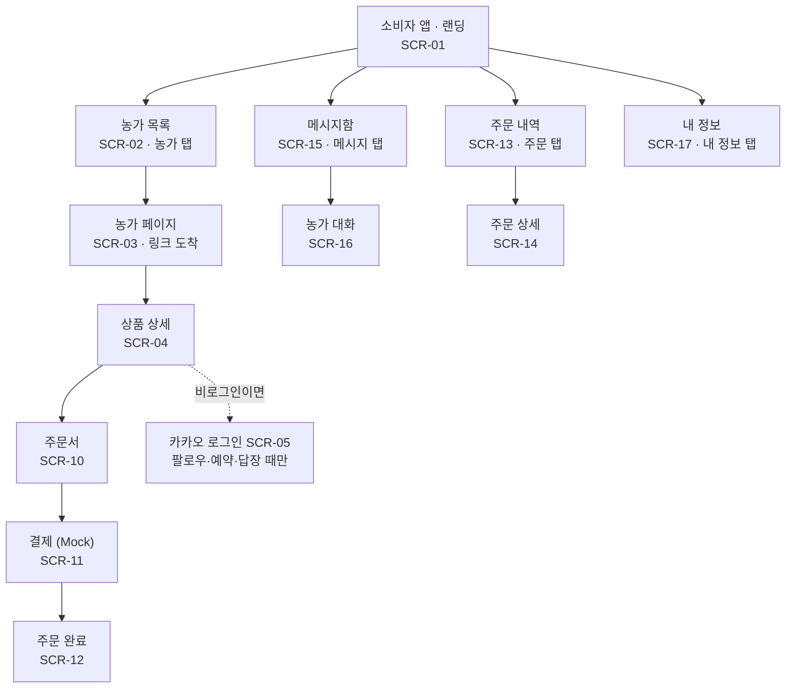
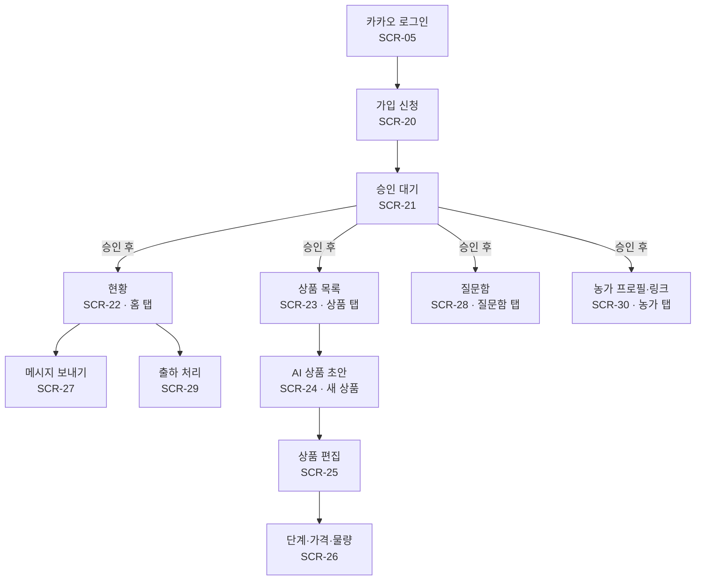
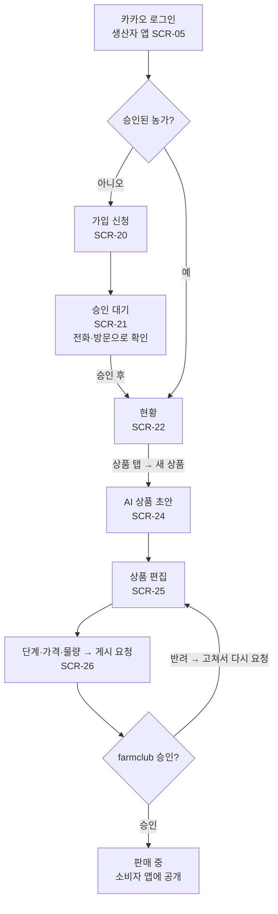
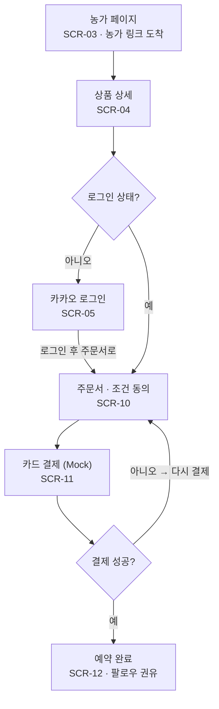

# farmclub IA·사용자 흐름 (I1-P15)

I1 화면은 24개다. 공개 5개, 소비자 8개, 생산자 11개다. 운영자는 I1에서 화면 없이 운영자 전용 관리 API를 Swagger UI에서 호출한다(전용 화면은 I2). 소비자는 농가가 보낸 링크로 농가 페이지에 들어오고, 주문·팔로우할 때만 로그인한다. 앱은 소비자 앱과 생산자 앱 두 개(모바일 웹)로 나누고, 같은 카카오 계정으로 둘 다 쓸 수 있다.

## 0. 문서 정보

| 항목 | 내용 |
| --- | --- |
| 문서 | farmclub IA·사용자 흐름 (Information Architecture, User Flow) |
| 태스크 | \[I1-P15\] SWPP-19 |
| 상태 | 초안 완료 — 열린 질문(7장) 9개 모두 결정, 팀 리뷰 전 |
| 담당 | 박현(PM) |
| 상위 문서 | farmclub PRD(I1-P14). 충돌하면 PRD가 우선한다 |
| 담는 것 | 화면 목록, 메뉴 구조, 화면 간 이동, 역할별 진입점과 접근 권한 |
| 담지 않는 것 | 화면 안 요소·문구·배치(와이어프레임 P20, 화면 명세 P21), 기능 동작·예외(기능 명세 P16) |
| 참조 방식 | 화면은 SCR-xx로 부른다. 기능은 PRD의 FEAT ID, 시나리오는 S-x를 그대로 쓴다 |
| 기준 | 모바일 웹 우선(PRD N-01), 한 화면에 주요 행동 하나(N-02), I1 P0 기능 17개를 빠짐없이 화면에 배치 |

## 1. 사이트맵

앱마다 하단 탭 4개 아래로 화면이 이어진다. 카카오 로그인(SCR-05)은 두 앱에 모두 있다.

&#91;embedded content: 소비자 앱 사이트맵 · 13개\]

소비자 앱에서는 농가 링크로 SCR-03에 바로 도착하고, 로그인은 팔로우·예약·답장을 누를 때만 거친다.

&#91;embedded content: 생산자 앱 사이트맵 · 11개\]

생산자 앱은 로그인 → 가입 신청 → 승인 대기를 거쳐야 탭이 열린다. 운영자는 승인·배송 완료·환불을 운영자 전용 관리 API로 처리하고, Swagger UI에서 호출한다(전용 화면은 I2).

## 2. 화면 목록

경로는 제안이고 구현에서 바꿀 수 있다. 화면 ID와 FEAT 연결은 바꾸지 않는다. 공개·소비자 화면은 소비자 앱, 생산자 화면은 생산자 앱의 경로다. 두 앱의 주소는 기술 설계에서 정한다.

소비자 앱 — **공개 (로그인 없이)**

| ID | 화면 | 경로 | 하는 일 | FEAT |
| --- | --- | --- | --- | --- |
| SCR-01 | 랜딩 | `/` | 서비스 소개, 농가 목록으로 이동, 생산자 가입 입구 | FEAT-06 |
| SCR-02 | 농가 목록 | `/farms` | 승인된 농가 둘러보기, 검색(필터는 I2) | FEAT-06 |
| SCR-03 | 농가 페이지 | `/farms/:farmId` | 농가 프로필, 공개 소식 목록, 상품 목록, 팔로우. 농가 링크의 도착점 | FEAT-06, 15, 19 |
| SCR-04 | 상품 상세 | `/products/:productId` | 품질·배송 예정 기간·단계 가격·남은 물량 확인, 주문 시작 | FEAT-07 |
| SCR-05 | 로그인 | `/login` | 카카오 로그인. 끝나면 하려던 행동으로 돌아감. 생산자 앱에도 같은 로그인 화면이 있다 | FEAT-01 |

**소비자 앱 — 로그인 후**

| ID | 화면 | 경로 | 하는 일 | FEAT |
| --- | --- | --- | --- | --- |
| SCR-10 | 주문서 | `/checkout/:productId` | 중량 옵션·수량(생산자가 정한 한도 안), 받는 사람·주소, 배송비 확인, 결제 전 동의 | FEAT-08 |
| SCR-11 | 결제 | `/checkout/:productId/pay` | Mock 카드 결제(성공·실패) | FEAT-09 |
| SCR-12 | 주문 완료 | `/orders/:orderId/done` | 예약 완료 안내, 농가 팔로우 권유 | FEAT-09 |
| SCR-13 | 주문 내역 | `/orders` | 내 주문 목록과 진행 상황 | FEAT-10 |
| SCR-14 | 주문 상세 | `/orders/:orderId` | 상태·배송 예정 기간, 출하 전 취소, 구매 확정, 배송 기간 변경 시 동의·환불 선택 | FEAT-10, 11 |
| SCR-15 | 메시지함 | `/inbox` | 팔로우한 농가별 대화 목록 | FEAT-12 |
| SCR-16 | 농가 대화 | `/inbox/:farmId` | 농가의 전체 메시지, 내 답장, AI 안내, 농가 답변 | FEAT-12, 13 |
| SCR-17 | 내 정보 | `/me` | 팔로우 목록, 배송지 관리, 로그아웃 | FEAT-06 |

**생산자 앱**

| ID | 화면 | 경로 | 하는 일 | FEAT |
| --- | --- | --- | --- | --- |
| SCR-20 | 가입 신청 | `/apply` | 농가 정보 입력, 신청 | FEAT-01 |
| SCR-21 | 승인 대기 | `/pending` | 전화·방문 확인 안내, 승인 전에는 다른 화면 잠김 | FEAT-01 |
| SCR-22 | 현황(홈) | `/` | 단계별 예약 수량, 배송할 주문, 할 일(답할 질문·승인 대기 상품) | FEAT-14 |
| SCR-23 | 상품 목록 | `/products` | 내 상품과 상태(초안·승인 대기·판매 중) | FEAT-04 |
| SCR-24 | AI 상품 초안 | `/products/new` | 기존 문구 붙여넣기 → 초안 확인 | FEAT-03 |
| SCR-25 | 상품 편집 | `/products/:id/edit` | 옵션·배송 예정 기간·배송비·품질(실측 당도) 편집, 게시 요청 | FEAT-04 |
| SCR-26 | 단계·가격·물량 | `/products/:id/stages` | 기본값 선택·수정 | FEAT-05 |
| SCR-27 | 메시지 보내기 | `/broadcast/new` | 글·사진·영상, 공개 여부 선택 | FEAT-12, 15 |
| SCR-28 | 질문함 | `/questions` | 전달된 질문 목록과 답변, 소비자별 대화 | FEAT-13 |
| SCR-29 | 출하 처리 | `/ship` | 자연어 입력 → AI가 찾은 주문 확인 → 반영 | FEAT-17 |
| SCR-30 | 농가 프로필·링크 | `/farm` | 프로필 편집, 농가 링크 복사·공유 | FEAT-02, 19 |

**운영자**: I1은 전용 화면 없이 운영자 전용 관리 API를 Swagger UI에서 호출한다(전용 화면 FEAT-23은 I2). 생산자·상품·가격 승인, 배송 완료, 환불을 이 API로 처리한다.

## 3. 콘텐츠 구성

화면 24개에 들어갈 정보 묶음과 순서다. 핵심 화면 8개를 먼저, 나머지 16개를 뒤에 둔다. 위에서부터 중요한 순서이고, 배치·디자인·문구는 화면 명세(P21)가 정한다. 순서가 정해지지 않은 곳은 IA-Q6\~Q8에서 정한다.

| 화면 | 앱 | 정보 묶음 (순서대로) |
| --- | --- | --- |
| SCR-02 농가 목록 | 소비자 | 1) 검색창 2) 농가 카드(농가명·지역·대표 상품·현재 단계 가격·단계 마감일). 정렬은 예약 마감 임박순: 판매 중인 상품의 현재 단계가 가장 일찍 끝나는 농가가 위, 판매 중 상품이 없는 농가는 맨 아래 |
| SCR-03 농가 페이지 | 소비자 | 1) 농가 프로필(이름·지역·소개·팔로워 수) 2) 팔로우 3) 탭 \[상품 \| 소식\]. 상품 탭: 판매 중 상품(상품명·현재 가격·배송 예정 기간·품절 여부). 소식 탭: 공개 소식(최신순). 처음 열릴 때는 상품 탭 |
| SCR-04 상품 상세 | 소비자 | 1) 상품명·품종·농가 2) 품질(당도 예상·실측, 등급) 3) 받는 시기(배송 예정 기간) 4) 단계별 가격(지금 단계 강조, 다음 단계 가격, 남은 물량·품절) 5) 중량 옵션 6) 배송비(무료·별도·도서산간) 7) 설명 8) 원산지·상품정보 9) 예약하기 |
| SCR-10 주문서 | 소비자 | 1) 상품·옵션·수량(한도 안) 2) 받는 사람·연락처·주소(저장된 배송지가 기본) 3) 금액(상품 + 배송비 = 합계) 4) 결제 전 고지·동의(배송 기간, 지연 시 환불, 흉작 처리, 취소 조건) 5) 결제하기 |
| SCR-14 주문 상세 | 소비자 | 1) 진행 상태 2) 배송 예정 기간(바뀌었으면 동의·환불 선택) 3) 상품·금액·받는 사람 4) 지금 할 수 있는 행동(출하 전 취소, 배송 후 구매 확정) |
| SCR-16 농가 대화 | 소비자 | 시간순: 농가 메시지, 내 답장, AI 안내(‘틀렸어요’ 버튼), 농가 답변. 맨 아래 입력창(글·사진) |
| SCR-22 현황 | 생산자 | 1) 할 일(답할 질문 수, 출하할 주문 수, 승인 대기 상품) 2) 메시지 보내기·출하 처리 버튼 3) 단계별 예약 수량 4) 최근 주문 |
| SCR-26 단계·가격·물량 | 생산자 | 1) 기본값 선택 2) 단계별 기간·중량 옵션별 가격·물량 3) 이른 단계가 더 싸야 한다는 안내 4) 게시 요청 |

**나머지 화면**

| 화면 | 앱 | 정보 묶음 (순서대로) |
| --- | --- | --- |
| SCR-01 랜딩 | 소비자 | 1) 한 줄 소개(수확 전 예약, 농가와 소통) 2) 농가 둘러보기 3) 농가로 시작하기(생산자 앱) 4) 사업자 정보 |
| SCR-05 로그인 | 공통 | 1) 로그인이 필요한 이유 한 줄 2) 카카오 로그인 3) 약관·개인정보 동의 |
| SCR-11 결제 | 소비자 | 1) 결제 금액 2) 카드 결제(Mock) 3) 실패 시 사유와 다시 시도 |
| SCR-12 주문 완료 | 소비자 | 1) 예약 완료와 배송 예정 기간 2) 농가 팔로우 권유 3) 주문 내역 보기 |
| SCR-13 주문 내역 | 소비자 | 주문 카드(상품·상태·배송 예정 기간), 할 일이 있는 주문(배송 기간 변경 동의, 구매 확정) 먼저, 그다음 최신순 |
| SCR-15 메시지함 | 소비자 | 팔로우한 농가별 대화(농가명·마지막 메시지·안 읽음 표시), 최근 메시지순 |
| SCR-17 내 정보 | 소비자 | 1) 프로필 2) 팔로우 목록 3) 배송지 관리(저장·수정·삭제) 4) 생산자 앱으로 가기 5) 로그아웃·탈퇴 |
| SCR-20 가입 신청 | 생산자 | 1) 농가명·지역·주 품목 2) 연락처 3) 확인 절차 안내(전화·방문) 4) 신청하기 |
| SCR-21 승인 대기 | 생산자 | 1) 현재 상태(대기·반려) 2) 다음 절차 3) 반려 시 사유와 다시 신청 |
| SCR-23 상품 목록 | 생산자 | 1) 새 상품 2) 상품 카드(상태: 초안·승인 대기·반려·판매 중·종료), 할 일 있는 상품 먼저 |
| SCR-24 AI 상품 초안 | 생산자 | 1) 문구 붙여넣기 2) 초안 결과 3) 빈 칸 표시 4) 편집으로 이동 |
| SCR-25 상품 편집 | 생산자 | 1) 기본 정보(상품명·품종·설명) 2) 품질(예상·실측 당도, 등급) 3) 중량 옵션·한 주문 최대 수량 4) 배송 예정 기간 5) 배송비·도서산간 6) 단계 설정으로 |
| SCR-27 메시지 보내기 | 생산자 | 1) 본문 2) 사진·영상 3) 공개 여부 4) 보낼 사람 수(팔로워) 5) 보내기 |
| SCR-28 질문함 | 생산자 | 1) 답할 질문(전달된 것) 2) 답한 질문 3) 소비자별 대화 |
| SCR-29 출하 처리 | 생산자 | 1) 출하할 주문 목록 2) 자연어 입력창 3) AI가 찾은 주문·바뀔 상태 4) 확인·취소 |
| SCR-30 농가 프로필·링크 | 생산자 | 1) 농가 링크 복사·공유 2) 프로필 편집 3) 소비자 앱으로 가기 |

**분류·탐색**: 농가 목록(SCR-02)에 검색을 둔다. 검색은 농가명·품종·지역을 찾는다. 지역·품종 필터는 I2에서 추가한다. 기본 정렬은 예약 마감 임박순이다(IA-Q6\~Q8).

## 4. 내비게이션과 진입 경로

역할마다 하단 탭 4개를 둔다(IA-Q1 결정). 탭에 없는 화면은 목록·버튼에서 들어간다.

| 역할 | 탭 1 | 탭 2 | 탭 3 | 탭 4 | 탭 밖 주요 버튼 |
| --- | --- | --- | --- | --- | --- |
| 소비자·비로그인 | 농가(SCR-02) | 메시지(SCR-15) | 주문(SCR-13) | 내 정보(SCR-17) | 상품 상세의 ‘예약하기’ → SCR-10 |
| 생산자 | 현황(SCR-22) | 상품(SCR-23) | 질문함(SCR-28) | 농가(SCR-30) | 현황의 ‘메시지 보내기’(SCR-27), ‘출하 처리’(SCR-29) |

비로그인 상태에서 메시지·주문·내 정보 탭을 누르면 로그인(SCR-05)으로 간다.

**진입 경로**

| 경로 | 도착 화면 | 그다음 |
| --- | --- | --- |
| 농가가 문자·카톡으로 보낸 링크 (첫 경로) | SCR-03 농가 페이지 | 상품(SCR-04) 또는 팔로우 |
| farmclub 주소·SNS | SCR-01 랜딩 | 농가 목록(SCR-02) |
| 생산자 시작 | 생산자 앱 주소, 또는 SCR-01의 ‘농가로 시작하기’(생산자 앱으로 이동) | SCR-05 → SCR-20 → SCR-21 → 승인 후 SCR-22 |

**로그인 관문**: 팔로우·주문·답장을 누르면 로그인(SCR-05)으로 가고, 끝나면 누른 화면과 행동으로 돌아간다. 예를 들어 상품 상세에서 ‘예약하기’를 눌렀다면 로그인 뒤 주문서(SCR-10)로 간다.

**레이블**

탭·버튼·상태 이름은 아래 말로 통일한다. 예약판매이므로 ‘구매’보다 ‘예약’을 쓴다. 최종 문구는 화면 명세에서 다듬는다.

| 쓰는 말 | 쓰는 곳 | 쓰지 않는 말 |
| --- | --- | --- |
| 예약하기 | 상품 상세의 주문 버튼 | 구매하기, 주문하기 |
| 예약 완료 | 결제 후 주문 상태 | 결제 완료 |
| 지금 가격 · 다음 단계 가격 | 단계별 가격 표시 | 얼리버드, 할인가 |
| 품절 | 단계 물량 소진 | 매진 |
| 받는 시기 | 배송 예정 기간 표시 | 출고일 |
| 팔로우 | 농가 구독 | 구독, 찜 |
| 메시지 | 농가가 팔로워에게 보내는 글, 메시지함 | 채팅, 단톡 |
| 소식 | 농가 페이지의 공개 메시지 탭 | 피드, 게시글 |
| AI 안내 | AI가 보낸 답 | 농가 답변 |
| 농가에 전달했어요 | AI가 답하지 않고 넘길 때 | — |
| 출하 | 생산자가 보낸 뒤 처리 | 발송 완료 |
| 구매 확정 | 배송 후 소비자 확인 | 수령 완료 |

## 5. 사용자 흐름

PRD의 시나리오 S-1\~S-4를 화면 단위로 풀고(‘생산자:’ 단계는 생산자 앱, ‘소비자:’ 단계는 소비자 앱), 기능 명세에서 필요한 흐름 두 개(F-5, F-6)를 더했다. 괄호는 화면 ID다.

**F-1. 생산자 가입과 상품 등록 (S-1)**

&#91;embedded content: F-1 생산자 가입·상품 등록 · 승인 2번\]

승인 대기 중에는 다른 생산자 화면이 잠기고, 상품은 반려되면 고쳐서 다시 요청한다. 판매가 시작되면 농가 탭(SCR-30)에서 링크를 복사해 단골에게 보낸다.

**F-2. 소비자 예약 주문 (S-2)**

&#91;embedded content: F-2 소비자 예약 주문 · 분기 2개\]

로그인은 예약하기를 누른 뒤에만 거치고, 끝나면 주문서로 바로 돌아온다. 예약 완료 후에는 주문 내역(SCR-13)으로 이동할 수 있다.

**F-3. 소통과 AI 응답 (S-3)**

1. 생산자: 현황에서 ‘메시지 보내기’ → 글·사진·영상, 공개 여부 선택 (SCR-22 → SCR-27)
2. 소비자: 메시지함 → 농가 대화에서 읽고 답장 (SCR-15 → SCR-16). 공개 메시지는 농가 페이지 소식(SCR-03)에도 보인다
3. AI가 같은 대화에 답하거나 ‘농가에 전달’ 안내 (SCR-16)
4. 생산자: 질문함에서 전달된 질문에 답변 → 그 소비자의 대화에만 표시 (SCR-28 → SCR-16)

**F-4. 출하와 취소 (S-4)**

1. 생산자: 현황에서 배송할 주문 확인 → ‘출하 처리’ (SCR-22 → SCR-29)
2. “김○○님 5kg 보냈어요” 입력 → AI가 찾은 주문 확인 → 반영 (SCR-29)
3. 소비자: 주문 상세에서 출하 전 취소 → 환불 완료 표시 (SCR-13 → SCR-14)

**F-5. 배송 기간 변경 (R-21)**

1. 배송 예정 기간이 바뀌면 주문 내역에 표시가 뜨고, 주문 상세에서 새 기간 동의 또는 전액 환불을 고른다 (SCR-13 → SCR-14). I1은 알림이 없으므로 앱 안 표시만 한다

**F-6. 구매 확정 (R-14)**

1. 배송 완료 후 주문 상세에서 ‘구매 확정’을 누르거나, 8일이 지나면 자동 확정 (SCR-14)

**예외 경로**

정상 흐름이 아닐 때 보낼 화면이다. 화면 안 문구는 화면 명세가 정한다.

| 상황 | 보내는 곳 |
| --- | --- |
| 없는 농가·승인 취소된 농가의 링크 | ‘찾을 수 없는 농가’ 안내 → 농가 목록(SCR-02) |
| 판매 종료·승인 전 상품의 링크 | ‘판매 중이 아닌 상품’ 안내 → 농가 페이지(SCR-03) |
| 품절인 상품 | 상품 상세는 열리고 예약하기만 막힘, 다음 단계 시작일 표시 (R-06) |
| 주문서·결제 중 단계가 바뀌거나 품절 | 주문서(SCR-10)로 돌아가 바뀐 가격·품절 안내, 입력값은 유지 (R-06, R-17) |
| 로그인이 끝난 뒤 행동 | 로그인(SCR-05) 후 같은 화면으로 복귀, 입력값 유지 |
| 남의 주문·팔로우 안 한 농가 대화의 주소로 직접 접근 | 내 주문 내역(SCR-13) 또는 그 농가 페이지(SCR-03) |
| 가입 안 한 사람이 생산자 앱 진입 | 로그인 후 가입 신청(SCR-20) |
| 생산자 가입 반려 | 승인 대기(SCR-21)에 사유와 다시 신청 |
| 농가 승인 취소(활동 정지) | 생산자 앱에서 정지 안내만 보임. 출하 전 주문은 전액 환불하고 소비자 주문 상세(SCR-14)에 사유를 표시 (R-24) |

## 6. 접근 권한

권한은 서버에서 검사한다(PRD N-06). 화면에서 숨기는 것만으로 막지 않는다.

| 화면 | 비로그인 | 소비자 | 생산자(승인 전) | 생산자(승인 후) |
| --- | --- | --- | --- | --- |
| SCR-01\~04 공개 화면 | 가능 | 가능 | 가능 | 가능 |
| SCR-10\~17 소비자 화면 | 로그인으로 이동 | 자기 주문·대화만 | 가능(소비자 앱) | 가능(소비자 앱) |
| SCR-20·21 가입·대기 | 로그인으로 이동 | 가능(생산자 앱에서 신청) | 가능 | — |
| SCR-22\~30 생산자 화면 | 로그인으로 이동 | 불가 | SCR-21로 이동 | 자기 농가·상품·주문만 |

- 같은 카카오 계정으로 소비자 앱과 생산자 앱을 모두 쓴다. 생산자도 소비자 앱에서 다른 농가 상품을 주문할 수 있고, 생산자 앱 권한은 승인 후에만 열린다(IA-Q4).
- 생산자는 배송 완료 전 주문의 배송 정보만 본다(R-15).

## 7. 열린 질문

- [x] IA-Q1. 하단 탭 4개 구성(4장)이 맞는가. 생산자는 탭 대신 대화형 한 화면(말로 모두 처리)이 나은가 → 결정: 역할별 하단 탭 4개(4장 그대로)
- [x] IA-Q2. 랜딩(SCR-01)과 농가 목록(SCR-02)을 하나로 합칠지 → 결정: I1은 따로 둠(소개 → 목록). 합치는 안은 이후 검토
- [x] IA-Q3. 출하 처리(SCR-29)를 별도 화면으로 둘지, 현황 화면의 입력창으로 넣을지 → 결정: 별도 화면(SCR-29), 현황의 ‘출하 처리’ 버튼으로 진입
- [x] IA-Q4. 생산자가 소비자로도 주문할 수 있게 할지(역할 전환) → 결정: 가능. 소비자 앱과 생산자 앱을 따로 두고 같은 계정으로 둘 다 사용
- [x] IA-Q5. 주문 수량: 1주문 1옵션일 때 같은 옵션을 여러 개(예: 5kg × 2) 주문할 수 있는지 → 결정: 수량을 고를 수 있고, 한 주문의 최대 수량은 생산자가 상품마다 정한다(R-23). 배송지는 주문당 1곳

* [x] IA-Q6. 농가 목록(SCR-02)을 무엇으로 정렬하는가 → 결정: 예약 마감 임박순
* [x] IA-Q7. 농가 페이지(SCR-03)에서 상품과 공개 소식 중 무엇을 먼저 보여주는가 → 결정: 탭으로 나눔(상품 | 소식)
* [x] IA-Q8. I1에 검색·필터가 필요한가 → 결정: I1은 검색만, 지역·품종 필터는 I2

- [x] IA-Q9. 농가 승인이 취소되면 이미 받은 예약 주문을 어떻게 처리하는가(예: 전액 환불, 다른 농가로 대체) → 결정: 출하 전 주문은 전액 환불(R-24)
