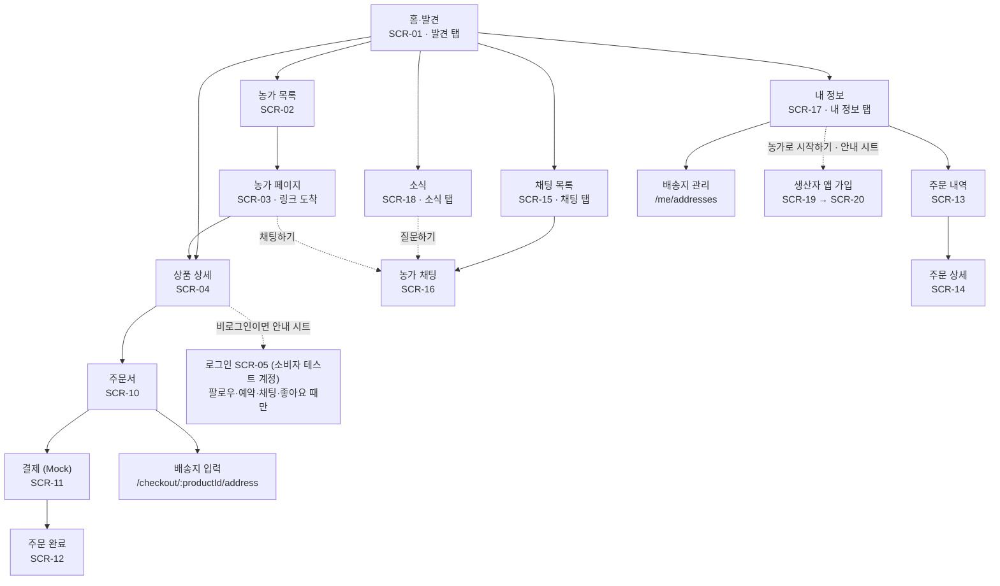
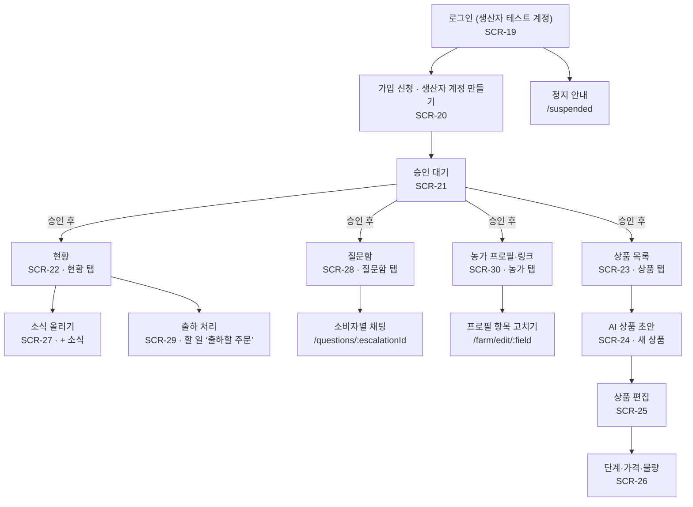
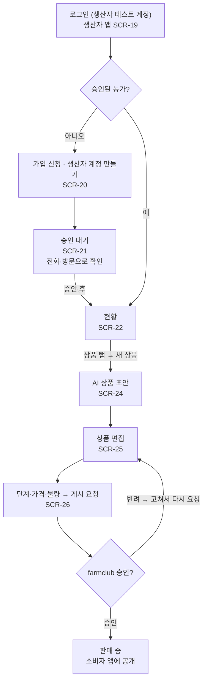
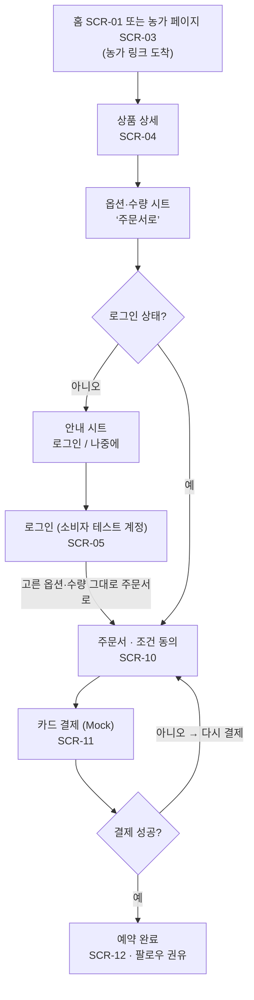

# farmclub IA·사용자 흐름 (I1-P15)

I1 화면은 26개다. 공개 5개, 소비자 9개, 생산자 12개다(로그인은 앱별로 소비자 SCR-05, 생산자 SCR-19). 그 밖에 하위 화면 5개(배송지 입력, 배송지 관리, 정지 안내, 소비자별 채팅, 프로필 항목 고치기)와 공통 권한 오류 화면이 있다. 운영자는 I1에서 화면 없이 운영자 전용 관리 API를 Swagger UI에서 호출한다(전용 화면은 I2). 소비자 앱의 첫 화면은 홈·발견이고, 농가가 보낸 링크로는 농가 페이지에 바로 들어온다. 로그인은 팔로우·예약·채팅·좋아요를 누를 때만 한다. 앱은 소비자 앱과 생산자 앱 두 개(모바일 웹)로 나누고, 계정도 앱별로 따로다(소비자 계정·생산자 계정, ADR 0010. I1은 테스트 계정, 카카오 로그인은 I2).

## 0. 문서 정보

| 항목 | 내용 |
| --- | --- |
| 문서 | farmclub IA·사용자 흐름 (Information Architecture, User Flow) |
| 태스크 | \[I1-P15\] SWPP-19 · \[I1-P22\] SWPP-26(화면 명세와 합치며 갱신) · SWPP-81(확정 디자인 동기화, 계정 분리) |
| 상태 | P22 반영 — 열린 질문(7장) 모두 결정, 팀 확인 전 |
| 담당 | 박현(PM) |
| 상위 문서 | farmclub PRD(I1-P14). 충돌하면 PRD가 우선한다 |
| 담는 것 | 화면 목록, 메뉴 구조, 화면 간 이동, 역할별 진입점과 접근 권한 |
| 담지 않는 것 | 화면 안 요소·데이터·동작·예외([화면 명세](./screens.md)), 기능 동작·인수 조건(기능 명세 P16) |
| 참조 방식 | 화면은 SCR-xx로 부른다. 기능은 PRD의 FEAT ID, 시나리오는 S-x를 그대로 쓴다 |
| 기준 | 모바일 웹 우선(PRD N-01), 한 화면에 주요 행동 하나(N-02), I1 P0 기능 17개를 빠짐없이 화면에 배치 |

## 1. 사이트맵

앱마다 하단 탭 4개 아래로 화면이 이어진다. 로그인은 앱별로 따로다(소비자 SCR-05, 생산자 SCR-19).

&#91;embedded content: 소비자 앱 사이트맵 · 14개\]

소비자 앱은 홈·발견(SCR-01)에서 시작하고, 농가 링크로는 SCR-03에 바로 도착한다. 로그인은 팔로우·예약·채팅·좋아요를 누를 때만 거친다.

&#91;embedded content: 생산자 앱 사이트맵 · 11개\]

생산자 앱은 생산자 계정 로그인(SCR-19) → 가입 신청 → 승인 대기를 거쳐야 탭이 열린다(시드의 승인된 생산자 계정은 바로 SCR-22, 정지된 계정은 정지 안내). 운영자는 승인·배송 완료·환불을 운영자 전용 관리 API로 처리하고, Swagger UI에서 호출한다(전용 화면은 I2).

## 2. 화면 목록

경로는 제안이고 구현에서 바꿀 수 있다. 화면 ID와 FEAT 연결은 바꾸지 않는다. 공개·소비자 화면은 소비자 앱, 생산자 화면은 생산자 앱의 경로다. 화면별 요소·데이터·동작·예외와 API는 [화면 명세](./screens.md)에 있다.

소비자 앱 — **공개 (로그인 없이)**

| ID | 화면 | 경로 | 하는 일 | FEAT |
| --- | --- | --- | --- | --- |
| SCR-01 | 홈·발견 | `/` | 시즌 히어로, 추천 상품(마감 임박순), 농가 둘러보기, 헤더 검색 아이콘 → 농가 목록. 발견 탭의 첫 화면 | FEAT-06 |
| SCR-02 | 농가 목록 | `/farms` | 승인된 농가 둘러보기, 검색(필터는 I2). 발견 탭 안 | FEAT-06 |
| SCR-03 | 농가 페이지 | `/farms/:farmId` | 농가 프로필, 탭 \[상품 \| 소식\], 팔로우, 채팅하기, 좋아요. 농가 링크의 도착점 | FEAT-02, 06, 12, 15, 19 |
| SCR-04 | 상품 상세 | `/products/:productId` | 품질·배송 예정 기간·단계 가격·남은 물량 확인, 예약하기(옵션·수량 시트), 채팅하기 | FEAT-07 |
| SCR-05 | 로그인 | `/login` | 소비자 테스트 계정 선택(I1, 카카오는 I2). 안내 시트에서 들어오고, 끝나면 하려던 행동으로 돌아감. 생산자 계정은 없음 | FEAT-01 |

**소비자 앱 — 로그인 후**

| ID | 화면 | 경로 | 하는 일 | FEAT |
| --- | --- | --- | --- | --- |
| SCR-10 | 주문서 | `/checkout/:productId` | 중량 옵션·수량(생산자가 정한 한도 안), 받는 곳·배송 메모, 배송비 확인, 결제 전 동의 | FEAT-08 |
| SCR-10 하위 | 배송지 입력 | `/checkout/:productId/address` | 받는 사람·연락처·우편번호·주소 직접 입력(우편번호 찾기 없음), 기본 배송지로 저장 | FEAT-08 |
| SCR-11 | 결제 | `/checkout/:productId/pay` | Mock 카드 결제(성공·실패) | FEAT-09 |
| SCR-12 | 주문 완료 | `/me/orders/:orderId/done` | 예약 완료 안내, 농가 팔로우 권유, 소식·채팅으로 이동 | FEAT-09 |
| SCR-13 | 주문 내역 | `/me/orders` | 내 주문 목록과 진행 상황. 내 정보에서 들어감 | FEAT-10 |
| SCR-14 | 주문 상세 | `/me/orders/:orderId` | 상태(예약 완료·수확·포장 중·배송 중·배송 완료)·배송 예정 기간·택배사·송장 번호·배송 조회, 보내기 전 취소, 구매 확정, 배송 기간 변경 시 동의·환불 선택 | FEAT-10, 11 |
| SCR-15 | 채팅 목록 | `/chats` | 농가별 1:1 채팅 목록. 채팅 탭의 첫 화면 | FEAT-12 |
| SCR-16 | 농가 채팅 | `/chats/:farmId` | 내 질문, AI 안내, 농가 답변(1:1) | FEAT-12, 13 |
| SCR-17 | 내 정보 | `/me` | 주문 내역, 팔로우 목록, 배송지 관리, 농가로 시작하기(생산자 앱은 따로 가입한다는 안내 시트), 로그아웃 | FEAT-01, 06, 08, 10 |
| SCR-17 하위 | 배송지 관리 | `/me/addresses` | 저장한 배송지 목록, 수정, 삭제 확인, 기본으로 | FEAT-08 |
| SCR-18 | 소식 | `/news` | 팔로우한 농가의 소식(공개·팔로워 전용) 시간순, 좋아요, 질문하기. 소식 탭의 첫 화면 | FEAT-12, 15 |

**생산자 앱**

| ID | 화면 | 경로 | 하는 일 | FEAT |
| --- | --- | --- | --- | --- |
| SCR-19 | 로그인 | `/login` | 생산자 테스트 계정 선택(승인·확인 중·반려·정지·농가 없음), 처음이면 ‘농가로 가입 신청’ | FEAT-01 |
| SCR-19 하위 | 정지 안내 | `/suspended` | 정지 사유와 처리 결과, 로그아웃. 정지된 생산자는 이 화면만 | FEAT-01 |
| SCR-20 | 가입 신청 | `/apply` | 대표자·농가 정보 입력, 신청. 생산자 계정 만들기를 겸함 | FEAT-01 |
| SCR-21 | 승인 대기 | `/pending` | 들어올 때 자동 확인, 전화·방문 확인 안내, 신청 내용 보기, 로그아웃. 승인 전에는 다른 화면 잠김 | FEAT-01 |
| SCR-22 | 현황(홈) | `/` | 할 일(답할 질문·출하할 주문·승인 대기 상품), 단계·옵션별 예약 수량, 최근 예약, + 소식 | FEAT-14 |
| SCR-23 | 상품 목록 | `/products` | 내 상품과 상태(초안·승인 대기·판매 중) | FEAT-04 |
| SCR-24 | AI 상품 초안 | `/products/new` | 기존 문구 붙여넣기 → 초안 확인(파일·사진 업로드는 P2) | FEAT-03 |
| SCR-25 | 상품 편집 | `/products/:id/edit` | 옵션·배송 예정 기간·배송비·품질(실측 당도) 편집, 게시 요청 | FEAT-04 |
| SCR-26 | 단계·가격·물량 | `/products/:id/stages` | 기본값 선택·수정 | FEAT-05 |
| SCR-27 | 소식 올리기 | `/broadcast/new` | 글·사진·영상, 공개 여부 선택 | FEAT-12, 15 |
| SCR-28 | 질문함 | `/questions` | 전달된 질문 목록(답할 질문·답한 질문) | FEAT-13 |
| SCR-28 하위 | 소비자별 채팅 | `/questions/:escalationId` | 그 소비자와의 채팅 전체, 답 입력 | FEAT-13 |
| SCR-29 | 출하 처리 | `/ship` | 수확 시작, 주문 여러 건 골라 택배사·송장 번호 입력 → 출하로 바꾸기(자연어·AI는 I2) | FEAT-17 |
| SCR-30 | 농가 프로필·링크 | `/farm` | 농가 링크 복사·공유, 프로필 미리보기와 항목 줄, + 소식 | FEAT-02, 19 |
| SCR-30 하위 | 프로필 항목 고치기 | `/farm/edit/:field` | 농가 이름·지역·소개 중 하나 고치기 | FEAT-02 |

**공통**: 권한 오류(403) 화면은 두 앱에 있다. ‘볼 수 없는 화면이에요’와 첫 화면으로(screens.md 3장).

**운영자**: I1은 전용 화면 없이 운영자 전용 관리 API를 Swagger UI에서 호출한다(전용 화면 FEAT-23은 I2). 생산자·상품·가격 승인, 배송 완료, 환불을 이 API로 처리한다.

## 3. 콘텐츠 구성

화면 26개에 들어갈 정보 묶음과 순서다. 위에서부터 중요한 순서이고, 요소·데이터·동작은 [화면 명세](./screens.md)가, 배치·디자인은 [확정 디자인](/docs/design/README.md)이 정한다.

| 화면 | 앱 | 정보 묶음 (순서대로) |
| --- | --- | --- |
| SCR-01 홈·발견 | 소비자 | 1) 헤더(워드마크·검색) 2) 시즌 히어로(연결 상품) 3) 추천 상품(예약 마감 임박순 상위 N개: 상품명·농가·받는 시기·지금 가격·D-day·n명 예약) 4) 농가 둘러보기(농가 카드)와 모두 보기 |
| SCR-02 농가 목록 | 소비자 | 1) 검색창 2) 농가 카드(농가명·지역·대표 상품·현재 단계 가격·단계 마감일). 정렬은 예약 마감 임박순: 판매 중인 상품의 현재 단계가 가장 일찍 끝나는 농가가 위, 판매 중 상품이 없는 농가는 맨 아래 |
| SCR-03 농가 페이지 | 소비자 | 1) 농가 프로필(이름·지역·소개·팔로워 수) 2) 팔로우·채팅하기 3) 탭 \[상품 \| 소식\]. 상품 탭: 판매 중 상품(상품명·현재 가격·배송 예정 기간·품절 여부). 소식 탭: 공개 소식(최신순, 좋아요 수). 처음 열릴 때는 상품 탭 |
| SCR-04 상품 상세 | 소비자 | 1) 사진(뒤로·공유) 2) 받는 시기 띠 3) 농가 요약(당도 기록 n회) 4) 상품명 5) 지금 가격과 단계 막대(다음 단계 차이, 마감, 남은 물량·품절) 6) 배송비(무료·별도·도서산간) 7) 품질(당도 예상·실측, 등급) 8) 농가의 한마디 9) 상품정보·원산지·취소 규정(접힘) 10) 하단 채팅하기 + 예약하기(옵션·수량 시트) |
| SCR-10 주문서 | 소비자 | 1) 상품·옵션·수량(한도 안) 2) 받는 사람·연락처·주소·배송 메모(저장된 배송지가 기본) 3) 금액(상품 + 배송비 = 합계) 4) 결제 전 고지·동의(배송 기간, 지연 시 환불, 흉작 처리, 취소 조건) 5) 결제하기 |
| SCR-14 주문 상세 | 소비자 | 1) 진행 상태(예약 완료·수확·포장 중·배송 중·배송 완료) 2) 배송 예정 기간(바뀌었으면 동의·환불 선택) 3) 택배사·송장 번호·배송 조회(배송 중) 4) 상품·금액·받는 사람 5) 지금 할 수 있는 행동(보내기 전 취소, 배송 후 구매 확정) |
| SCR-16 농가 채팅 | 소비자 | 시간순: 내 질문, AI 안내, 농가 답변. 맨 아래 입력창(글·사진). 농가 소식은 나오지 않는다 |
| SCR-18 소식 | 소비자 | 팔로우한 농가의 소식 카드(농가명·작성일·본문·사진·영상·공개 여부·좋아요·질문하기), 최신순 |
| SCR-22 현황 | 생산자 | 1) 농가 사진 띠와 오늘 할 일 수 2) 할 일(답할 질문 수, 출하할 주문 수, 승인 대기 상품) 3) 단계·옵션별 예약 수량 4) 최근 예약 5) 떠 있는 + 소식 |
| SCR-26 단계·가격·물량 | 생산자 | 1) 기본값 선택 2) 단계별 기간·중량 옵션별 가격·물량 3) 이른 단계가 더 싸야 한다는 안내 4) 게시 요청 |

**나머지 화면**

| 화면 | 앱 | 정보 묶음 (순서대로) |
| --- | --- | --- |
| SCR-05 로그인 | 소비자 | 1) 로그인이 필요한 이유 한 줄 2) 소비자 테스트 계정 목록(I1, 카카오는 I2) 3) 농가는 생산자 앱에서 따로 로그인한다는 한 줄 4) 약관·개인정보 처리방침 |
| SCR-19 로그인 | 생산자 | 1) 워드마크 ‘농가용’ 2) 생산자 테스트 계정 목록(농가명·상태) 3) 처음이면 농가로 가입 신청 4) 약관·개인정보 처리방침 |
| SCR-11 결제 | 소비자 | 1) 결제 금액 2) 카드 결제(Mock) 3) 실패 시 사유와 다시 시도 |
| SCR-12 주문 완료 | 소비자 | 1) 예약 완료와 배송 예정 기간 2) 농가 팔로우 권유 3) 소식 보기·채팅하기 4) 주문 내역 보기 |
| SCR-13 주문 내역 | 소비자 | 주문 카드(상품·상태·배송 예정 기간), 할 일이 있는 주문(배송 기간 변경 동의, 구매 확정) 먼저, 그다음 최신순 |
| SCR-15 채팅 목록 | 소비자 | 농가별 채팅(농가명·마지막 질문·답·안 읽음 표시), 최근 순 |
| SCR-17 내 정보 | 소비자 | 1) 프로필 2) 주문 내역 3) 팔로우 목록 4) 배송지 관리(하위 화면) 5) 농가로 시작하기(생산자 앱은 따로 가입한다는 시트) 6) 로그아웃 |
| SCR-20 가입 신청 | 생산자 | 1) 생산자 계정이 함께 만들어진다는 안내 2) 대표자 이름·농가명·지역·주 품목·연락처 3) 확인 절차 안내(전화·방문) 4) 입점 정책 동의 5) 신청하기 |
| SCR-21 승인 대기 | 생산자 | 1) 현재 상태(확인 중·반려) 2) 다음 절차(들어올 때 자동 확인) 3) 반려 시 사유와 다시 신청 4) 신청 내용 보기·로그아웃 |
| SCR-23 상품 목록 | 생산자 | 1) 새 상품 2) 상품 카드(상태: 초안·승인 대기·반려·판매 중·종료), 할 일 있는 상품 먼저 |
| SCR-24 AI 상품 초안 | 생산자 | 1) 문구 붙여넣기 2) 초안 결과 3) 빈 칸 표시 4) 편집으로 이동 |
| SCR-25 상품 편집 | 생산자 | 1) 기본 정보(상품명·품종·설명) 2) 품질(예상·실측 당도, 등급) 3) 중량 옵션·한 주문 최대 수량 4) 배송 예정 기간 5) 배송비·도서산간 6) 단계 설정으로 |
| SCR-27 소식 올리기 | 생산자 | 1) 본문 2) 사진·영상 3) 공개 여부 4) 받을 팔로워 수 5) 올리기 |
| SCR-28 질문함 | 생산자 | 1) 답할 질문(전달된 것) 2) 답한 질문 3) 줄을 누르면 소비자별 채팅에서 답 |
| SCR-29 출하 처리 | 생산자 | 1) 상품별 수확 시작 2) 출하할 주문 목록(고르기) 3) 주문별 택배사·송장 번호 시트 4) n건 출하로 바꾸기 확인 |
| SCR-30 농가 프로필·링크 | 생산자 | 1) 농가 링크 복사·공유 2) 프로필 미리보기와 항목 줄(항목별 고치기) 3) 소비자 앱에서 내 농가 보기 |

**분류·탐색**: 홈(SCR-01)의 추천 상품과 농가 목록(SCR-02)은 예약 마감 임박순이다. 농가 목록에 검색을 둔다. 검색은 농가명·품종·지역을 찾는다. 지역·품종 필터는 I2에서 추가한다(IA-Q6\~Q8).

## 4. 내비게이션과 진입 경로

역할마다 하단 탭 4개를 둔다(IA-Q1, IA-Q10 결정). 탭에 없는 화면은 목록·버튼에서 들어간다.

| 역할 | 탭 1 | 탭 2 | 탭 3 | 탭 4 | 탭 밖 주요 버튼 |
| --- | --- | --- | --- | --- | --- |
| 소비자·비로그인 | 발견(SCR-01) | 소식(SCR-18) | 채팅(SCR-15) | 내 정보(SCR-17) | 상품 상세의 ‘예약하기’ → SCR-10, 농가 페이지·상품 상세의 ‘채팅하기’ → SCR-16, 내 정보의 ‘주문 내역’ → SCR-13 |
| 생산자 | 현황(SCR-22) | 상품(SCR-23) | 질문함(SCR-28) | 농가(SCR-30) | 현황·농가의 떠 있는 ‘+ 소식’(SCR-27), 현황 할 일 ‘출하할 주문’(SCR-29), 상품의 ‘+ 새 상품’(SCR-24) |

비로그인 상태에서 소식·채팅·내 정보 탭을 누르면 안내 시트 뒤 로그인(SCR-05)으로 간다.

**진입 경로**

| 경로 | 도착 화면 | 그다음 |
| --- | --- | --- |
| 농가가 문자·카톡으로 보낸 링크 (첫 경로) | SCR-03 농가 페이지 | 상품(SCR-04) 또는 팔로우 |
| farmclub 소비자 앱 주소·SNS | SCR-01 홈·발견 | 상품(SCR-04) 또는 농가 목록(SCR-02) |
| 생산자 시작 | 생산자 앱 주소, 또는 소비자 앱 내 정보(SCR-17)의 ‘농가로 시작하기’(‘생산자 앱은 따로 가입해요’ 시트 뒤 생산자 앱으로 이동) | SCR-19 → 처음이면 SCR-20(생산자 계정 만들기) → SCR-21 → 승인 후 SCR-22 |

레포 밖 마케팅 랜딩 페이지(`docs/farmclub-*.html`)는 앱 화면이 아니다.

**로그인 관문**: 팔로우·예약·채팅하기(질문하기)·좋아요를 누르면 안내 시트(로그인 / 나중에)를 먼저 띄우고, 로그인하면 소비자 로그인(SCR-05)으로 가고, 끝나면 누른 화면과 행동으로 돌아간다. 예약은 상품 상세의 옵션·수량 시트에서 ‘주문서로’를 누를 때 시트를 띄우고, 로그인 뒤 고른 옵션·수량 그대로 주문서(SCR-10)로 간다. 팔로우하지 않은 농가에서 ‘채팅하기’를 누르면 “팔로우하고 대화를 시작해요” 안내와 함께 팔로우되고 채팅(SCR-16)이 열린다.

**레이블**

탭·버튼·상태 이름은 아래 말로 통일한다. 예약판매이므로 ‘구매’보다 ‘예약’을 쓴다. 최종 문구는 화면 명세에서 다듬는다.

| 쓰는 말 | 쓰는 곳 | 쓰지 않는 말 |
| --- | --- | --- |
| 예약하기 | 상품 상세의 주문 버튼 | 구매하기, 주문하기 |
| 예약 완료 | 결제 후 주문 상태 | 결제 완료 |
| 지금 가격 · 다음 단계 가격 | 단계별 가격 표시 | 얼리버드, 할인가 |
| 품절 | 단계 물량 소진 | 매진 |
| 받는 시기 | 배송 예정 기간 표시 | 출고일 |
| 팔로우 · 팔로잉 | 농가 구독과 구독 중 상태 | 구독, 찜 |
| 발견 | 소비자 첫 탭(홈) | 홈, 쇼핑 |
| 소식 | 농가가 올리는 1:N 글. 소식 탭, 농가 페이지 소식 탭 | 메시지, 피드, 게시글 |
| 소식 올리기 | 생산자가 소식을 쓰는 화면(SCR-27) | 메시지 보내기, 공지 |
| 좋아요 | 소식 반응 | 하트, 추천 |
| 채팅 | 소비자와 농가의 1:1 질문·답(AI 안내 포함). 채팅 탭, 채팅하기 | 메시지, 문의, 단톡 |
| 질문하기 | 소식 카드에서 그 농가 채팅으로 가는 버튼 | 답장, 댓글 |
| 질문함 | 생산자가 전달된 질문을 보는 탭 | 문의함, 메시지함 |
| AI 안내 | AI가 보낸 답 | 농가 답변 |
| 농가에 전달했어요 | AI가 답하지 않고 넘길 때 | — |
| 출하 준비 · 출하 | 생산자 앱의 주문 상태 | 발송 완료 |
| 수확·포장 중 · 배송 중 | 소비자 앱의 같은 상태(출하 준비 · 출하) | 출하(소비자 화면) |
| 구매 확정 | 배송 후 소비자 확인 | 수령 완료 |

소비자 화면에는 ‘메시지’라는 말을 쓰지 않는다.

## 5. 사용자 흐름

PRD의 시나리오 S-1\~S-4를 화면 단위로 풀고(‘생산자:’ 단계는 생산자 앱, ‘소비자:’ 단계는 소비자 앱), 기능 명세에서 필요한 흐름 두 개(F-5, F-6)를 더했다. 괄호는 화면 ID다.

**F-1. 생산자 가입과 상품 등록 (S-1)**

&#91;embedded content: F-1 생산자 가입·상품 등록 · 승인 2번\]

승인 대기 중에는 다른 생산자 화면이 잠기고, 상품은 반려되면 고쳐서 다시 요청한다. 판매가 시작되면 농가 탭(SCR-30)에서 링크를 복사해 단골에게 보낸다.

**F-2. 소비자 예약 주문 (S-2)**

&#91;embedded content: F-2 소비자 예약 주문 · 분기 2개\]

로그인은 옵션 시트에서 ‘주문서로’를 누른 뒤에만 거치고, 끝나면 고른 옵션·수량 그대로 주문서로 돌아온다. 예약 완료 후에는 내 정보의 주문 내역(SCR-13)으로 이동할 수 있다.

디자인 흐름도 F-3~F-5(`docs/design/screens/f-3.html` 등)는 아래 F-3·F-4와 F-5·취소를 화면 그림으로 그린 것이다.

**F-3. 소식과 AI 응답 (S-3)**

1. 생산자: 현황에서 ‘소식 올리기’ → 글·사진·영상, 공개 여부 선택 (SCR-22 → SCR-27)
2. 소비자: 소식 탭에서 팔로우한 농가의 소식을 읽고 좋아요를 누르거나 ‘질문하기’ (SCR-18 → SCR-16). 공개 소식은 농가 페이지 소식 탭(SCR-03)에도 보인다
3. AI가 같은 채팅에 답하거나 ‘농가에 전달했어요’ 안내 (SCR-16)
4. 생산자: 질문함에서 질문을 눌러 소비자별 채팅에서 답변 → 그 소비자의 채팅에만 표시 (SCR-28 → 소비자별 채팅 → SCR-16)

**F-4. 출하와 취소 (S-4)**

1. 생산자: 현황의 할 일 ‘출하할 주문’ (SCR-22 → SCR-29)
2. 상품별 ‘수확 시작’ → 보낸 주문을 골라 줄마다 택배사·송장 번호를 넣고 ‘n건 출하로 바꾸기’ → 확인 (SCR-29). 소비자 주문 상세는 수확·포장 중 → 배송 중(배송 조회)으로 바뀐다. 자연어 입력과 AI 주문 찾기는 I2
3. 소비자: 내 정보 → 주문 내역 → 주문 상세에서 보내기 전 취소 → 환불 완료 표시와 토스트 (SCR-17 → SCR-13 → SCR-14)

**F-5. 배송 기간 변경 (R-21)**

1. 배송 예정 기간이 바뀌면 주문 내역에 표시가 뜨고, 주문 상세에서 새 기간 동의 또는 전액 환불을 고른다 (SCR-13 → SCR-14). I1은 알림이 없으므로 앱 안 표시만 한다

**F-6. 구매 확정 (R-14)**

1. 배송 완료 후 주문 상세에서 ‘구매 확정’을 누르거나, 8일이 지나면 자동 확정 (SCR-14)

**예외 경로**

정상 흐름이 아닐 때 보낼 화면이다. 화면 안 문구는 화면 명세가 정한다.

| 상황 | 보내는 곳 |
| --- | --- |
| 없는 농가·승인 취소된 농가의 링크 | ‘찾을 수 없는 농가’ 안내 → 농가 목록(SCR-02) |
| 판매 종료·승인 전 상품의 링크 | ‘판매 중이 아닌 상품’ 안내 → 농가 페이지(SCR-03) |
| 품절인 상품 | 상품 상세는 열리고 예약하기만 막힘, 다음 단계 시작일 표시 (R-06) |
| 주문서·결제 중 단계가 바뀌거나 품절 | 주문서(SCR-10)로 돌아가 바뀐 가격·품절 안내, 입력값은 유지 (R-06, R-17) |
| 로그인이 끝난 뒤 행동 | 로그인(SCR-05) 후 같은 화면으로 복귀, 입력값 유지 |
| 다른 앱 계정의 토큰(403 `WRONG_APP`) | 토큰을 지우고 그 앱의 로그인(소비자 SCR-05, 생산자 SCR-19) |
| 남의 주문·남의 채팅 주소로 직접 접근 | 내 주문 내역(SCR-13) 또는 그 농가 페이지(SCR-03) |
| 팔로우한 농가가 없는데 소식 탭을 염 | 빈 상태와 ‘농가 둘러보기’ → 홈(SCR-01)·농가 목록(SCR-02) |
| 가입 안 한 사람이 생산자 앱 진입 | 생산자 로그인(SCR-19)의 ‘농가로 가입 신청’ → 가입 신청(SCR-20) |
| 소비자 앱에서 ‘농가로 시작하기’ | ‘생산자 앱은 따로 가입해요’ 시트 → 생산자 앱 가입(SCR-19 → SCR-20) |
| 생산자 가입 반려 | 승인 대기(SCR-21)에 사유와 다시 신청 |
| 농가 승인 취소(활동 정지) | 생산자 앱에서 정지 안내(`/suspended`)만 보임. 출하 전 주문은 전액 환불하고 소비자 주문 상세(SCR-14)에 사유를 표시 (R-24) |

## 6. 접근 권한

권한은 서버에서 검사한다(PRD N-06). 화면에서 숨기는 것만으로 막지 않는다.

| 화면 | 비로그인 | 소비자 계정 | 생산자 계정(승인 전·반려) | 생산자 계정(승인 후) |
| --- | --- | --- | --- | --- |
| SCR-01\~05 소비자 앱 공개 화면 | 가능 | 가능 | 소비자 앱에는 로그인할 수 없음(비로그인으로 둘러보기만) | 같음 |
| SCR-10\~18 소비자 화면 | 안내 시트 → SCR-05 | 자기 주문·채팅만, 팔로우한 농가의 소식만 | 불가(403 `WRONG_APP`) | 불가(403 `WRONG_APP`) |
| SCR-19 생산자 로그인 | 가능 | 생산자 앱에는 로그인할 수 없음 | 가능 | 가능 |
| SCR-20·21 가입·대기 | SCR-19로 이동 | 불가(생산자 앱에서 따로 가입) | 가능 | — |
| SCR-22\~30 생산자 화면 | SCR-19로 이동 | 불가(403 `WRONG_APP`) | SCR-21로 이동(정지면 정지 안내) | 자기 농가·상품·주문만 |

- 소비자 계정과 생산자 계정은 따로다(ADR 0010, IA-Q4 변경). 계정 하나는 역할 하나이고, 로그인은 앱별이다(I1은 앱별 시드 테스트 계정, I2부터 카카오). 생산자가 다른 농가 상품을 사려면 소비자 계정을 따로 쓴다. 생산자 앱 권한은 승인 후에만 열린다.
- 생산자는 배송 완료 전 주문의 배송 정보만 본다(R-15).

## 7. 열린 질문

- [x] IA-Q1. 하단 탭 4개 구성(4장)이 맞는가. 생산자는 탭 대신 대화형 한 화면(말로 모두 처리)이 나은가 → 결정: 역할별 하단 탭 4개(4장 그대로)
- [x] IA-Q2. 랜딩(SCR-01)과 농가 목록(SCR-02)을 하나로 합칠지 → 결정: I1은 따로 둠(소개 → 목록). 합치는 안은 이후 검토 → P22에서 SCR-01을 홈·발견으로 재정의(IA-Q11)
- [x] IA-Q3. 출하 처리(SCR-29)를 별도 화면으로 둘지, 현황 화면의 입력창으로 넣을지 → 결정: 별도 화면(SCR-29), 현황의 ‘출하 처리’ 버튼으로 진입. P22에서도 유지
- [x] IA-Q4. 생산자가 소비자로도 주문할 수 있게 할지(역할 전환) → 결정: 가능. 소비자 앱과 생산자 앱을 따로 두고 같은 계정으로 둘 다 사용 → **변경(SWPP-81)**: 소비자·생산자 계정 완전 분리. 계정 하나는 역할 하나, 로그인은 앱별(SCR-05·SCR-19), 다른 앱 토큰은 403. 생산자가 소비자로 주문하려면 소비자 계정을 따로 쓴다([ADR 0010](./tech-design/adr/0010-separate-accounts.md))
- [x] IA-Q5. 주문 수량: 1주문 1옵션일 때 같은 옵션을 여러 개(예: 5kg × 2) 주문할 수 있는지 → 결정: 수량을 고를 수 있고, 한 주문의 최대 수량은 생산자가 상품마다 정한다(R-23). 배송지는 주문당 1곳

* [x] IA-Q6. 농가 목록(SCR-02)을 무엇으로 정렬하는가 → 결정: 예약 마감 임박순
* [x] IA-Q7. 농가 페이지(SCR-03)에서 상품과 공개 소식 중 무엇을 먼저 보여주는가 → 결정: 탭으로 나눔(상품 | 소식)
* [x] IA-Q8. I1에 검색·필터가 필요한가 → 결정: I1은 검색만, 지역·품종 필터는 I2

- [x] IA-Q9. 농가 승인이 취소되면 이미 받은 예약 주문을 어떻게 처리하는가(예: 전액 환불, 다른 농가로 대체) → 결정: 출하 전 주문은 전액 환불(R-24)
- [x] IA-Q10. 소비자 하단 탭을 P21처럼 바꾸는가 → 결정(P22): 발견 · 소식 · 채팅 · 내 정보. 주문 내역은 내 정보 안으로
- [x] IA-Q11. 소비자 앱 첫 화면 → 결정(P22): SCR-01을 홈·발견(시즌 히어로, 추천 상품, 소식 미리보기)으로 재정의. ‘농가로 시작하기’는 내 정보(SCR-17)로
- [x] IA-Q12. 소식과 채팅을 어떻게 나누는가 → 결정(P22): 소식 탭(SCR-18) = 팔로우한 농가의 소식(공개·팔로워 전용) 시간순, 채팅 탭 = 1:1 질문·답만. 팔로우하지 않은 농가에서 채팅하기를 누르면 자동 팔로우(M-04 유지)

## 8. 변경 이력

| 날짜 | 버전 | 내용 |
| --- | --- | --- |
| 2026-10-07 | 0.4 | SWPP-81: 확정 디자인 동기화와 계정 분리. 화면 26개(SCR-19 생산자 로그인), 하위 화면 5개와 공통 403, 홈 농가 둘러보기·검색, 관문 안내 시트, 소비자 상태 문구, 택배사·여러 건 출하, 접근 권한 표와 IA-Q4 변경 |
| 2026-10-07 | 0.3 | P22(SWPP-26): 소비자 탭(발견·소식·채팅·내 정보), SCR-01 홈·발견, SCR-18 소식 추가(화면 25개), 주문 내역을 내 정보 안으로, 채팅·소식 레이블, Mock 로그인, 출하 처리 송장 입력. 화면 명세(screens.md) 연결 |
