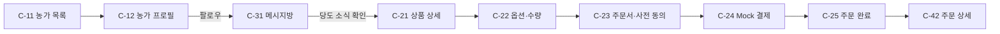
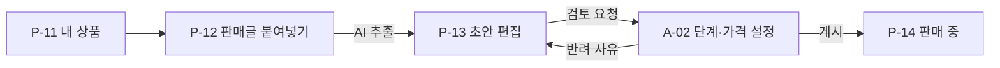
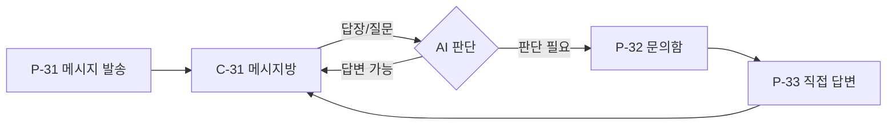
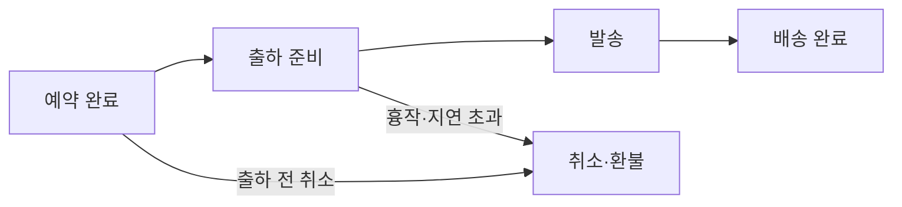

# P15 정보 구조 (IA)

> SWPP-19 · 상태: 초안 · 기준: P14
> 화면 ID 규칙: `S-` 공통, `C-` 소비자, `P-` 생산자, `A-` 운영자. P20 와이어프레임·P21 화면 명세가 같은 ID를 쓴다.

## 1. 앱 구성
- **안드로이드 앱 1개**에 역할(소비자/생산자)을 두고, 로그인한 역할에 따라 하단 탭이 바뀐다. 한 계정은 한 역할만 갖는다 (I1).
- **운영자**는 앱이 아니라 웹 관리자 화면을 쓴다 (P19 스택의 기본 관리자 기능 활용).

## 2. 공통 (S)
```
S-01 스플래시
 └ S-02 로그인 ─ S-03 회원가입 → S-04 역할 선택
                                   ├ 소비자 → C-01 홈
                                   └ 생산자 → S-05 농가 프로필 설정 → P-01 홈
S-06 알림 목록 (앱 내 알림: 주문 상태, 새 메시지, 문의 전달)
```

## 3. 소비자 (C) — 하단 탭 5개
```
[홈] C-01 홈
 ├ 팔로우 농가 새 메시지 미리보기 → C-31 메시지방
 └ 판매 중 상품 (현재 단계·마감 임박순) → C-21 상품 상세

[농가] C-11 농가 목록
 └ C-12 농가 프로필 (소개·대표 사진·팔로우 버튼·판매 상품·메시지방 입장)
     ├ C-31 메시지방
     └ C-21 상품 상세
         └ C-22 옵션·수량 선택 → C-23 주문서(배송지·사전 동의) → C-24 결제(Mock) → C-25 주문 완료

[메시지] C-30 메시지방 목록 (팔로우 농가별, 최근 메시지순)
 └ C-31 메시지방 (농부 메시지 + 내 답장 + AI 답변)

[주문] C-41 내 주문 목록
 └ C-42 주문 상세 (상태 타임라인, 배송 정보, 출하 전 취소)

[MY] C-51 마이페이지
 ├ C-52 배송지 관리
 ├ S-06 알림 목록
 └ 로그아웃
```

## 4. 생산자 (P) — 하단 탭 5개
```
[홈] P-01 대시보드
 ├ 상품별 예약 현황 (옵션별 주문량 / 공급 수량)
 └ 확인 필요 문의 수 → P-32 문의함

[상품] P-11 내 상품 목록 (상태: 초안·검토 중·판매 중·마감·완료)
 ├ P-12 AI 상품 등록: 판매글·텍스트 붙여넣기 (+ 사진 선택)
 │   └ P-13 상품 초안 편집 (AI 추출값 확인·수정) → 검토 요청
 └ P-14 상품 상세 (판매 현황, 단계별 가격 — 읽기 전용)

[메시지] P-31 내 메시지방 (팔로워 전체에게 발송: 텍스트·사진·당도)
 └ P-32 문의함 (소비자 답장·질문: AI 답변 완료 / 확인 필요)
     └ P-33 문의 상세 (대화 보기, AI 답변 확인, 직접 답변)

[주문] P-41 주문 목록 (상품·상태 필터)
 └ P-42 주문 상세 / 출하 처리 (상태 변경, 송장번호 입력)

[MY] P-51 마이페이지
 ├ P-52 농가 프로필 편집 (S-05와 같은 폼)
 ├ S-06 알림 목록
 └ 로그아웃
```

## 5. 운영자 (A) — 웹 관리자
```
A-01 상품 검토 목록 (검토 요청 상품)
 └ A-02 상품 검토·게시 (판매 단계 일정·옵션별 단계 가격 입력 → 게시 / 반려)
A-03 주문 관리 (상태 강제 변경: 흉작·지연 환불 처리)
A-04 사용자·농가 관리
```

## 6. 핵심 사용자 흐름
### F1. 팔로우 → 메시지 → 예약구매 (소비자, 메인 데모)


### F2. AI 상품 등록 → 게시 (생산자 + 운영자)


### F3. 메시지 → 문의 → AI 응답 (Should)


### F4. 주문 처리


## 7. 화면 목록 요약
| 구분 | 화면 수 | ID |
| -- | -- | -- |
| 공통 | 6 | S-01~06 |
| 소비자 | 15 | C-01, C-11~12, C-21~25, C-30~31, C-41~42, C-51~52 |
| 생산자 | 13 | P-01, P-11~14, P-31~33, P-41~42, P-51~52 |
| 운영자(웹) | 4 | A-01~04 |
