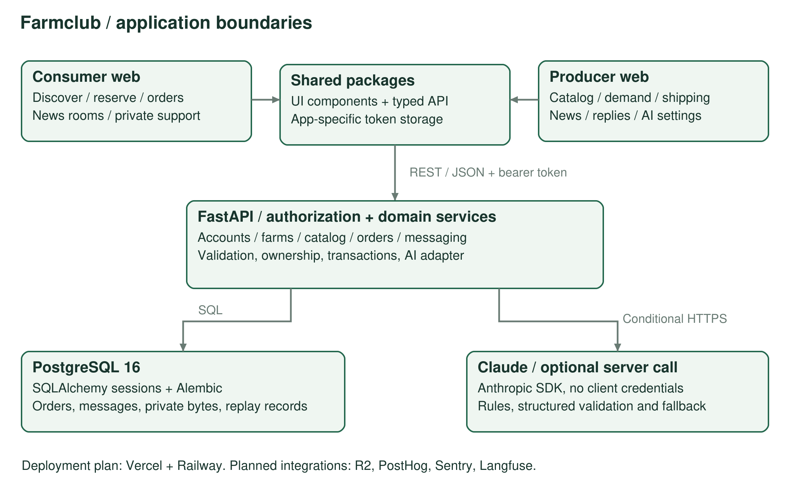
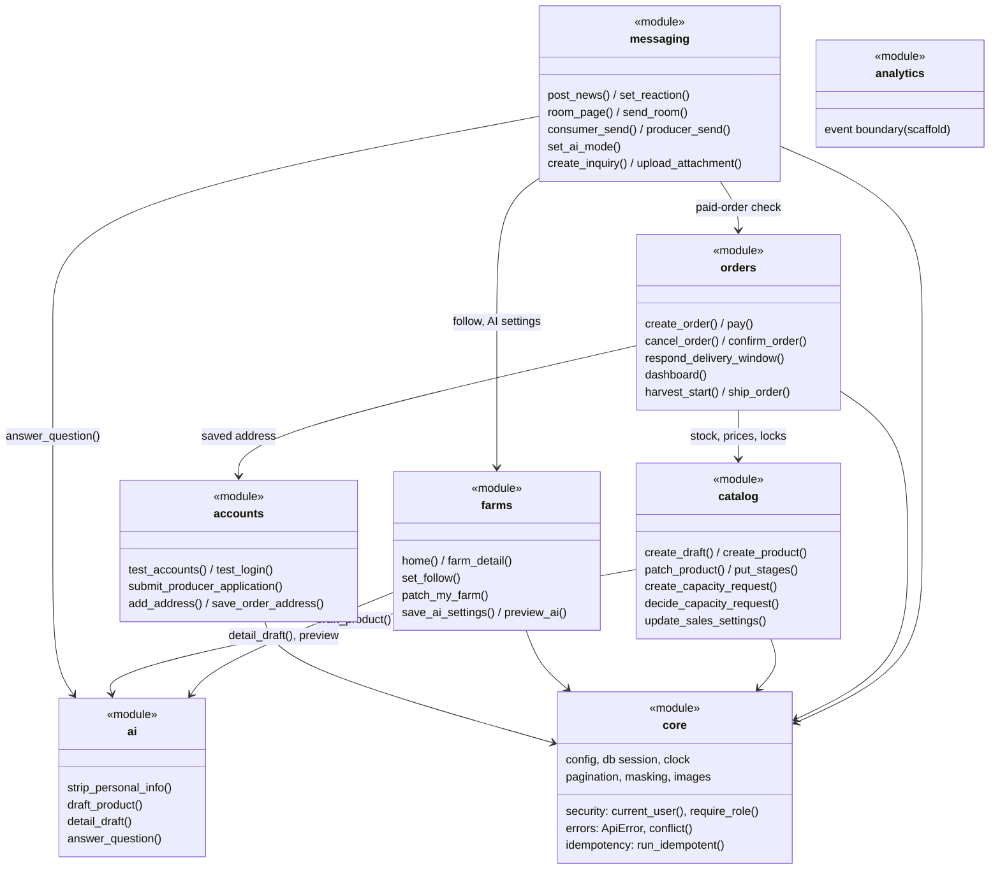
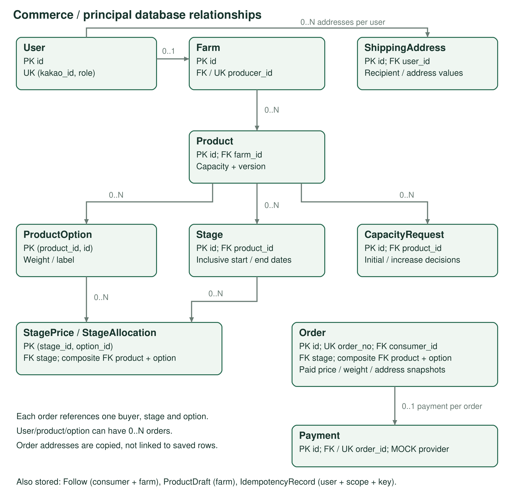
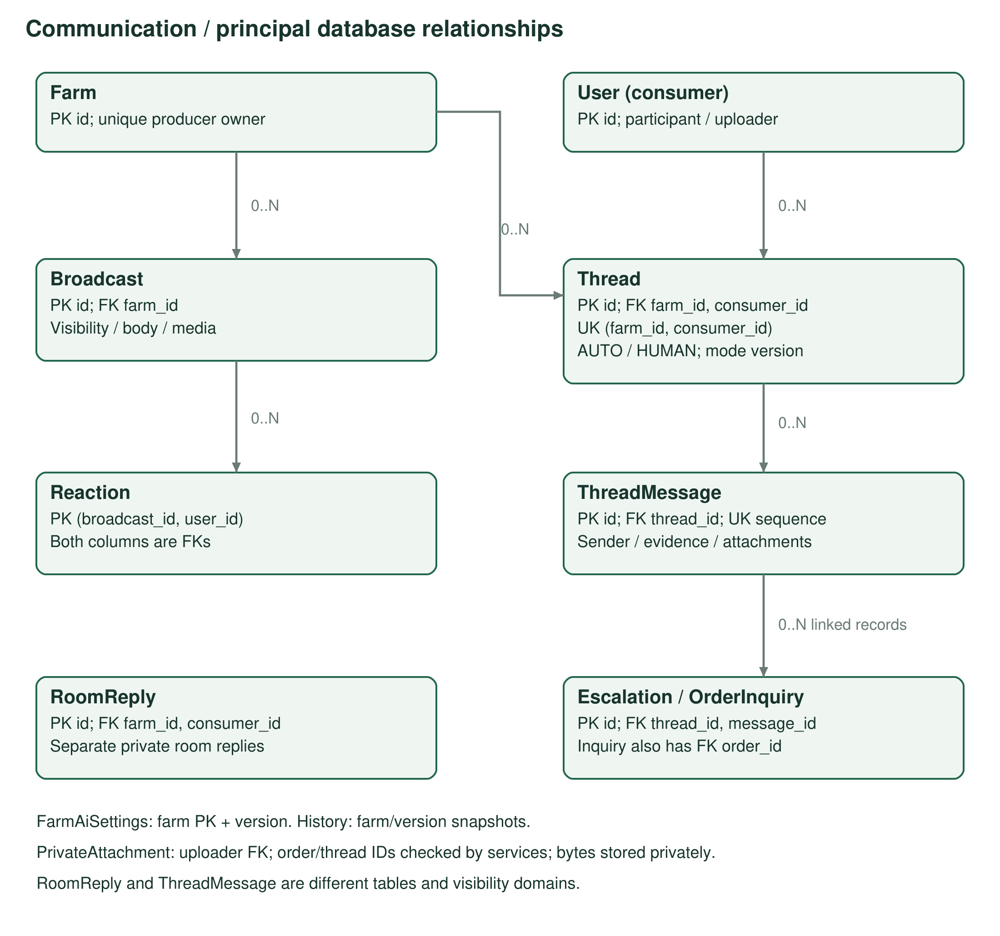
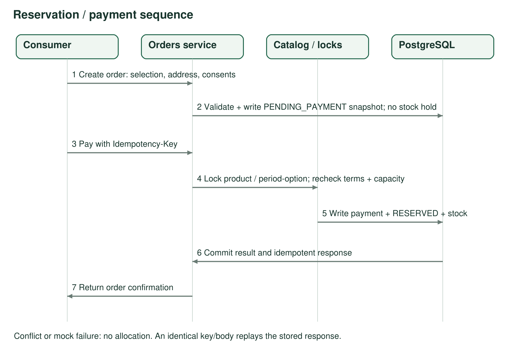

# Design Documentation

Team 6 | Farmclub | Iteration 1 | 9 October 2026

This page is for the development team. It explains how the system is built so we can split work and so another developer can run and extend it. Test plans and results are in [Testing Documentation](https://github.com/snuhcs-course/swpp-2026-project-team-06/wiki/Testing-Documentation).

## Table of Contents

- [Document Revision History](#document-revision-history)
- [1. System Architecture](#1-system-architecture)
- [2. Design Details](#2-design-details)
  - [2.1 Frontend class diagram](#21-frontend-class-diagram)
  - [2.2 Backend class diagram](#22-backend-class-diagram)
  - [2.3 Database model](#23-database-model)
  - [2.4 API specification](#24-api-specification)
  - [2.5 Key flows](#25-key-flows)
  - [2.6 AI components](#26-ai-components)
  - [2.7 Implementation decisions](#27-implementation-decisions)
- [3. Design Patterns](#3-design-patterns)
- [4. Implementation Status](#4-implementation-status)
- [5. Running Locally and Source Map](#5-running-locally-and-source-map)

## Document Revision History

| Version | Date | Author | Major changes |
| --- | --- | --- | --- |
| 0.1 | 2026-10-07 | Team 6 | Initial sitemaps, flows, data model and order states |
| 0.2 | 2026-10-07 | Team 6 | Replace Django plan with FastAPI and operator API (ADR 0007/0008) |
| 0.3 | 2026-10-07 | Team 6 | Separate accounts, screen/state details and seed contracts |
| 0.4 | 2026-10-08 | Team 6 | Synchronize design frames with specs 1.2-1.5 |
| 1.0 | 2026-10-09 | Team 6 | Submission edition: architecture, ER diagrams, API, AI and concurrency details |
| 1.1 | 2026-10-09 | Team 6 | Table of contents, frontend and backend class diagrams, API request/response examples, design-pattern section, restructured to the course guideline |

## 1. System Architecture

Farmclub is a client-server system. Two Expo web apps (consumer and producer) talk to one FastAPI server over REST/JSON. The server owns every business rule, permission check, database write and AI call. The two apps share a UI package and an API client package. This page describes the code on `main` (commit 8f2b8a5); product code has not changed since the I1 baseline 747f588.



Figure 1. Request and data flow. The call to Claude only happens when the server has an API key. Hosting and monitoring services at the bottom are the planned production setup.

| Component | Responsibility | Interface |
| --- | --- | --- |
| Consumer app | Discovery, checkout, orders, news rooms, private chat, order inquiries | REST/JSON through `packages/api` |
| Producer app | Approval gate, products and sales settings, dashboard, shipping, chat | Same server; separate account role and token storage |
| `packages/ui` | Design tokens and shared components (bars, chat, news room, story) | React Native components |
| `packages/api` | Typed endpoint functions, token storage, error mapping, demo (mock) transport | `fetch` with `Authorization: Bearer`; `ApiError` |
| FastAPI server | Routing, validation, access checks, transactions | `/api/...` resources; `/admin/...` capacity decisions |
| PostgreSQL | Accounts, catalog, orders, messages, private attachments, idempotency records | SQLAlchemy 2.0 + psycopg |
| AI adapter (`server/app/ai`) | Product draft extraction, story drafts, question answering | Anthropic SDK (Claude Haiku 4.5) with rule-based fallback |

### 1.1 External libraries

| Layer | Libraries | Notes |
| --- | --- | --- |
| Web clients | Expo, React Native, Expo Router, TypeScript | Two web builds |
| Server | FastAPI, Pydantic v2, pydantic-settings, Uvicorn | OpenAPI generated from routers and schemas |
| Database | SQLAlchemy 2.0, psycopg, Alembic, PostgreSQL 16 | Migrations 0001-0005 |
| Auth | PyJWT | I1 uses seeded test accounts; Kakao login is planned for I2 |
| AI | Anthropic SDK | Model `claude-haiku-4-5` |
| Images | python-multipart, image validation and EXIF removal | Private inquiry photos are stored in PostgreSQL in I1 |
| Planned | Vercel (apps), Railway (server, DB), Cloudflare R2, PostHog, Sentry, Langfuse | Chosen in the stack; not wired up yet (see section 4) |

Exact versions are in `package-lock.json` and `server/uv.lock`.

### 1.2 Architectural decisions

| Decision | Why | What it means in the code |
| --- | --- | --- |
| Two web apps instead of one (ADR 0001/0010) | Consumers and producers do different jobs and need different permissions | Separate routes and token storage; the server still checks the role on every call |
| Client-server, all rules on the server | Payment, stock and order state must stay consistent across both apps | Apps never decide prices or stock; they show what the server returns |
| FastAPI modular backend (ADR 0007) | Typed requests and responses and generated API docs | One folder per domain with `router`, `schemas`, `service`, `models` |
| REST + polling, no WebSocket | Chat volume is small in I1 and REST is simpler to test | Open chat screens refresh every 2 seconds; no push delivery |
| PostgreSQL transactions and row locks | Two people must never buy the same last box | Payment locks the product and period allocation before checking stock |
| One AI adapter (ADR 0004) | Keep the API key and prompt details out of the rest of the code | Only `server/app/ai` calls the model; callers get structured results |
| Seeded test login (ADR 0009) | Reproduce every account state (pending, rejected, suspended) without real identities | Test accounts only, behind an explicit on/off flag |
| Operator API before operator UI (ADR 0008) | An operator screen is not needed to demo I1 | Capacity approval works through `/admin` and Swagger UI |
| Copy order data at payment | Later edits to a product or address must not change paid orders | Price, weight, address and delivery window are copied into `Order` |

ADR 0002 (Django) was replaced by ADR 0007/0008.

## 2. Design Details

### 2.1 Frontend class diagram

Both apps are built from Expo Router screens. A screen loads data with the `useAsync` or `useLiveList` hook, calls an endpoint group from `packages/api`, and draws itself with components from `packages/ui`. The diagram shows the main classes and modules, not every file.

```mermaid
classDiagram
  direction LR
  class ConsumerApp {
    <<Expo Router>>
    (tabs) Discover / My Orders / Chat / Me
    products/[id]
    checkout/[productId]
    login
  }
  class ProducerApp {
    <<Expo Router>>
    (tabs) Dashboard / Products / Chat / Settings
    login / apply / pending / suspended
    ship / broadcast / news
  }
  class ApiClient {
    <<packages/api client.ts>>
    configureApi(namespace)
    request~T~(method, path, opts)
    getToken() / setToken()
    newIdempotencyKey()
    uploadAttachment()
  }
  class ApiError {
    status
    code
    message
    details.reason
  }
  class Endpoints {
    <<packages/api endpoints.ts>>
    auth
    farms
    catalog
    orders
    messaging
  }
  class MockTransport {
    <<packages/api mock>>
    demo data for EXPO_PUBLIC_API_MOCK=1
  }
  class Hooks {
    <<packages/ui>>
    useAsync(fn, deps)
    useLiveList(load, scope, active, interval=2000)
  }
  class UIComponents {
    <<packages/ui>>
    Screen, HeaderBar, TabBar, BottomBar, Sheet
    Button, Input, Chip, Icon
    ChatThread, ChatBubble, AiBadge
    NewsRoom, ConversationRow, DetailStory
  }
  class Tokens {
    <<packages/ui tokens.ts>>
    colors, type scale, spacing
  }
  ConsumerApp --> Endpoints : calls
  ProducerApp --> Endpoints : calls
  ConsumerApp --> Hooks
  ProducerApp --> Hooks
  ConsumerApp --> UIComponents
  ProducerApp --> UIComponents
  UIComponents --> Tokens
  Endpoints --> ApiClient : request()
  ApiClient --> ApiError : throws
  ApiClient ..> MockTransport : when mock mode is on
```

| Module | What it does |
| --- | --- |
| `configureApi(namespace)` | Each app calls it once with `consumer` or `producer`, so the two apps keep separate tokens in `localStorage` |
| `request<T>()` | Adds the bearer token, sends JSON, and turns error responses into `ApiError` (status, code, message, details) |
| `Endpoints` | One object per server domain (`auth`, `farms`, `catalog`, `orders`, `messaging`). Order creation and payment add an idempotency key automatically |
| `useAsync` | Loads screen data and keeps what is already shown if a reload fails |
| `useLiveList` | Polls an open chat or room every 2 seconds and merges new messages by ID |
| `UIComponents` | Shared layout and chat components so both apps look like one product |

### 2.2 Backend class diagram

The server is split into domain modules. Each module has a `router` (HTTP and permission checks), `schemas` (Pydantic request/response models), `service` (business logic as functions) and `models` (SQLAlchemy tables). Modules call each other only through service functions. `core` holds shared infrastructure.



| Module | Main tables it owns | Talks to |
| --- | --- | --- |
| `core` | `IdempotencyRecord` | Used by every module |
| `accounts` | `User`, `ShippingAddress` | `farms` for producer applications |
| `farms` | `Farm`, `Follow`, `FarmAiSettings`, `FarmAiSettingsHistory` | `catalog` for product summaries, `ai` for story drafts and previews |
| `catalog` | `Product`, `ProductOption`, `Stage`, `StagePrice`, `StageAllocation`, `CapacityRequest`, `ProductDraft` | `orders` for usage, `ai` for draft extraction |
| `orders` | `Order`, `Payment` | `catalog` for locks and allocation, `messaging` for inquiries |
| `messaging` | `Broadcast`, `Reaction`, `RoomReply`, `Thread`, `ThreadMessage`, `Escalation`, `OrderInquiry`, `PrivateAttachment` | `farms`, `orders`, `ai` |
| `ai` | None (stateless) | Returns structured results; the caller saves them |

When one action touches several modules (for example, payment updates `Order`, `Payment` and `StageAllocation`), the services share one SQLAlchemy session so everything commits or rolls back together.

### 2.3 Database model

#### Accounts and commerce



Figure 2. PK = primary key, FK = foreign key, UK = unique constraint. Timestamps and display-only fields are left out.

| Table | Key data | Keys and relationships |
| --- | --- | --- |
| `User` | Role (consumer or producer), test-account flag, name, phone | String PK; one role per account |
| `ShippingAddress` | Recipient, phone, address, default flag | User 1:N; orders copy the values |
| `Farm` | Owner, approval status and reason, profile, story blocks (JSON) | UK producer_id; user 1:0..1 farm |
| `Follow` | Consumer, farm, created time | PK (consumer_id, farm_id) blocks duplicate follows |
| `Product` | Farm, quality, delivery window, fees, status, capacity, version, story blocks | Farm 1:N |
| `ProductOption` | Weight in kg, label, sort order | PK (product_id, id) |
| `Stage` | Start and end date (inclusive), order | Product 1:N |
| `StagePrice` / `StageAllocation` | Price; box quantity and reserved count | PK (stage_id, option_id) |
| `CapacityRequest` | Initial or increase, requested grams, decision, status, version | Product 1:N history |
| `Order` | Buyer, product, option, period, quantity, copied price/weight/address, consents, status | UK order_no |
| `Payment` | Method, provider (MOCK), amount, status, time | UK order_id; order 1:0..1 |
| `ProductDraft` | Pasted text, extracted fields, missing fields, failed flag | Farm-owned |
| `IdempotencyRecord` | User, scope, key, body hash, stored response | UK (user_id, scope, key); kept 24 hours |

#### Communication



Figure 3. News (broadcasts and room replies) and 1:1 chat (threads) are stored separately. Some links, such as an attachment's order or thread, are checked in the service instead of by a database FK.

| Table | Key data and constraints |
| --- | --- |
| `Broadcast` | Farm, text, media URLs, PUBLIC or FOLLOWERS, like count |
| `Reaction` | PK (broadcast_id, user_id): one like per person per post |
| `RoomReply` | Farm, consumer, masked text; only that consumer and the farm can read it |
| `Thread` | UK (farm_id, consumer_id); AUTO or HUMAN mode, mode version, read positions |
| `ThreadMessage` | Thread, increasing sequence number, sender type, masked text, attachments, AI evidence, handoff state |
| `Escalation` | Question handed to the producer: reason, OPEN or ANSWERED, reply |
| `FarmAiSettings` / `FarmAiSettingsHistory` | On/off, version, guidelines, FAQs, handoff topics, and each saved version |
| `OrderInquiry` | Order, thread, problem type, OPEN or RESOLVED, version |
| `PrivateAttachment` | Uploader, order or thread, MIME type, bytes, bound flag |

#### Rules the data must keep

- Money is an integer in won. Supply limits and the weight copied into an order are integers in grams; `ProductOption` keeps `weight_kg` for display.
- `reservedGrams + shippedGrams <= salesLimitGrams <= approvedSupplyGrams`. Usage is calculated from paid orders, their `unit_weight_grams` and `released_quantity`.
- A paid order holds `max(0, quantity - released_quantity)` boxes. `shipped_at` decides whether that weight counts as reserved or shipped.
- `StageAllocation` adds a separate box limit per period and option.
- A refund after shipping never gives capacity back.
- Period dates are inclusive and in KST. `FIXED_NOW` pins the clock for demos and tests.

| Migration | Adds |
| --- | --- |
| 0001 | Accounts, farms, catalog and orders |
| 0002 | Messaging: rooms and threads |
| 0003 | AI settings, order inquiries, private attachments |
| 0004 | Weight-based supply and capacity requests |
| 0005 | Farm and product story content |

### 2.4 API specification

#### Common rules

- App endpoints are under `/api`; operator capacity decisions are under `/admin/products`. `GET /health` and `GET /openapi.json` are at the root, and Swagger UI is at `/docs`.
- JSON fields are camelCase. Protected endpoints need `Authorization: Bearer <token>`.
- Errors always look like `{ "code", "message", "details" }`: 400 `VALIDATION_ERROR`, 401 not logged in, 403 `FORBIDDEN` (with `details.reason = WRONG_APP` for the other app's account), 404 not found or hidden, 409 `CONFLICT` with a reason such as `STAGE_CHANGED`, `SOLD_OUT`, `INVALID_TRANSITION`, `STALE_VERSION` or `IDEMPOTENCY_MISMATCH`.
- Lists use `limit` (default 20, max 50) and an opaque `cursor`, and return `{ items, nextCursor }`.
- Order creation, payment and versioned edits require an `Idempotency-Key` header.

#### Example: create an order and pay

`POST /api/orders` (consumer, `Idempotency-Key` required)

```json
{
  "productId": "p-house",
  "optionId": "opt-5",
  "quantity": 1,
  "recipientName": "Kim Minji",
  "recipientPhone": "010-0000-0000",
  "postalCode": "04001",
  "address": "Seoul, Mapo-gu ...",
  "addressDetail": "302",
  "deliveryNote": "Leave at the door",
  "consents": { "deliveryWindow": true, "delayRefund": true, "shortage": true, "cancelPolicy": true },
  "consentVersion": "2026-10-07",
  "saveAddress": true
}
```

Response `200`: an unpaid order with the server's price.

```json
{
  "orderId": "o-...",
  "orderNo": "FC-1007-0001",
  "status": "PENDING_PAYMENT",
  "quantity": 1,
  "unitPrice": 29000,
  "shippingFee": 0,
  "remoteAreaFee": 0,
  "totalAmount": 29000,
  "deliveryWindow": { "start": "2026-11-10", "end": "2026-11-20" }
}
```

`POST /api/orders/{orderId}/pay` with `{ "mockResult": "success" }` returns `{ "order": { ...status: "RESERVED" }, "result": "success", "failReason": null }`. If the period or price changed, or the last box was just sold, it returns:

```json
{ "code": "CONFLICT", "message": "이 단계 물량이 다 팔렸어요.", "details": { "reason": "SOLD_OUT", "productId": "p-house" } }
```

#### Example: AI product draft

`POST /api/products/drafts` (approved producer) with `{ "inputText": "[강씨네 귤밭] 올해 하우스 감귤 ... 5키로 3만원" }` returns the extracted fields, a `missingFields` list and a `failed` flag. A price in the text is never copied into the draft. If the model fails or times out, `failed` is true and the producer fills in the product by hand.

#### Endpoint groups

Paths use `{id}` as a placeholder.

| Method and path | Caller | Purpose |
| --- | --- | --- |
| GET /api/auth/test-accounts · POST /api/auth/test-login | Anyone, when test login is on | Account list for the app; login returns a JWT |
| GET /api/auth/me | Logged in | Current account |
| GET · POST /api/auth/producer-application | Producer | Read or submit the farm application |
| GET · POST · PATCH · DELETE /api/auth/me/addresses | Consumer | Address book |
| GET /api/home · GET /api/farms · GET /api/farms/{id} | Anyone | Home, farm list, farm page |
| PUT · DELETE /api/farms/{id}/follow | Consumer | Follow and unfollow |
| GET · PATCH /api/farms/me | Farm owner | Own profile and story |
| GET · PUT /api/farms/me/ai-settings · POST .../preview | Farm owner | AI settings and preview |
| GET /api/products/{id} | Anyone | Published product |
| GET /api/products/mine · POST /api/products/drafts · POST /api/products | Approved producer | Own products, AI draft, new product |
| PATCH /api/products/{id} · PUT /api/products/{id}/stages · PUT .../sales-settings | Owner | Edit product, periods and prices, sales limit and pause |
| GET · POST /api/products/{id}/capacity-requests · POST .../{requestId}/withdraw | Owner | Supply requests |
| POST /admin/products/{id}/capacity-requests/{requestId}/approve · .../reject | Operator | Approve or reject supply |
| POST /api/orders · POST /api/orders/{id}/pay | Consumer | Create order, pay |
| GET /api/orders · GET /api/orders/{id} | Order owner | History and detail |
| POST /api/orders/{id}/cancel · .../confirm · .../delivery-window-response | Order owner | Cancel, confirm receipt, answer a window change |
| GET /api/orders/producer/dashboard · GET /api/orders/producer | Approved producer | Dashboard and orders to ship |
| POST /api/orders/producer/harvest-start · POST /api/orders/{id}/ship | Owning producer | RESERVED → PREPARING → SHIPPED |
| GET · POST /api/messaging/rooms/{farmId}/messages · POST /api/messaging/news | Follower / owner | Room page, private reply, broadcast |
| PUT · DELETE /api/messaging/news/{id}/reaction | Consumer | Like and unlike |
| GET · POST /api/messaging/chats · .../chats/{farmId}/messages | Consumer | Chat list, start, history, send |
| GET · POST /api/messaging/producer/chats/{consumerId}/messages · PUT .../ai-mode | Owning producer | Reply; switch AUTO or HUMAN |
| POST /api/orders/{id}/inquiries | Paid-order owner | Order problem inquiry |
| POST /api/messaging/attachments · GET .../{id} | Participants | Upload and read a private photo |

Room lists, read positions, question lists and inquiry status endpoints are also available; the full list is in OpenAPI at `/docs`.

### 2.5 Key flows

#### Reservation and payment



Figure 4. Checkout creates an unpaid order without holding stock. Stock is checked and taken only at payment.

1. The consumer picks an option and quantity and accepts four consents.
2. `POST /api/orders` checks the current period, price, limits and address, and copies them into a `PENDING_PAYMENT` order.
3. `POST /api/orders/{id}/pay` locks the product and period allocation and checks the order against the current terms.
4. If the period or price changed or stock ran out, it returns 409 and the app asks the user to confirm again. A simulated failure takes no stock.
5. On success it records `Payment`, sets `RESERVED` and takes the stock in the same transaction.
6. Sending the same request with the same key returns the saved result, so nothing is charged or taken twice.

#### Order states

| From | Action | To | Stock |
| --- | --- | --- | --- |
| PENDING_PAYMENT | Payment succeeds | RESERVED | Boxes and weight reserved |
| RESERVED | Producer starts harvest | PREPARING | No change |
| RESERVED / PREPARING | Consumer cancels | REFUNDED | Unshipped quantity released once |
| PREPARING | Producer ships | SHIPPED | Weight moves from reserved to shipped |
| SHIPPED | Delivery confirmed | DELIVERED | No change (operator/courier step, not in the I1 operator API) |
| DELIVERED | Consumer confirms receipt | COMPLETED | No change |

- Any other transition is rejected with `INVALID_TRANSITION`.
- Shipping several orders at once calls the ship endpoint once per order; it is not one bulk transaction.
- Refund status, reason and time are stored on `Order` and `Payment`. There is no separate refund table.

### 2.6 AI components

#### Product draft and story draft

1. The producer sends text through a farm or catalog endpoint.
2. `strip_personal_info()` removes phone numbers and account numbers. Prices and dates stay in sales settings, never in generated text.
3. `draft_product()` asks Claude for a fixed JSON schema. No key, invalid output or a timeout returns a failed draft so the producer can fill it in by hand (N-04, 20-second budget).
4. `detail_draft()` builds a rule-based story from the farm's own data first, then asks Claude to improve it when a key is set. Output blocks and chosen photo URLs are validated. The response says `mode: ai` or `mode: mock`.
5. Nothing is published until the producer saves.

#### Question answering and handoff

1. Check that the farm has AI on and the thread is AUTO.
2. Questions on fixed handoff topics go straight to the producer: pesticide and growing claims, refunds, compensation, subjective taste, damage, delivery promises.
3. Simple facts are answered by rules first: delivery window and fee, measured or expected sweetness, FAQ, policy text.
4. Otherwise Claude is called with selected evidence only. Shipping details and private photos are never sent.
5. The model returns ANSWER or HANDOFF. No key, a model error or weak evidence means HANDOFF.
6. Before saving the answer, the service checks that the thread mode and AI settings version have not changed. A producer reply switches the thread to HUMAN; turning AUTO back on only affects later messages.

The answer is generated inside the request while the thread row is locked. This keeps ordering simple in I1, but a slow model call makes the request slower. Moving it to a background worker is a candidate for a later iteration.

### 2.7 Implementation decisions

| Problem | What we do | Why |
| --- | --- | --- |
| Two buyers, one box left | Lock the product, then the period/option allocation, then recheck usage | Only one payment can take the last box |
| Product edits after payment | Copy unit price and unit weight into `Order` | Paid orders never change |
| Cancel pressed twice | `released_quantity` and `shipped_at` guard the release | Stock is given back once, and never after shipping |
| Two people editing the same product or settings | Version number on product, capacity request and AI settings | The second save gets `STALE_VERSION` instead of overwriting |
| Retried requests | Store user + scope + key, a hash of the body, and the response | Same request gets the same answer; a changed body is rejected |
| Old idempotency records | Kept 24 hours, cleaned up when touched | Keeps the table small |
| Late AI answer after the producer takes over | Thread lock plus mode and settings versions | A stale AI answer is never saved |
| Message order in chat | Unique sequence number per thread | Stable read positions and page merging |
| Privacy in rooms | Filter by viewer before paging and previews | Other buyers' replies never leak into counts or previews |
| Private photos | MIME and size checks, EXIF removed, served only after an access check, unbound files expire after 24 hours | Inquiry photos stay between buyer and farm |
| Chat updates | Poll every 2 seconds on open screens only | Simple and enough for I1 traffic; no socket server to run |

## 3. Design Patterns

Detailed write-ups are due in Iteration 5. Patterns already in the code that we plan to document:

- **Adapter:** `server/app/ai` hides the Anthropic SDK behind `draft_product()`, `detail_draft()` and `answer_question()`, with a rule-based fallback.
- **Service layer:** routers only validate and check permissions; business logic lives in each module's `service.py`.
- **Idempotency key:** `core/idempotency.py` replays a stored response for a repeated request.
- **Optimistic concurrency:** version numbers on products, capacity requests and AI settings.
- **Snapshot:** orders copy price, weight and address at payment time.

## 4. Implementation Status

Working in I1 against the real server: reservation, simulated payment, fulfillment, capacity approval, private messaging, AI settings, order inquiries and farm stories.

Not built yet:

| Planned | Current state |
| --- | --- |
| Server-rendered share page `/s/farms/{id}` for KakaoTalk previews | No route yet; the farm link opens the consumer app directly |
| Operator APIs for approval, refunds and delivery | Only capacity approval is available |
| Automatic purchase confirmation after 8 days, scheduled refunds | No scheduler yet |
| Cloudflare R2 for public media | Private photos are stored in PostgreSQL; public media upload is not wired up |
| PostHog, Sentry, Langfuse | Chosen in the stack; not connected |
| Producer-specific remote delivery areas | Uses an example postal-code rule |

## 5. Running Locally and Source Map

### 5.1 Setup

1. Node.js from `.nvmrc` with npm workspaces; Python 3.12 with uv; PostgreSQL 16 from `server/docker-compose.yml`.
2. Server: `uv sync`, `docker compose up -d`, `uv run alembic upgrade head`.
3. Demo data (local database only): `uv run python -m app.core.seed --reset`.
4. Set `MOCK_LOGIN_ENABLED=true` and `FIXED_NOW=2026-10-07T10:00:00+09:00` for the seeded scenario.
5. Start the server from `server/`: `uv run uvicorn app.main:app --host 127.0.0.1 --port 8000`.
6. Start each app with `EXPO_PUBLIC_API_MOCK=0`, `EXPO_PUBLIC_API_URL=http://127.0.0.1:8000` and no `EXPO_PUBLIC_SHARED_MOCK_URL`, on ports 8081 and 8082.
7. Outside local runs, set `JWT_SECRET`. An Anthropic key is only needed for real AI generation. Never commit secrets.

### 5.2 Where to look in the code

| Topic | Files |
| --- | --- |
| Routers and CORS | `server/app/main.py` |
| Login and roles | `server/app/core/security.py`, `server/app/accounts/router.py` |
| Orders, stock and capacity | `server/app/orders/service.py`, `server/app/catalog/service.py` |
| Idempotency and errors | `server/app/core/idempotency.py`, `server/app/core/errors.py` |
| Chat, privacy and attachments | `server/app/messaging/service.py`, `server/app/messaging/models.py` |
| AI | `server/app/ai/service.py` |
| Database | `server/app/*/models.py`, `server/migrations/versions/0001-0005` |
| Frontend API client | `packages/api/src/client.ts`, `packages/api/src/endpoints.ts` |
| Shared UI | `packages/ui/src/` |
| Screen designs | `docs/design/README.md`, `docs/design/screens/` |

Product behavior is defined in [docs/spec](https://github.com/snuhcs-course/swpp-2026-project-team-06/tree/main/docs/spec).
