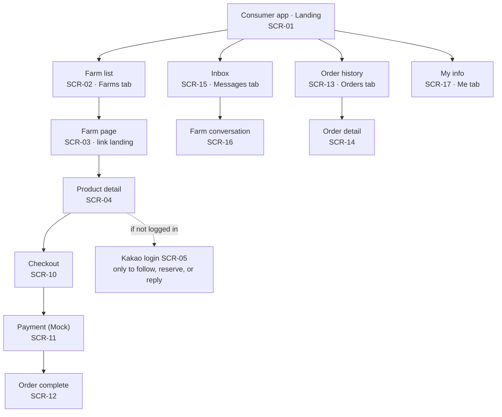
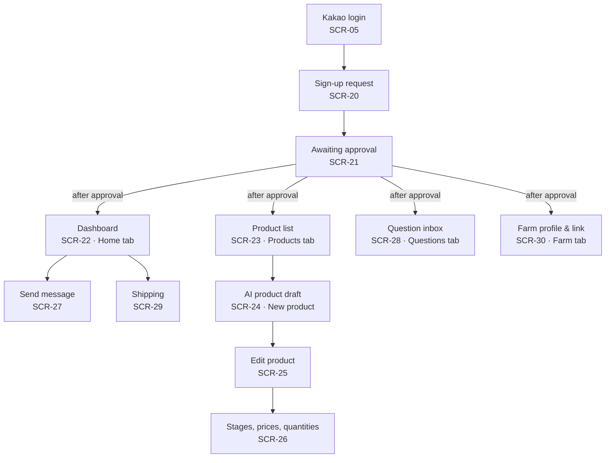
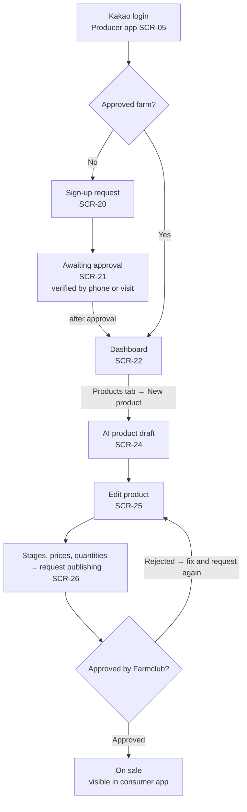
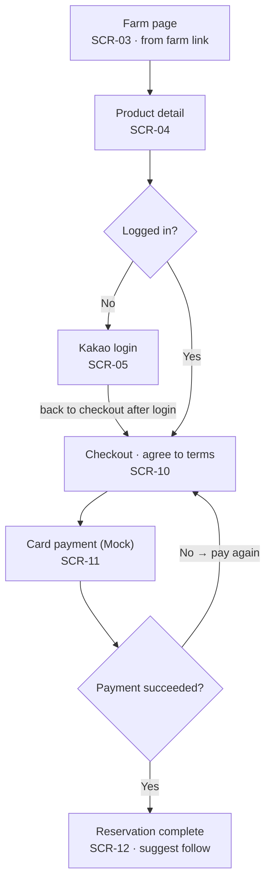
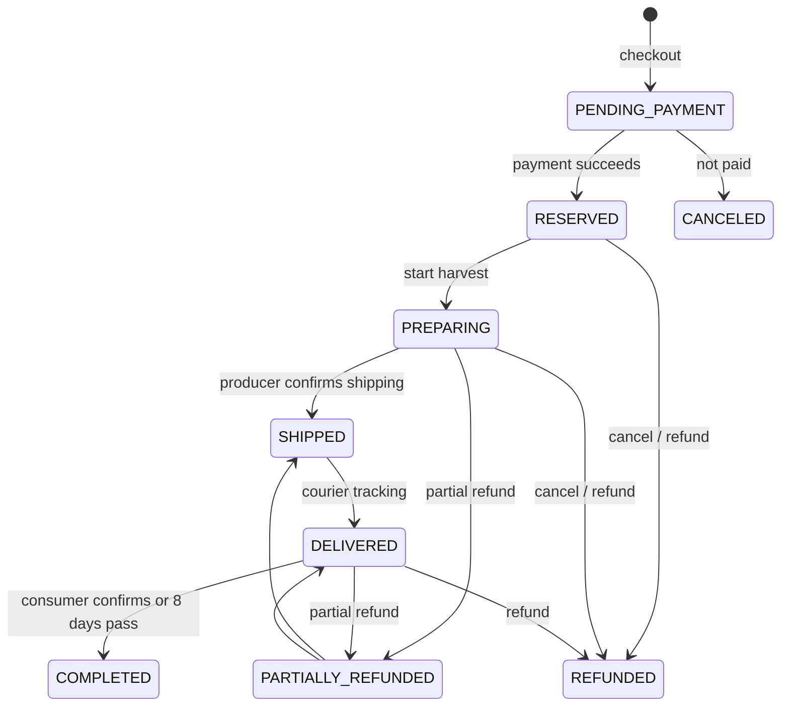

# Design Documentation

## Document Revision History

| Version | Date | Author | Changes |
| -- | -- | -- | -- |
| 0.1 | 2026-10-07 | Team 6 | Initial draft: sitemaps, user flows, data model summary, order states |

## 1. System Architecture

### 1.1 High-Level Architecture

### 1.2 Component Overview

### 1.3 Key Data Flows

### 1.4 Technology Stack & External Libraries

### 1.5 Architectural Decisions & Rationale

## 2. Design Details

### 2.1 Frontend Design

I1 has 24 screens: 5 public, 8 consumer, and 11 producer. There are no operator screens. There are two mobile web apps, a consumer app and a producer app, and one Kakao account works for both. Each app has four bottom tabs.

#### Sitemap: consumer app

Consumers usually arrive at a farm page (SCR-03) from a link the farm sent. Login is needed only to follow, reserve, or reply.

#### Sitemap: producer app

Producers must log in, apply, and wait for approval before the tabs open. In I1, operators handle approval, delivery completion, and refunds with scripts.

#### Flow F-1: producer sign-up and product registration (S-1)

While awaiting approval, other producer screens are locked. A rejected product can be fixed and submitted again. Once on sale, the producer copies the farm link from the Farm tab (SCR-30) and sends it to regular customers.

#### Flow F-2: consumer reservation order (S-2)

Login happens only after tapping "Reserve", and the user returns straight to checkout. After the reservation is complete, the user can go to order history (SCR-13).

### 2.2 Backend Design

### 2.3 Data Model

This is the draft model from the technical design. It lists the minimum fields. Fields can be added during implementation, but names and meanings follow the PRD glossary. The final version will be written after the tech stack decision (P19).

Both apps use the same Kakao account. One `User` can have several roles. Producer app APIs check the `PRODUCER` role and farm approval (`Farm.approvalStatus = APPROVED`) on the server.

| Entity | Key fields | Relation |
| -- | -- | -- |
| `User` | kakaoId, roles (CONSUMER, PRODUCER, ADMIN), name, phone | — |
| `Farm` | producerId, name, region, intro, approvalStatus (PENDING / APPROVED / REJECTED) | 1 producer : 1 farm |
| `Follow` | consumerId, farmId | consumer N : M farm |
| `Product` | name, variety, description, deliveryWindow, maxDelayUntil, expectedBrix, measuredBrix, grade, status (DRAFT / PENDING_APPROVAL / PUBLISHED / CLOSED), shippingFeeType (FREE / SEPARATE), maxQuantityPerOrder | farm 1 : N product |
| `ProductOption` | weightKg | product 1 : N option |
| `Stage` | seq, name, startsAt, endsAt | product 1 : N stage |
| `StagePrice` | price (won) | one per stage × option |
| `StageAllocation` | quantity, reservedCount | one per stage × option |
| `Order` | optionId, stageId, quantity, unitPrice, totalAmount, recipient, address, status, timestamps | — |
| `Payment` | method (CARD), provider (MOCK / PG), amount, status | order 1 : 1 payment |
| `Refund` | amount, reason, refundedAt | order 1 : N refund |
| `Broadcast` | body, attachments, visibility (PUBLIC / FOLLOWERS) | farm 1 : N broadcast |
| `Thread` / `ThreadMessage` | senderType (CONSUMER / PRODUCER / AI), body, sourceRefs | one thread per (farm, consumer) |
| `Escalation` | threadMessageId, status (OPEN / ANSWERED) | forwarded question |
| `ProductDraft` | inputText, output (JSON), missingFields | AI product draft |

Key invariants:

1. `Order.unitPrice` is a copy of the `StagePrice` at order time (R-17).
2. `reservedCount ≤ quantity`. Creating the order and reducing the quantity happen in one transaction (R-06).
3. An order can only use the stage that is open now. Stages of one product do not overlap.
4. `totalAmount = unitPrice × quantity`, in whole won. If shipping is `SEPARATE`, the shipping fee is added (R-20).
5. `deliveryWindow.end ≤ maxDelayUntil`.
6. A product can be `PUBLISHED` only if every option has a stage price and a delivery window is set.
7. A producer can write only their own product's stages, prices, and quantities (R-18).
8. No balance, point, credit, or stored-value fields (R-08).

#### Order states

| State | Meaning | Next states | Changed by |
| -- | -- | -- | -- |
| `PENDING_PAYMENT` | Terms agreed, not paid yet | RESERVED, CANCELED | System |
| `RESERVED` | Paid, waiting for shipping (shown as "Reserved") | PREPARING, REFUNDED | Producer (start harvest), consumer cancel, system (R-09) |
| `PREPARING` | Harvest and shipping prep | SHIPPED, REFUNDED, PARTIALLY_REFUNDED | Producer (ship, FEAT-17), consumer cancel, system (R-09, R-10) |
| `SHIPPED` | Shipped. Consumer can no longer simply cancel | DELIVERED | Operator |
| `DELIVERED` | Delivery confirmed by courier tracking, waiting for purchase confirmation | COMPLETED, REFUNDED, PARTIALLY_REFUNDED | Consumer confirms, system (8 days after delivery, R-14), operator (R-11) |
| `COMPLETED` | Purchase confirmed | — | — |
| `CANCELED` | Ended without payment | — | — |
| `REFUNDED` | Fully refunded | — | — |
| `PARTIALLY_REFUNDED` | Part refunded, the rest still ships | SHIPPED, DELIVERED | Operator |

Transitions not in the table are blocked. On a refund, the refunded quantity goes back to `StageAllocation.reservedCount`.

### 2.4 API Specification

### 2.5 AI Components

### 2.6 Implementation-Level Decisions

## 3. Design Patterns

Source of truth: `docs/spec/ia.md` and `docs/spec/tech-design/README.md` (Korean).
