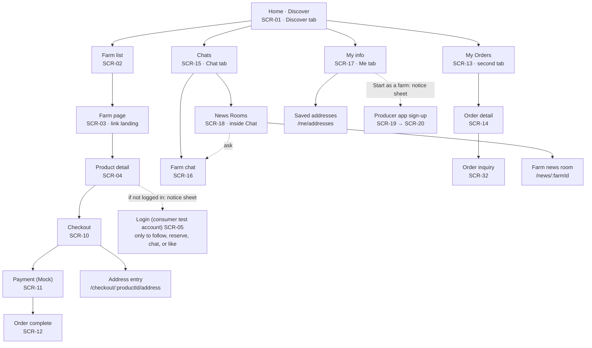
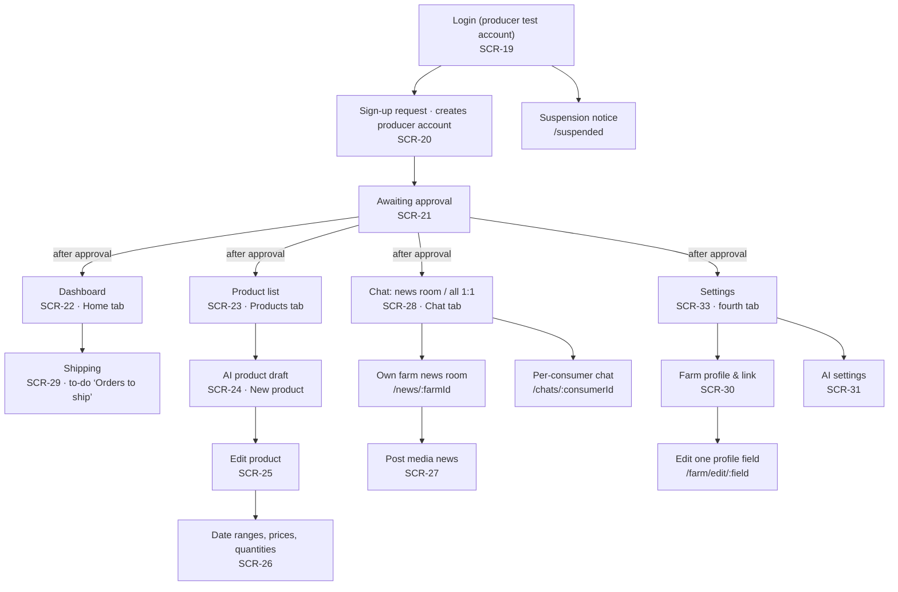
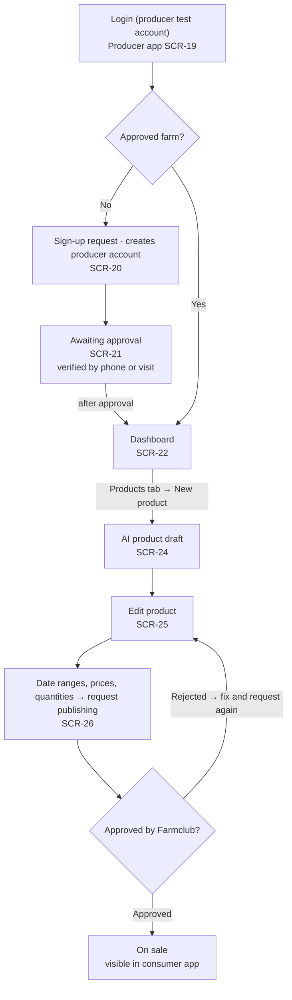
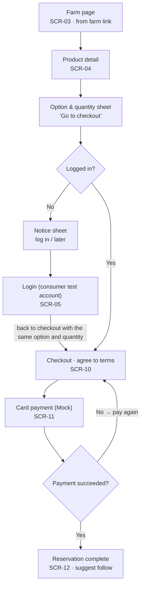
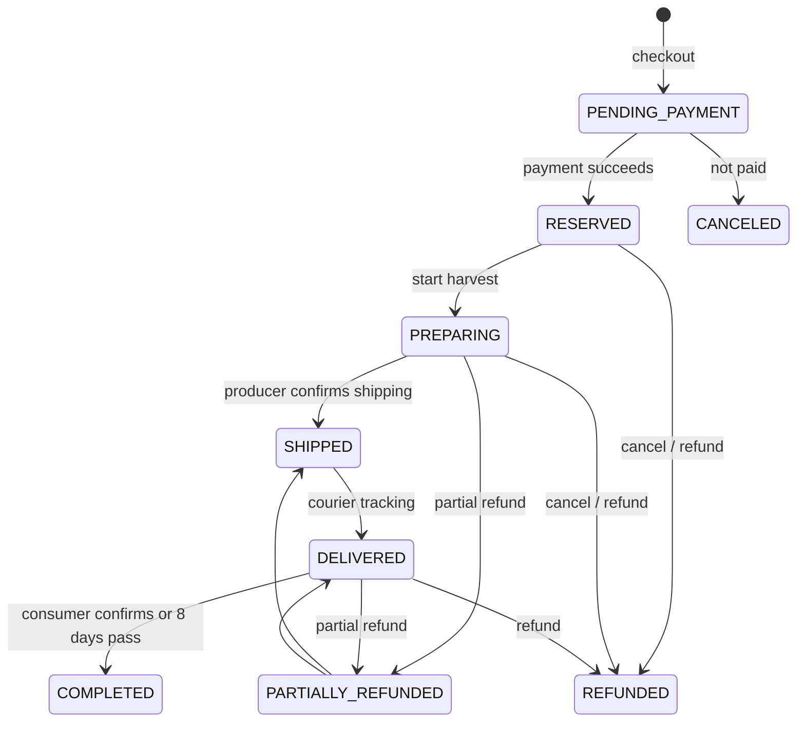

# Design Documentation

## Document Revision History

| Version | Date | Author | Changes |
| -- | -- | -- | -- |
| 0.1 | 2026-10-07 | Team 6 | Initial draft: sitemaps, user flows, data model summary, order states |
| 0.2 | 2026-10-07 | Team 6 | Backend Django → FastAPI; operators use the admin API through Swagger UI instead of Django Admin (ADR 0007, 0008) |
| 0.3 | 2026-10-07 | Team 6 | Synced with the final design (`docs/design/`) and screen spec 1.1: separate consumer and producer accounts (ADR 0010), producer login SCR-19, sub-screens, design rules, seed data, new fields (SWPP-81) |

## 1. System Architecture

### 1.1 High-Level Architecture

There are two Expo web apps (consumer and producer) and one FastAPI server. Both apps call the server's REST API. The server owns the database, file storage, login (I1: mock login with seeded test accounts; Kakao in I2), and all AI calls. Consumer and producer accounts are separate: each account has one role, and each app has its own login (ADR 0010). In I1, operators call admin API endpoints (`/admin/...`) through Swagger UI; a dedicated operator screen comes in I2.

### 1.2 Component Overview

```
apps/
  consumer/        Consumer app (Expo Router, web output)
  producer/        Producer app (Expo Router, web output)
packages/
  ui/              Shared components and design tokens
  api/             API client and types
server/            FastAPI server
  app/
    main.py        App setup, router registration
    core/          Settings, DB session, auth and permissions, common code
    accounts/      Users, roles, mock login (Kakao in I2), producer sign-up and approval, saved addresses (ShippingAddress)
    farms/         Home, farms, follows, search, share links (OG)
    catalog/       Products, weight options, stages, prices, quantities, product approval
    orders/        Orders, mock payment, cancel and refund, harvest and shipping, purchase confirmation, order-time address copy
    messaging/     News, likes, chat, question inbox, contact masking
    ai/            Claude adapter, product draft, inquiry answers, personal data removal (shipping text parsing in I2)
    analytics/     PostHog server events
  migrations/      Alembic migrations
docs/              Spec (docs/spec) and wiki (docs/wiki)
```

Each domain module has `router.py` (API routes), `models.py` (SQLAlchemy models), `schemas.py` (Pydantic input and output), and `service.py` (business logic).

Each code folder has a `spec.md` (implementation decisions) and a `tasks.md` (work log).

### 1.3 Key Data Flows

**Mock login (FEAT-01, ADR 0009) — I1**
1. The app lists its own seeded test accounts from `GET /api/auth/test-accounts?app=consumer|producer` (the consumer app shows only consumer accounts, the producer app only producer accounts).
2. The user picks one and the app posts it to `POST /api/auth/test-login` with `userId` and `app`.
3. The server returns a JWT only when the `MOCK_LOGIN_ENABLED` setting is on and the user is a seeded test account. No new accounts are created.
4. Consumer APIs require the `CONSUMER` role, and producer app APIs require the `PRODUCER` role and farm approval, checked on the server. A token from the other app gets 403 `FORBIDDEN` with `details.reason: WRONG_APP`. Kakao login (ADR 0003) replaces this in I2, and the flag is turned off.

**Share link (FEAT-19)**
1. The producer app copies a server link, `/s/farms/<id>`.
2. That page returns HTML rendered with a Jinja2 template, with OG tags (farm name, intro, main photo), so KakaoTalk and SMS show a preview. People are sent on to the farm page in the consumer app.
3. A farm whose approval was revoked goes to "farm not found".

**AI call (FEAT-03, FEAT-13; FEAT-17 in I2)**
1. Every call goes through one adapter in `server/app/ai`. Other modules do not know the model name.
2. Contact info, addresses, and account numbers are removed before sending.
3. Output must match a fixed JSON format. Anything else is treated as a failure.
4. Input, output, sources, model, and latency are logged in Langfuse.

### 1.4 Technology Stack & External Libraries

| Area | Choice |
| -- | -- |
| Frontend | Expo (React Native, TypeScript) + Expo Router, web output, two apps |
| Web hosting | Vercel |
| Backend | FastAPI + Pydantic v2 + SQLAlchemy 2.0 + Alembic on Railway |
| Operator screens | Admin API (`/admin/...`) + Swagger UI; dedicated screen in I2 |
| Auth | I1: mock login with seeded test accounts → JWT (PyJWT). I2: Kakao login |
| Database | PostgreSQL (Railway) |
| Files | Cloudflare R2 + boto3 |
| AI | Claude API, Claude Haiku 4.5, behind one backend adapter |
| AI observability | Langfuse Cloud |
| Analytics | PostHog Cloud |
| Errors | Sentry |
| Payment | Mock in I1, PortOne (NHN KCP) from I2 |
| CI/CD | GitHub Actions → Railway and Vercel |

### 1.5 Architectural Decisions & Rationale

Each decision has an ADR in `docs/spec/tech-design/adr/`.

| ADR | Decision | Why |
| -- | -- | -- |
| 0001 | Expo web output, two apps | Ship web first, build Android and iOS from the same code later |
| 0002 | Django + DRF, Django Admin for operators (superseded by 0007 and 0008) | Operator screens come almost free. ORM transactions prevent overselling |
| 0003 | Kakao login + JWT (deferred to I2) | Works when the apps and the API are on different domains |
| 0004 | Claude Haiku 4.5 behind one adapter | Fast and cheap. The model can be swapped by changing only the adapter |
| 0005 | PostHog from I1 | Measure PRD metrics without personal data |
| 0006 | Server OG page for share links | Web output apps cannot easily build per-page meta tags for link previews |
| 0007 | FastAPI + Pydantic v2 + SQLAlchemy 2.0 + Alembic (replaces 0002) | Lighter structure and typed API definitions. The OpenAPI schema comes straight from the code |
| 0008 | Admin API + Swagger UI for operators; dedicated screen in I2 (replaces 0002) | No time for an operator screen in I1. The I2 screen will reuse the same API |
| 0009 | I1 mock login with seeded test accounts, behind a setting flag; per-app account lists since 0010 | Demo all roles without external accounts. Risk: anyone with the demo URL can use a test account, so test accounts hold no real data and no admin role |
| 0010 | Separate consumer and producer accounts (changes IA-Q4) | One login screen mixing both roles confused the demo, and one token valid in both apps makes access checks harder. Each account has one role; the same person uses two accounts. Producer sign-up also creates the producer account |

## 2. Design Details

### 2.1 Frontend Design

I1 includes the original screens plus AI settings SCR-31, order inquiries SCR-32, and Settings SCR-33, with sub-screens (address entry, saved addresses, suspension notice, per-consumer chat, edit one profile field, consumer news room, producer news room) and a shared 403 screen. Operators handle approvals, delivery confirmation and refunds by calling admin API endpoints through Swagger UI; a dedicated operator screen comes in I2. There are two mobile web apps, a consumer app and a producer app, with separate accounts: the consumer app logs in at SCR-05 with consumer accounts only, and the producer app logs in at SCR-19 with producer accounts only (ADR 0010). Each app has four bottom tabs: consumer Discover · My Orders · Chat · Me, producer Dashboard · Products · Chat · Settings. Chat contains separate News Rooms (broadcasts and private replies) and 1:1 Chat; consumer screens do not use the word "message". Screen-level specs and the API contract are in `docs/spec/screens.md` (screen structure 1.3; API contract 1.2).

**Design source and rules.** The final design is the Claude Design canvas exported to `docs/design/` (static HTML per frame, plus a README with tokens and rules). Screens, wording, and sizes follow its README; static HTML remains the 1.1 snapshot until the frontend follow-up. Key rules after the design review:

- Tap targets are at least 48px (PRD N-02). Small visible buttons, such as the 40px round buttons over photos, get a 48px hit area.
- Type scale: body 17, input 16 (prevents iOS zoom), secondary 15, meta (dates, chips, tabs, "n reserved", times) 15. Pretendard variable web font first, tabular numbers.
- Spacing uses a 4px grid (4, 8, 12, 16, 20, 24, 32, 40). Thumbnails come in three sizes: 104 (browse lists), 64 (order summaries, producer lists), 40 (avatars). News photos are 7:4.
- One accent-colored main button per screen. Exceptions: unread badges, the "rejected" label, and the "Follow" button before following (SCR-03, SCR-12). After following it becomes a neutral "Following" toggle.
- Header types: tab root = large title, list sub-screen = 48px bar + large title, task screen = 48px bar with centered title, photo screen = round buttons over the photo. Close (X) only for full screens that slide up.
- Success toasts are used for posting news, saving, saving a tracking number, saving or deleting an address, canceling a reservation, unfollowing, and copying a link. Network errors show one shared "connection is unstable" toast with retry.
- On desktop the app is centered at a maximum width of 480px on a #F5F5F3 background. Light mode only in I1 (`color-scheme: light`); safe-area insets are added at the top and bottom.
- Consumer screens say "harvesting & packing" and "in delivery" for the order states the producer app calls "preparing" and "shipped". The API state values do not change.

#### Sitemap: consumer app

The consumer app opens on Home · Discover (SCR-01); a link the farm sent opens the farm page (SCR-03). Login is needed only to follow, reserve, chat, or like. Order history lives under Me.



#### Sitemap: producer app

Producers log in with a producer account (SCR-19), apply, and wait for approval before the tabs open. Signing up creates the producer account; it is separate from any consumer account. In I1, operators handle approval, delivery completion, and refunds through admin API endpoints in Swagger UI.



#### Flow F-1: producer sign-up and product registration (S-1)



While awaiting approval, other producer screens are locked. A rejected product can be fixed and submitted again. Once on sale, the producer copies the farm link from Settings → Farm profile (SCR-33 → SCR-30) and sends it to regular customers.

#### Flow F-2: consumer reservation order (S-2)



Login happens only after tapping "Go to checkout" in the option sheet, and the user returns straight to checkout with the chosen option and quantity. After the reservation is complete, the user can go to order history under Me (SCR-13).

### 2.2 Backend Design

### 2.3 Data Model

This is the draft model from the technical design. It lists the minimum fields. Fields can be added during implementation, but names and meanings follow the PRD glossary. The final version will be written after the tech stack decision (P19).

Consumer and producer accounts are separate (ADR 0010). Each `User` has exactly one role, so the same person who buys and sells has two accounts (seeded test accounts in I1, Kakao in I2). Consumer APIs require `CONSUMER`; producer app APIs require `PRODUCER` and farm approval (`Farm.approvalStatus = APPROVED`) on the server.

| Entity | Key fields | Relation |
| -- | -- | -- |
| `User` | kakaoId (I2), isTestAccount, role (one of CONSUMER, PRODUCER, ADMIN), name, phone | one per (kakaoId, role) |
| `ShippingAddress` | userId, recipient, postalCode, address, addressDetail, isDefault | user 1 : N saved address; orders copy it at order time, no reference |
| `Farm` | producerId, name, region, intro, mainItems, contactPhone, approvalStatus (PENDING / APPROVED / REJECTED / SUSPENDED), rejectReason, suspendReason | 1 producer account : 1 farm, created by the sign-up request |
| `Follow` | consumerId, farmId | consumer N : M farm |
| `Product` | name, variety, description, deliveryWindow, maxDelayUntil, expectedBrix, measuredBrix, grade, status (DRAFT / PENDING_APPROVAL / PUBLISHED / CLOSED), shippingFeeType (FREE / SEPARATE), maxQuantityPerOrder | farm 1 : N product |
| `ProductOption` | weightKg | product 1 : N option |
| `Stage` | seq, name, startsAt, endsAt | product 1 : N stage |
| `StagePrice` | price (won) | one per stage × option |
| `StageAllocation` | quantity, reservedCount (boxes) | one per stage × option. Product responses also have `reservedCount` = number of people who reserved (no duplicates) |
| `Order` | optionId, stageId, quantity, unitPrice, totalAmount, recipient, phone, postalCode, address, addressDetail, deliveryNote, status, carrier (CJ / EPOST / HANJIN / LOTTE / LOGEN / ETC), trackingNumber, timestamps | address fields are a copy made at order time |
| `Payment` | method (CARD), provider (MOCK / PG), amount, status | order 1 : 1 payment |
| `Refund` | amount, reason, refundedAt | order 1 : N refund |
| `Broadcast` | body, attachments, visibility (PUBLIC / FOLLOWERS) | farm 1 : N broadcast; shown as "News" |
| `Reaction` | broadcastId, userId | one like per user per post, only on posts the user can see |
| `Thread` / `ThreadMessage` | senderType (CONSUMER / PRODUCER / AI), body, sourceRefs | one thread per (farm, consumer) |
| `Escalation` | threadMessageId, status (OPEN / ANSWERED) | forwarded question |
| `ProductDraft` | inputText, output (JSON), missingFields | AI product draft |

Key invariants:

1. `Order.unitPrice` is a copy of the `StagePrice` at order time (R-17).
2. `reservedCount ≤ quantity`. Creating the order and reducing the quantity happen in one transaction (R-06).
3. An order can only use the stage that is open now. Stages of one product do not overlap.
4. `totalAmount = unitPrice × quantity`, in whole won. If shipping is `SEPARATE`, the shipping fee is added (R-20).
5. `deliveryWindow.end ≤ maxDelayUntil`.
6. A product can be `PUBLISHED` only if every option has a stage price and a delivery window is set.
7. A producer can write only their own product's stages, prices, and quantities (R-18).
8. No balance, point, credit, or stored-value fields (R-08).

#### Order states

| State | Meaning | Next states | Changed by |
| -- | -- | -- | -- |
| `PENDING_PAYMENT` | Terms agreed, not paid yet | RESERVED, CANCELED | System |
| `RESERVED` | Paid, waiting for shipping (shown as "Reserved") | PREPARING, REFUNDED | Producer (start harvest), consumer cancel, system (R-09) |
| `PREPARING` | Harvest and shipping prep | SHIPPED, REFUNDED, PARTIALLY_REFUNDED | Producer (ship with tracking number, FEAT-17), consumer cancel, system (R-09, R-10) |
| `SHIPPED` | Shipped. Consumer can no longer simply cancel | DELIVERED | Operator |
| `DELIVERED` | Delivery confirmed by courier tracking, waiting for purchase confirmation | COMPLETED, REFUNDED, PARTIALLY_REFUNDED | Consumer confirms, system (8 days after delivery, R-14), operator (R-11) |
| `COMPLETED` | Purchase confirmed | — | — |
| `CANCELED` | Ended without payment | — | — |
| `REFUNDED` | Fully refunded | — | — |
| `PARTIALLY_REFUNDED` | Part refunded, the rest still ships | SHIPPED, DELIVERED | Operator |

Transitions not in the table are blocked. On a refund, the refunded quantity goes back to `StageAllocation.reservedCount`.



### 2.4 API Specification

The baseline endpoint list plus the 1.2 additions, the common error format `{code, message, details}`, cursor pagination, and `Idempotency-Key` for order and payment requests are in `docs/spec/screens.md` section 7. Version 1.1 adds: `app` on the mock login endpoints, 403 `WRONG_APP` for a token from the other app, `reservedCount` and `brixRecordCount` on product responses, `carrier` on shipping, no "latest news" on product detail, and farm cards instead of a news preview on home. Shipping several orders calls the per-order ship endpoint once per order.

**Seed data.** Server seeds and app mocks follow one table in `docs/spec/tech-design/README.md`: consumers Kim Minji and Lee Seojun; producers Kang Youngsoo (approved), Oh Misook (pending), Park Soonja (rejected), Choi Taeho (suspended), and a new producer with no farm; one house tangerine product with three stages, 37 people / 40 orders reserved, and today = 2026-10-07 (Wednesday).

### 2.5 AI Components

### 2.6 Implementation-Level Decisions

## 3. Design Patterns

Source of truth: `docs/spec/ia.md` and `docs/spec/tech-design/README.md` (Korean).

### Specification 1.2 Design Delta

The static HTML and original canvas remain a 1.1 snapshot. The 1.2 section of `docs/design/README.md` defines the next frontend changes: compact chat headers, date groups and profile bubbles, readable product sales summaries, and date-range pricing instead of numbered steps. Check 360/390/430/1440px widths, long names, empty/error states, photos, keyboards, scrolling, and safe areas. Minimum 48px hit targets remain.

The detailed API contract is `docs/spec/contracts-1.2.md`, indexed in `screens.md` 7.3. It adds product sales settings, news-room replies, all producer threads, explicit read/mode writes, farm AI settings/preview, order inquiries, and private attachments. Existing account separation and error envelopes remain. A same-role foreign resource is 404; wrong-app tokens are 403 WRONG_APP.

Product adds maxSalesQuantity/soldQuantity/salesPaused/version, with derived remainingQuantity and availability. Stable period IDs and approved/draft sales values are separate. Payment, cap changes, and pause serialize on the product row, then period-option allocation. Idempotent payment and pre-shipping quantity returns commit atomically with state changes. Settings use optimistic versions.

Thread is unique per farm/consumer and stores AUTO/HUMAN plus read positions. Room replies are separately permission-filtered before cursor pagination. FarmAiSettings stores versioned policies; OrderInquiry has its own status/version; private attachments are authenticated, MIME-checked, EXIF-stripped, and cleaned up if unbound after 24 hours. AI receives neither shipping PII nor private inquiry photos. Existing data migration and cross-role seed cases are specified in contract section 7; they are not implemented by this documentation PR.

AI workers capture both thread-mode and farm-settings versions and compare them atomically before saving. Switching HUMAN→AUTO or OFF→ON never revives an old in-flight answer; unanswered questions remain for the producer. Draft products may have a null total cap and null remaining quantity, with NOT_OPEN availability until configured. Consumer price displays use a variable list of date ranges and distinguish paused, not-open, sold-out, and ended states.

## Spec 1.3 layout

No floating chat launcher. Third Chat tab contains News Rooms / 1:1; consumer defaults to News Rooms, producer to 1:1. Circular avatars 48px, names/previews each one line, time/badges retain space. Initials replace missing photos; consumer identities stay masked on the producer side. Room headers include avatars; date separators, bubbles and bottom composer use existing tokens.

Products have five state filters/counts. Dashboard/profile have no news FAB. My Orders is a root screen. Settings is a farm summary and profile/link, AI settings, logout list. Existing HTML exports are historical 1.1 snapshots; current rules are in `docs/design/README.md` and `docs/spec/navigation-1.3.md`.
