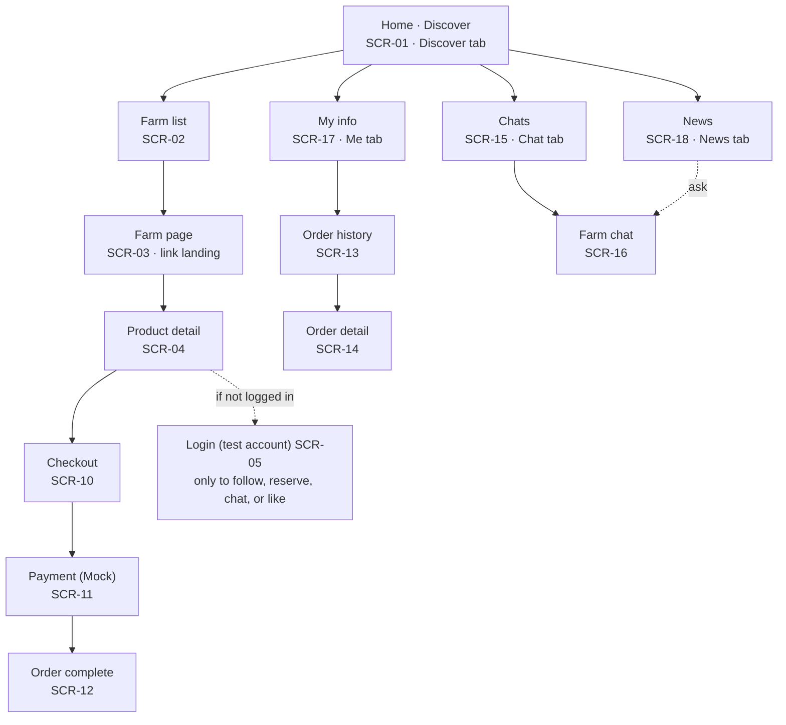
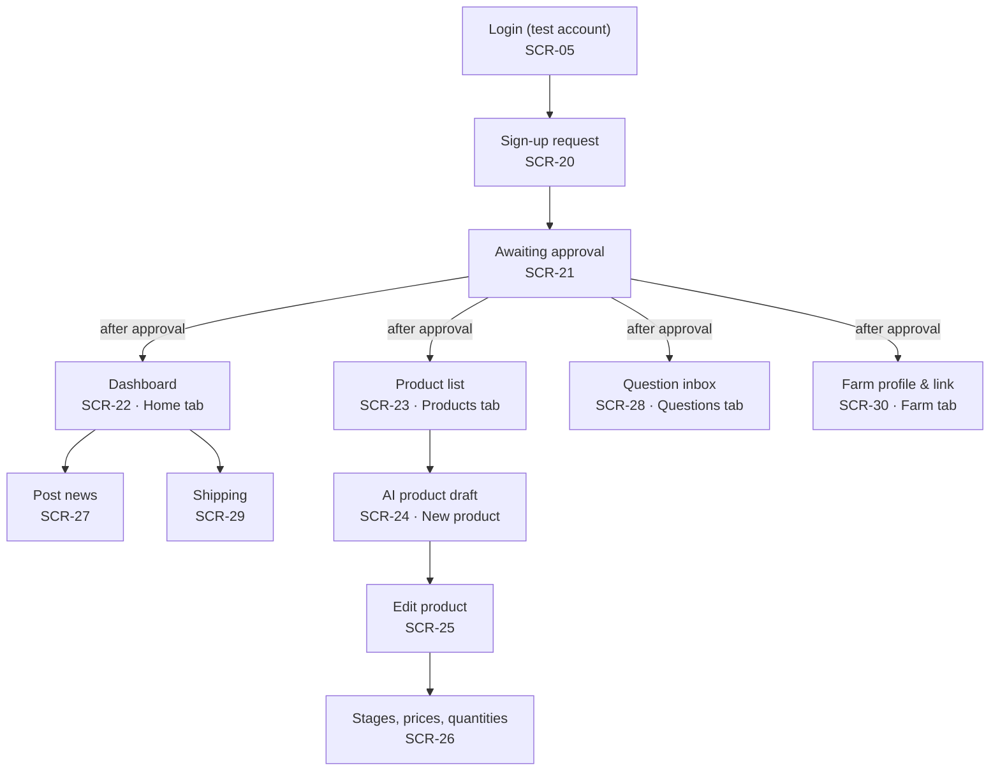
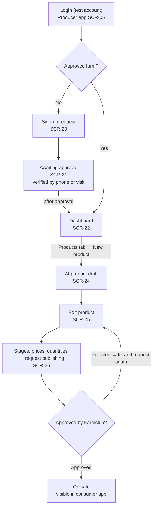
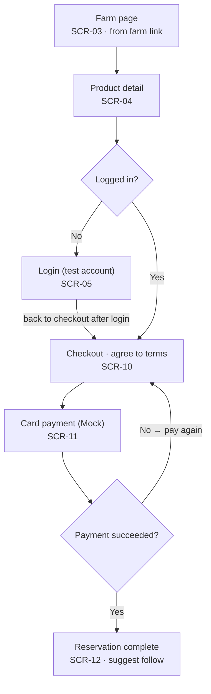
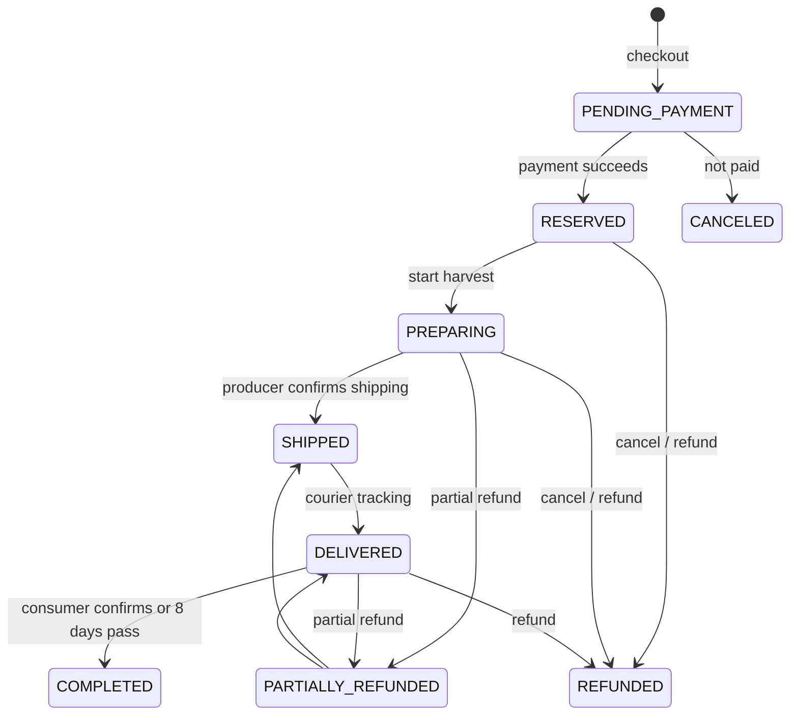

# Design Documentation

## Document Revision History

| Version | Date | Author | Changes |
| -- | -- | -- | -- |
| 0.1 | 2026-10-07 | Team 6 | Initial draft: sitemaps, user flows, data model summary, order states |
| 0.2 | 2026-10-07 | Team 6 | Backend Django → FastAPI; operators use the admin API through Swagger UI instead of Django Admin (ADR 0007, 0008) |

## 1. System Architecture

### 1.1 High-Level Architecture

There are two Expo web apps (consumer and producer) and one FastAPI server. Both apps call the server's REST API. The server owns the database, file storage, login (I1: mock login with seeded test accounts; Kakao in I2), and all AI calls. In I1, operators call admin API endpoints (`/admin/...`) through Swagger UI; a dedicated operator screen comes in I2.

### 1.2 Component Overview

```
apps/
  consumer/        Consumer app (Expo Router, web output)
  producer/        Producer app (Expo Router, web output)
packages/
  ui/              Shared components and design tokens
  api/             API client and types
server/            FastAPI server
  app/
    main.py        App setup, router registration
    core/          Settings, DB session, auth and permissions, common code
    accounts/      Users, roles, mock login (Kakao in I2), producer sign-up and approval, saved addresses (ShippingAddress)
    farms/         Home, farms, follows, search, share links (OG)
    catalog/       Products, weight options, stages, prices, quantities, product approval
    orders/        Orders, mock payment, cancel and refund, harvest and shipping, purchase confirmation, order-time address copy
    messaging/     News, likes, chat, question inbox, contact masking
    ai/            Claude adapter, product draft, inquiry answers, personal data removal (shipping text parsing in I2)
    analytics/     PostHog server events
  migrations/      Alembic migrations
docs/              Spec (docs/spec) and wiki (docs/wiki)
```

Each domain module has `router.py` (API routes), `models.py` (SQLAlchemy models), `schemas.py` (Pydantic input and output), and `service.py` (business logic).

Each code folder has a `spec.md` (implementation decisions) and a `tasks.md` (work log).

### 1.3 Key Data Flows

**Mock login (FEAT-01, ADR 0009) — I1**
1. The app lists seeded test accounts from `GET /api/auth/test-accounts`.
2. The user picks one and the app posts it to `POST /api/auth/test-login`.
3. The server returns a JWT only when the `MOCK_LOGIN_ENABLED` setting is on and the user is a seeded test account. No new accounts are created.
4. Producer app APIs check the `PRODUCER` role and farm approval on the server. Kakao login (ADR 0003) replaces this in I2, and the flag is turned off.

**Share link (FEAT-19)**
1. The producer app copies a server link, `/s/farms/<id>`.
2. That page returns HTML rendered with a Jinja2 template, with OG tags (farm name, intro, main photo), so KakaoTalk and SMS show a preview. People are sent on to the farm page in the consumer app.
3. A farm whose approval was revoked goes to "farm not found".

**AI call (FEAT-03, FEAT-13; FEAT-17 in I2)**
1. Every call goes through one adapter in `server/app/ai`. Other modules do not know the model name.
2. Contact info, addresses, and account numbers are removed before sending.
3. Output must match a fixed JSON format. Anything else is treated as a failure.
4. Input, output, sources, model, and latency are logged in Langfuse.

### 1.4 Technology Stack & External Libraries

| Area | Choice |
| -- | -- |
| Frontend | Expo (React Native, TypeScript) + Expo Router, web output, two apps |
| Web hosting | Vercel |
| Backend | FastAPI + Pydantic v2 + SQLAlchemy 2.0 + Alembic on Railway |
| Operator screens | Admin API (`/admin/...`) + Swagger UI; dedicated screen in I2 |
| Auth | I1: mock login with seeded test accounts → JWT (PyJWT). I2: Kakao login |
| Database | PostgreSQL (Railway) |
| Files | Cloudflare R2 + boto3 |
| AI | Claude API, Claude Haiku 4.5, behind one backend adapter |
| AI observability | Langfuse Cloud |
| Analytics | PostHog Cloud |
| Errors | Sentry |
| Payment | Mock in I1, PortOne (NHN KCP) from I2 |
| CI/CD | GitHub Actions → Railway and Vercel |

### 1.5 Architectural Decisions & Rationale

Each decision has an ADR in `docs/spec/tech-design/adr/`.

| ADR | Decision | Why |
| -- | -- | -- |
| 0001 | Expo web output, two apps | Ship web first, build Android and iOS from the same code later |
| 0002 | Django + DRF, Django Admin for operators (superseded by 0007 and 0008) | Operator screens come almost free. ORM transactions prevent overselling |
| 0003 | Kakao login + JWT (deferred to I2) | Works when the apps and the API are on different domains |
| 0004 | Claude Haiku 4.5 behind one adapter | Fast and cheap. The model can be swapped by changing only the adapter |
| 0005 | PostHog from I1 | Measure PRD metrics without personal data |
| 0006 | Server OG page for share links | Web output apps cannot easily build per-page meta tags for link previews |
| 0007 | FastAPI + Pydantic v2 + SQLAlchemy 2.0 + Alembic (replaces 0002) | Lighter structure and typed API definitions. The OpenAPI schema comes straight from the code |
| 0008 | Admin API + Swagger UI for operators; dedicated screen in I2 (replaces 0002) | No time for an operator screen in I1. The I2 screen will reuse the same API |
| 0009 | I1 mock login with seeded test accounts, behind a setting flag | Demo all roles without external accounts. Risk: anyone with the demo URL can use a test account, so test accounts hold no real data and no admin role |

## 2. Design Details

### 2.1 Frontend Design

I1 has 25 screens: 5 public, 9 consumer, and 11 producer. Operators handle approvals, delivery confirmation and refunds by calling admin API endpoints through Swagger UI; a dedicated operator screen comes in I2. There are two mobile web apps, a consumer app and a producer app, and one account works for both. Each app has four bottom tabs: consumer Discover · News · Chat · Me, producer Dashboard · Products · Questions · Farm. "News" means the farm's 1:N posts and "Chat" means the private 1:1 Q&A; consumer screens do not use the word "message". Screen-level specs and the API contract are in `docs/spec/screens.md`.

#### Sitemap: consumer app

The consumer app opens on Home · Discover (SCR-01); a link the farm sent opens the farm page (SCR-03). Login is needed only to follow, reserve, chat, or like. Order history lives under Me.



#### Sitemap: producer app

Producers must log in, apply, and wait for approval before the tabs open. In I1, operators handle approval, delivery completion, and refunds through admin API endpoints in Swagger UI.



#### Flow F-1: producer sign-up and product registration (S-1)



While awaiting approval, other producer screens are locked. A rejected product can be fixed and submitted again. Once on sale, the producer copies the farm link from the Farm tab (SCR-30) and sends it to regular customers.

#### Flow F-2: consumer reservation order (S-2)



Login happens only after tapping "Reserve", and the user returns straight to checkout. After the reservation is complete, the user can go to order history under Me (SCR-13).

### 2.2 Backend Design

### 2.3 Data Model

This is the draft model from the technical design. It lists the minimum fields. Fields can be added during implementation, but names and meanings follow the PRD glossary. The final version will be written after the tech stack decision (P19).

Both apps use the same account (seeded test accounts in I1, Kakao in I2). One `User` can have several roles. Producer app APIs check the `PRODUCER` role and farm approval (`Farm.approvalStatus = APPROVED`) on the server.

| Entity | Key fields | Relation |
| -- | -- | -- |
| `User` | kakaoId (I2), isTestAccount, roles (CONSUMER, PRODUCER, ADMIN), name, phone | — |
| `ShippingAddress` | userId, recipient, postalCode, address, addressDetail, isDefault | user 1 : N saved address; orders copy it at order time, no reference |
| `Farm` | producerId, name, region, intro, approvalStatus (PENDING / APPROVED / REJECTED) | 1 producer : 1 farm |
| `Follow` | consumerId, farmId | consumer N : M farm |
| `Product` | name, variety, description, deliveryWindow, maxDelayUntil, expectedBrix, measuredBrix, grade, status (DRAFT / PENDING_APPROVAL / PUBLISHED / CLOSED), shippingFeeType (FREE / SEPARATE), maxQuantityPerOrder | farm 1 : N product |
| `ProductOption` | weightKg | product 1 : N option |
| `Stage` | seq, name, startsAt, endsAt | product 1 : N stage |
| `StagePrice` | price (won) | one per stage × option |
| `StageAllocation` | quantity, reservedCount | one per stage × option |
| `Order` | optionId, stageId, quantity, unitPrice, totalAmount, recipient, phone, postalCode, address, addressDetail, deliveryNote, status, trackingNumber, timestamps | address fields are a copy made at order time |
| `Payment` | method (CARD), provider (MOCK / PG), amount, status | order 1 : 1 payment |
| `Refund` | amount, reason, refundedAt | order 1 : N refund |
| `Broadcast` | body, attachments, visibility (PUBLIC / FOLLOWERS) | farm 1 : N broadcast; shown as "News" |
| `Reaction` | broadcastId, userId | one like per user per post, only on posts the user can see |
| `Thread` / `ThreadMessage` | senderType (CONSUMER / PRODUCER / AI), body, sourceRefs | one thread per (farm, consumer) |
| `Escalation` | threadMessageId, status (OPEN / ANSWERED) | forwarded question |
| `ProductDraft` | inputText, output (JSON), missingFields | AI product draft |

Key invariants:

1. `Order.unitPrice` is a copy of the `StagePrice` at order time (R-17).
2. `reservedCount ≤ quantity`. Creating the order and reducing the quantity happen in one transaction (R-06).
3. An order can only use the stage that is open now. Stages of one product do not overlap.
4. `totalAmount = unitPrice × quantity`, in whole won. If shipping is `SEPARATE`, the shipping fee is added (R-20).
5. `deliveryWindow.end ≤ maxDelayUntil`.
6. A product can be `PUBLISHED` only if every option has a stage price and a delivery window is set.
7. A producer can write only their own product's stages, prices, and quantities (R-18).
8. No balance, point, credit, or stored-value fields (R-08).

#### Order states

| State | Meaning | Next states | Changed by |
| -- | -- | -- | -- |
| `PENDING_PAYMENT` | Terms agreed, not paid yet | RESERVED, CANCELED | System |
| `RESERVED` | Paid, waiting for shipping (shown as "Reserved") | PREPARING, REFUNDED | Producer (start harvest), consumer cancel, system (R-09) |
| `PREPARING` | Harvest and shipping prep | SHIPPED, REFUNDED, PARTIALLY_REFUNDED | Producer (ship with tracking number, FEAT-17), consumer cancel, system (R-09, R-10) |
| `SHIPPED` | Shipped. Consumer can no longer simply cancel | DELIVERED | Operator |
| `DELIVERED` | Delivery confirmed by courier tracking, waiting for purchase confirmation | COMPLETED, REFUNDED, PARTIALLY_REFUNDED | Consumer confirms, system (8 days after delivery, R-14), operator (R-11) |
| `COMPLETED` | Purchase confirmed | — | — |
| `CANCELED` | Ended without payment | — | — |
| `REFUNDED` | Fully refunded | — | — |
| `PARTIALLY_REFUNDED` | Part refunded, the rest still ships | SHIPPED, DELIVERED | Operator |

Transitions not in the table are blocked. On a refund, the refunded quantity goes back to `StageAllocation.reservedCount`.



### 2.4 API Specification

The endpoint list (57 endpoints), the common error format `{code, message, details}`, cursor pagination, and `Idempotency-Key` for order and payment requests are in `docs/spec/screens.md` section 7.

### 2.5 AI Components

### 2.6 Implementation-Level Decisions

## 3. Design Patterns

Source of truth: `docs/spec/ia.md` and `docs/spec/tech-design/README.md` (Korean).
