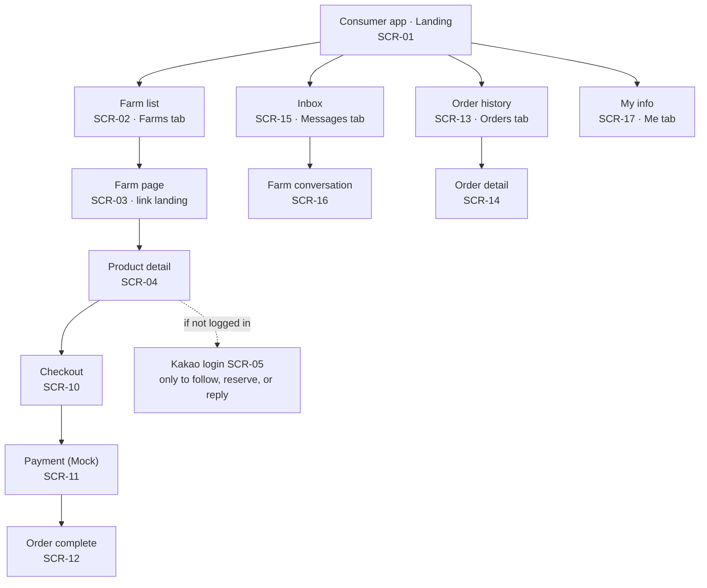
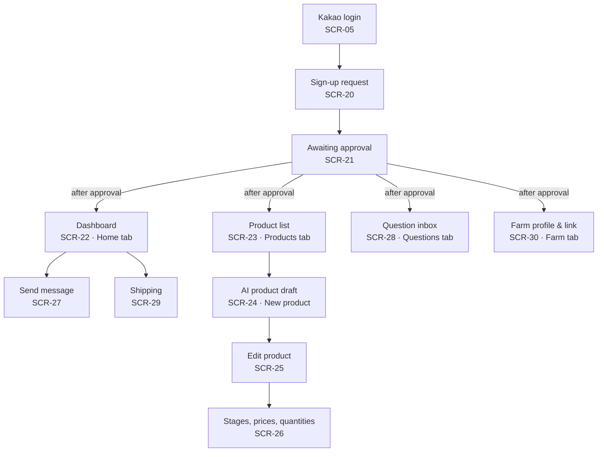
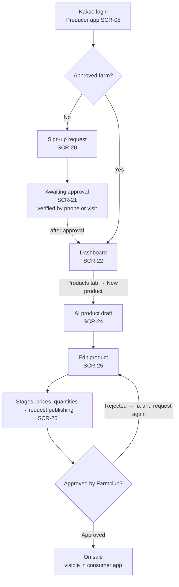
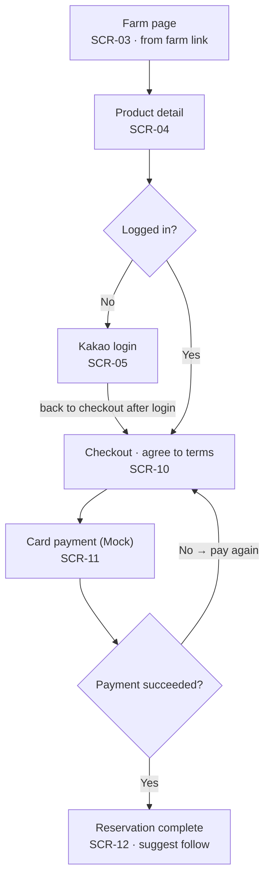
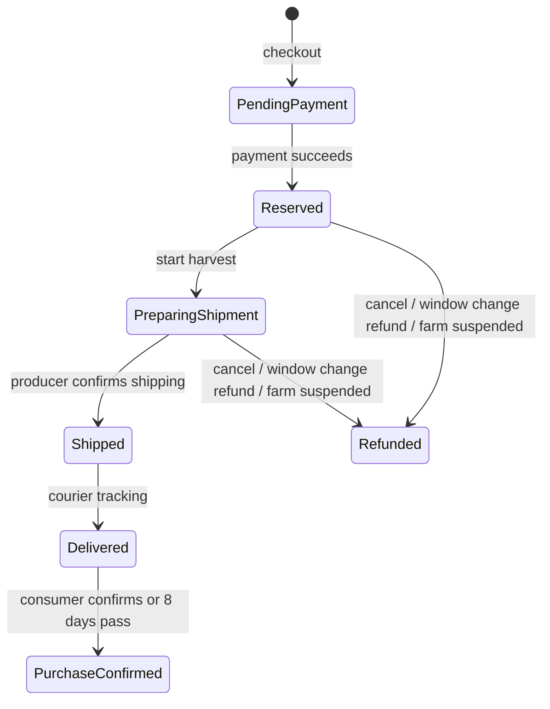

# Design Documentation

## Document Revision History

| Version | Date | Author | Changes |
| -- | -- | -- | -- |
| 0.1 | 2026-10-07 | Team 6 | Initial draft: sitemaps, user flows, data model summary, order states |

## 1. System Architecture

### 1.1 High-Level Architecture

### 1.2 Component Overview

### 1.3 Key Data Flows

### 1.4 Technology Stack & External Libraries

### 1.5 Architectural Decisions & Rationale

## 2. Design Details

### 2.1 Frontend Design

I1 has 24 screens: 5 public, 8 consumer, and 11 producer. There are no operator screens. There are two mobile web apps, a consumer app and a producer app, and one Kakao account works for both. Each app has four bottom tabs.

#### Sitemap: consumer app

Consumers usually arrive at a farm page (SCR-03) from a link the farm sent. Login is needed only to follow, reserve, or reply.

#### Sitemap: producer app

Producers must log in, apply, and wait for approval before the tabs open. In I1, operators handle approval, delivery completion, and refunds with scripts.

#### Flow F-1: producer sign-up and product registration (S-1)

While awaiting approval, other producer screens are locked. A rejected product can be fixed and submitted again. Once on sale, the producer copies the farm link from the Farm tab (SCR-30) and sends it to regular customers.

#### Flow F-2: consumer reservation order (S-2)

Login happens only after tapping "Reserve", and the user returns straight to checkout. After the reservation is complete, the user can go to order history (SCR-13).

### 2.2 Backend Design

### 2.3 Data Model

Main entities for I1, based on the shared glossary. Field-level design is not final yet.

| Entity | Meaning |
| -- | -- |
| User | One Kakao account. Can be a consumer, and a producer after approval |
| Farm | The selling unit run by one producer. Target of follows and messages. One producer has one farm |
| Product | One variety for one harvest season from one farm. States: draft, pending approval, rejected, on sale, ended |
| Weight option | The unit a product is sold in (for example 3 kg, 5 kg, 10 kg) |
| Stage | A sales period with start, end, and order. Set by the producer from defaults. Not a crop growth stage |
| Stage price / stage quantity | Price and sellable quantity for each stage × weight option. Quantity is not "stock" because it is before harvest |
| Reservation order | One weight option bought at one stage price, with a quantity up to the producer's limit. The amount is fixed at order time |
| Payment / refund | Full card payment for the order (mock in I1). A refund is a card cancellation; there are no points or credits |
| Follow | A consumer chose to receive a farm's messages |
| Message | A farm → all followers (1:N) message. If public, it also appears in the farm's news tab |
| Conversation | The private 1:1 reply thread between one consumer and one farm. Holds replies, AI answers, and farm answers |
| Forwarded question | A question AI did not answer and sent to the producer's question inbox |
| AI product draft | A product draft that AI built from the producer's text |

#### Order states

| State | Meaning |
| -- | -- |
| Pending payment | Order created at checkout; price is fixed but quantity is not yet taken |
| Reserved | Payment succeeded; stage quantity is reduced |
| Preparing shipment | Producer pressed "Start harvest" for the product. Consumer can still cancel |
| Shipped | Producer confirmed shipping (FEAT-17). Consumer can no longer cancel |
| Delivered | Delivery confirmed by courier tracking |
| Purchase confirmed | Consumer tapped "Confirm purchase", or 8 days passed after delivery |
| Refunded | Cancelled before shipping, refund chosen after a delivery window change, or the farm was suspended. Stage quantity is restored on cancel |

### 2.4 API Specification

### 2.5 AI Components

### 2.6 Implementation-Level Decisions

## 3. Design Patterns

Source of truth: `docs/spec/ia.md` and `docs/spec/functional/` (Korean).
