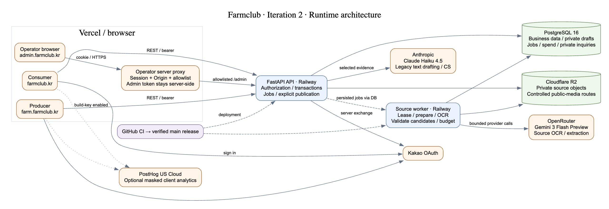
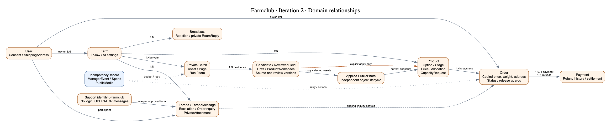
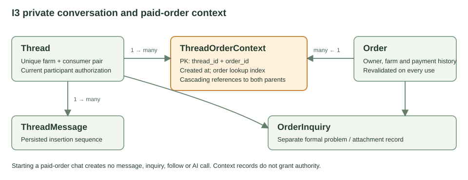
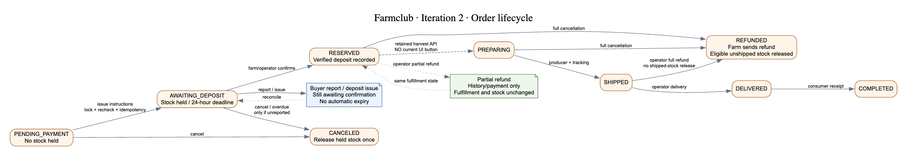
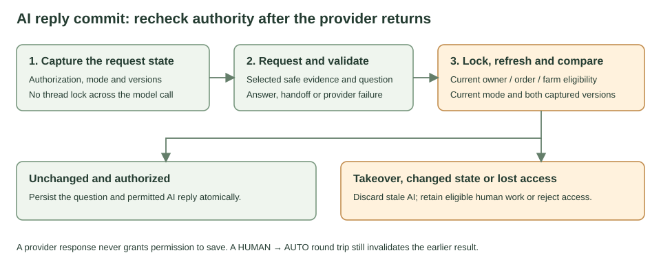
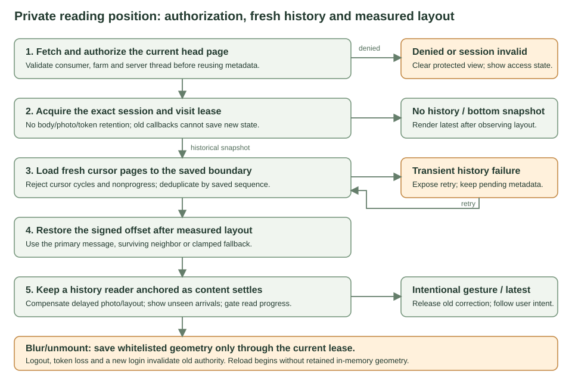

# Design Documentation

Team 6 | Farmclub | Iteration 3 | 6 November 2026

This document describes the main snapshot [`28feb94ac47b259b6a6299e9fd742b75e756a33d`](https://github.com/snuhcs-course/swpp-2026-project-team-06/commit/28feb94ac47b259b6a6299e9fd742b75e756a33d) used for I3 closeout. Its audience is the development team: a developer should be able to locate each responsibility, follow its data flow, and reproduce the local system. This revision retains Team 6’s architecture, dated decisions and figures, and synchronizes the I3 implementation deltas. Documentation changes do not change product behavior. Test plans, measurements and environment-specific results remain in [Testing Documentation](https://github.com/snuhcs-course/swpp-2026-project-team-06/wiki/Testing-Documentation).

## Table of Contents

- [Document Revision History](#document-revision-history)
- [1. System Architecture](#1-system-architecture)
- [2. Design Details](#2-design-details)
- [3. Design Patterns](#3-design-patterns)
- [4. Implementation Status](#4-implementation-status)
- [5. Running Locally and Source Map](#5-running-locally-and-source-map)

## Document Revision History

| Version | Date | Author | Major changes |
| --- | --- | --- | --- |
| 0.1 | 2026-10-07 | Team 6 | Initial sitemaps, flows, data model and order states |
| 0.2 | 2026-10-07 | Team 6 | Replace Django plan with FastAPI and operator API (ADR 0007/0008) |
| 0.3 | 2026-10-07 | Team 6 | Separate accounts, screen/state details and seed contracts |
| 0.4 | 2026-10-08 | Team 6 | Synchronize design frames with specs 1.2-1.5 |
| 1.0 | 2026-10-09 | Team 6 | Submission edition: architecture, ER diagrams, API, AI and concurrency details |
| 1.1 | 2026-10-09 | Team 6 | Table of contents, frontend and backend class diagrams, AI answer sequence diagram, API request/response examples, design-pattern section, restructured to the course guideline |
| 1.2 | 2026-10-18 | Team 6 | DEV-68: bank transfer to the farm's account replaces the simulated card payment. `AWAITING_DEPOSIT` state, deposit deadline, producer deposit confirmation, refund settlement by the farm, farm bank account fields |
| 1.3 | 2026-10-18 | Team 6 | PostHog analytics in both web apps (DEV-71): US Cloud, screen events, purchase funnel up to the deposit report, masked session replay |
| 1.4 | 2026-10-21 | Team 6 | DEV-104: session replays mask only personal fields on account, order and checkout screens |
| 1.5 | 2026-10-23 | Team 6 | DEV-125: PostHog starts only on the production hosts (farmclub.kr, farm.farmclub.kr); Vercel preview, demo and localhost visits are not collected |
| 2.0 | 2026-10-22 | Team 6 | I2 implementation snapshot: deployed clients/API/worker, Kakao onboarding, operator UI, private source workspace, media boundaries, bank-transfer lifecycle, schema 0019 and current diagrams |
| 2.1 | 2026-10-23 | Team 6 | DEV-33: consumer and producer apps move to EAS native builds (ADR 0013); platform split of web-only code, Kakao return through the app scheme |
| 3.0 | 2026-11-06 | Minsun Kim; existing Team 6 and owner contributions retained | DEV-158: schema 0026, paid-order conversation association, session/anchor lifecycle, AI save-time race checks, two-stage source pipeline and reproducible I3 demo boundary |
| 3.1 | 2026-11-09 | Team 6 | DEV-293: shared UI tokens and headers follow the DEV-292 audit baseline; consumer home, product detail, checkout, orders, me and login simplified (per-option boxes left, hidden tab bar on purchase screens) |

## 1. System Architecture

Farmclub has separate consumer and producer Expo applications with web outputs and an EAS native build path, plus an operator web interface. Native configuration and shared source do not establish store acceptance or physical-device verification. A modular FastAPI API owns authorization, transaction rules and persistence. A separately deployed worker processes private source-analysis jobs using the same PostgreSQL database and private storage. The browser never calls an AI provider or receives its credentials.

Figure 1. Retained I2 component overview; the current tables and I3 lifecycle sections describe the changes since this figure. Solid arrows represent runtime calls or data access; the deployment arrow represents the release pipeline. The original I1 architecture is retained in repository history.

| Component | Responsibility | Interface / deployment |
| --- | --- | --- |
| Consumer | Discovery, Kakao onboarding, checkout, deposit reporting, orders, farm rooms and private inquiries | Expo Router / React Native Web; `farmclub.kr` on Vercel |
| Producer | Application gate, farm settings and bank account, private product workspace, sales, deposit/refund confirmation, messaging and help tour | Separate Expo build/session namespace; `farm.farmclub.kr` on Vercel |
| Operator | Farm approval, initial/increased capacity, test-farm visibility, user support, farmclub inbox and AI cost by feature | Static HTML/JavaScript plus server-side Vercel proxy; `admin.farmclub.kr` |
| Shared packages | Typed API transport, UI/detail renderer, web analytics | npm workspaces: `packages/api`, `packages/ui`, `packages/analytics` |
| API | HTTP validation, role/ownership checks, transactions, chat AI, job submission and explicit publication | FastAPI / Uvicorn; `api.farmclub.kr` on Railway |
| Source worker | Claim jobs, prepare documents, extract/validate candidates, persist partial/final results and cost ledger | `python -m app.source_analysis.worker`; separate Railway process/image |
| PostgreSQL 16 | Relational business data, job leases, private inquiry attachments, immutable snapshots, idempotency and spend records | SQLAlchemy + psycopg; Alembic migrations `0001`–`0026` |
| Cloudflare R2 | Private source originals/prepared files; public-media objects delivered through application routes | Server-only S3-compatible credentials; source bucket is not public |
| AI providers | Anthropic Claude Haiku 4.5 for existing text drafting/CS; OpenRouter Gemini 3 Flash Preview for source analysis | Separate adapters/configuration, structured outputs, validation and explicit failure states |
| PostHog | Client page/funnel events, masked replay and heatmaps when enabled at build time, on the production hosts only | US Cloud; internal user identifier, no network/console recording |

### 1.1 External libraries and runtime

| Layer | Libraries / runtime | Design role |
| --- | --- | --- |
| Clients | Node 24, Expo, React Native, Expo Router, React, TypeScript | Shared mobile web implementation with independently routed consumer/producer apps |
| API | Python 3.12, FastAPI, Pydantic v2, pydantic-settings, Uvicorn | Typed boundaries and generated OpenAPI |
| Persistence | PostgreSQL 16, SQLAlchemy, psycopg, Alembic | Transactions, row locks, constraints and forward schema evolution |
| Authentication | PyJWT, HTTP client for Kakao OAuth | Server-issued role-specific sessions; Kakao state/return handling; local test login flag |
| Media/documents | Pillow, Pillow-HEIF, pypdfium2, python-multipart, boto3 | Format/size checks, EXIF removal, HEIC/PDF handling, object storage |
| Source OCR | RapidOCR 3.10.0 and ONNX Runtime 1.31.0 in the worker image | Pinned preprocessing/OCR assets; model manifest checked before work; current source pipeline also uses Gemini OCR for selected source crops |
| AI | Anthropic SDK; OpenAI-compatible SDK for OpenRouter | Provider-specific transport behind server adapters |
| Analytics | posthog-js / posthog-react-native | Web events with masked replay on allowed hosts; native screen events without native replay |

Exact package versions are locked in `package-lock.json` and `server/uv.lock`. `server/Dockerfile` installs the API without development dependencies; `server/Dockerfile.worker` adds OCR dependencies and provisioned, verified model files. The API owns migrations; the worker checks schema readiness before processing. A worker must share the API's database and storage configuration.

### 1.2 Architectural decisions

| Decision | Rationale | Consequence / trade-off |
| --- | --- | --- |
| Separate consumer and producer applications (ADR 0001/0010) | Different journeys, permissions and account states | Separate routing/token namespaces; server role checks remain mandatory |
| Modular FastAPI backend (ADR 0007, replacing ADR 0002) | Typed contracts with a small deployable service | Domain services own transactions; routers do not duplicate business rules |
| Operator API extended with a browser proxy | A browser needs operational tools without exposing an admin bearer token | Password-derived session cookie at proxy; server-only admin token; smaller allowlisted action surface |
| Relational transactions for capacity and deposits | Concurrent buyers must not reserve the same supply | Product/allocation locks, rechecks and idempotent release; higher contention is preferable to overselling |
| Private source workspace plus explicit apply | Analysis must not silently alter a selling product | Independent drafts/versions; publication copies only approved public content and photos |
| Worker for source analysis | OCR and provider calls may exceed an interactive request | Persisted jobs, leases, progress and retry states; API and worker deployments must remain compatible |
| Two AI workflows | Legacy CS and source-document extraction have different evidence, latency and cost needs | `app/ai/service.py` and `app/ai/source_analysis.py` remain distinct; changing the source model does not change CS |
| REST polling | Current traffic and operational simplicity | Open chat screens poll about every two seconds; no real-time socket or push guarantee |
| Direct farm bank transfer (DEV-68) | I2 scope uses the farm's existing account | Farmclub records instructions/confirmation; no bank reconciliation or payment custody |
| Fixed public domains (ADR 0012) | Kakao returns, share previews and links require stable origins | Consumer `/s/*` forwards to API-generated Open Graph pages; approved farm links return to the consumer app |
| Native store apps from the same Expo code (ADR 0013, DEV-33) | Both apps must reach the iOS and Android stores while the web keeps changing weekly; a TWA covers only Android and a WebView shell risks App Store 4.2 | EAS Build for native changes, EAS Update (`fingerprint` runtime policy, `preview`/`production` channels) for JS; web-only code lives in `*.native.ts` pairs or `Platform.OS` branches, tokens in SecureStore, and the Kakao web return page hands the code to the app scheme so the server contract is unchanged |

ADRs retain their original decisions and dates. Historical statements about I1-only operator APIs or a planned source model are superseded here by the implemented boundaries at this document’s reference commit.

## 2. Design Details

### 2.1 Frontend structure

Expo Router route modules render components from `src/`. They call typed endpoint functions through `packages/api`; `configureApi('consumer'|'producer')` gives each app a separate persisted token namespace. `request<T>()` attaches authorization and maps non-success responses into `ApiError(status, code, message, details)`. UI state preserves the user's draft when validation, network or version conflicts occur.

| Module | Responsibility and interaction |
| --- | --- |
| Route screens + `useAsync` | Load data, retain displayed state during reload, expose retry and permission redirects |
| `useLiveList` / room screens | Poll active rooms, merge by ID and persisted insertion sequence, stop hidden-room polling and retain composer text when folding the shelf |
| Consumer private-chat route + shared `ChatThread` | Initialize and freshly authorize the exact thread before rendering/sending; apply session-scoped reading metadata; isolate selected-order attachments, retries and stale async completions |
| `Storefront` / shared UI | News carousel and two-column product grid, farm rooms, fixed product purchase controls, brand assets and detail blocks. Shared tokens follow the DEV-292 baseline (Daangn SEED sizes): 16 gutter, body 16 / secondary 14 / meta 12, section 18, tab-screen title 22, 52 buttons, 32 chips with a 48 hit area, 56 headers (tab roots left-aligned 22, sub-screens Back + left-aligned 18) |
| Source-analysis screen/editor | Save basic information before upload, separate source files from product photos, observe the latest run, edit shared detail-renderer modules, save privately and explicitly apply |
| Product page workspace | Initialize from a product snapshot; protect direct edits, representative photo and section/item visibility through versioned saves |
| Producer help tour | First-visit walkthrough; help-button restart; skip unavailable support-room steps instead of blocking navigation |
| Shared analytics | Screen/funnel events and route/field masking, disabled without a build key |

The current UI contract is [UI 1.6](https://github.com/snuhcs-course/swpp-2026-project-team-06/blob/main/docs/spec/conversation-ui-1.6.md), extended by [source-editor](https://github.com/snuhcs-course/swpp-2026-project-team-06/blob/main/docs/spec/source-editor.md). The I1 frontend class diagram in history is an earlier module view, not a current screen reference.

### 2.2 Backend structure and trust boundaries

Each domain contains routers, Pydantic schemas, service functions and SQLAlchemy models. `core` supplies settings, sessions, errors, JWT checks, time, storage and idempotency. The API response is derived from persisted state; clients do not decide prices, stock, role or AI-report status.

| Domain | Owns / coordinates |
| --- | --- |
| `accounts` | User, consents, address book, test/Kakao login, producer application and account-state gates |
| `farms` | Farm profile, bank account, following, AI settings/history and share information |
| `catalog` | Products/options, reservation periods, prices/allocations, capacity requests and legacy text drafts |
| `orders` | Order/payment/refund state, stock accounting, deposit deadlines/reports/issues, fulfillment and settlement history |
| `messaging` | Broadcasts/reactions, private room replies, threads, AI/handoff/reporting, inquiries/attachments and farmclub support |
| `admin` | Producer/capacity decisions, refund/recovery actions, visibility/tester operations, user lookup and inbox through services |
| `source_analysis` | Private batches/assets/pages/jobs/candidates, reviewed values, drafts/workspaces, publication and global spend reservations |
| `media` | Validated public upload metadata and controlled delivery of public media |
| `ai` | Legacy text/CS provider adapter and independently configured source extraction adapter |

**Operator session:** `/login` checks `ADMIN_WEB_PASSWORD`; the proxy signs an approximately 12-hour HttpOnly, SameSite=Strict cookie (Secure on HTTPS). Mutations check Origin and an allowlisted path/method. `ADMIN_TOKEN` remains in the server environment and authenticates proxy-to-API calls. Backend admin authorization is still required. Operations currently share the `u-admin` identity: this is not individual operator attribution or multi-operator assignment. Routes include producer approval, capacity, farms, users/user detail and inbox. Private support photos are represented by counts in the inbox, not rendered there.

**Farmclub support:** approving a producer ensures one support `Thread` with non-login account `u-farmclub` and an operator welcome message; migration `0019` also provisions existing approved farms. The producer's 1:1 list sorts it by recent activity. Operator messages use sender type `OPERATOR`. Consumer lists and ordinary user search omit the support identity. AI mode and order panels do not apply to this room; hidden/suspended farms retain their history for support. Suspended and rejected farms reach their own room through `/messaging/producer/support/*` (DEV-209): a messaging-router dependency accepts approved, suspended or rejected farms only, the room is created on first open with a status-specific operator message, and attachment checks allow that room for its own producer. The producer app gate opens `/support` for those two states and nothing else.

**Consumer farmclub support (DEV-150).** One `SupportThread` per consumer and its `SupportMessage` rows are separate from farm-bound `Thread` conversations. Consumer/operator sender types and independent read positions keep this operator exchange out of farm AI and farm order context. Producer farmclub support continues to use the special `u-farmclub` participant in `Thread`; these two support stores are not interchangeable. Source: [support models](https://github.com/snuhcs-course/swpp-2026-project-team-06/blob/28feb94ac47b259b6a6299e9fd742b75e756a33d/server/app/messaging/models.py#L184).

### 2.3 Database model

Figure 2. Retained I2 principal-relationship overview; the I3 association below extends communication without replacing the commerce or formal-inquiry model. Labels show one-to-many relationships; composite uniqueness and cross-domain checks are detailed below. This is a readable domain view, not a complete physical-column listing; actual columns/indexes are defined by models and migrations.

| Data group | Structures and invariants |
| --- | --- |
| Identity | `User`, `UserConsent`, `ShippingAddress`; role/app gates; shipping details exposed only to authorized participants |
| Farm | `Farm`, `Follow`, `FarmAiSettings`, `FarmAiSettingsHistory`; farm owner and versioned settings; approval distinct from public visibility and suspension |
| Catalog | `Product`, `Option`, `Stage`, `StagePrice`, `StageAllocation`, `CapacityRequest`, `ProductDraft`; period/option composite keys, approved grams and sales limits, product version |
| Commerce | `Order`, `Payment`, `Refund`; unique order number; payment unique per order; copied unit price/weight/address/consents; refund history separate from fulfillment |
| Communication | `Broadcast`, `Reaction`, `RoomReply`, `Thread`, `ThreadMessage`, `Escalation`, `OrderInquiry`, `PrivateAttachment`, `ThreadOrderContext`, `SupportThread`, `SupportMessage`; unique farm/consumer thread and per-thread sequence; participant-filtered reads |
| Source analysis | `Batch`, `Asset`, `Page`, `Run`, `Item`, `Candidate`, `ReviewedField`, `Draft`, `RequestRecord`, `PublicPhoto`, `Spend`, `ProductWorkspace`; farm ownership, source revisions, job leases and product-bound draft snapshots |
| Operations / media / retry | `ManagerEvent`, `PublicMedia`, `IdempotencyRecord`; action history, validated object metadata, unique user/scope/key with body hash and stored response |

Source drafts use schemaVersion 1 and 18 content modules. `hiddenSectionIds` and item `enabled` flags are independent: turning a section back on does not restore excluded items. `Product.moduleDetail` stores applied modules; legacy `detailContent` remains compatible. Private provenance/validation metadata is omitted from public responses. `ProductWorkspace` stores the editable product snapshot, including an explicitly nullable representative photo.

Schema head at this reference is **0026**. The retained I2 sequence covers baseline (0001), messaging/settings/capacity/storefront (0002–0005), source/manager/AI reporting (0006–0008), publication/preprocessing/workspace/photo placement/diagnostics (0009–0013), bank transfer/deposit issues (0014–0015), onboarding (0016), public media (0017), operational tester flag (0018), and support room (0019). I3 adds account deletion (0020), AI usage (0021), consumer support (0022), source refinement (0023), tracking corrections/version (0024), news soft deletion (0025), and paid-order conversation context (0026). Migration files define the physical columns, constraints and upgrade/downgrade behavior; this document did not rerun migrations.

Figure 2a. I3 paid-order entry records a context independently of messages and formal problem inquiries. `ThreadOrderContext` has composite primary key `(thread_id, order_id)`, creation time, cascading foreign keys to thread/order, and an order lookup index. The association is a retained entry record; it grants no authority without current owner/payment/farm checks. Existing valid `OrderInquiry` links remain readable without a mutating GET or data backfill. Source: [0026 migration](https://github.com/snuhcs-course/swpp-2026-project-team-06/blob/28feb94ac47b259b6a6299e9fd742b75e756a33d/server/migrations/versions/0026_thread_order_contexts.py) and [current eligibility checks](https://github.com/snuhcs-course/swpp-2026-project-team-06/blob/28feb94ac47b259b6a6299e9fd742b75e756a33d/server/app/messaging/order_context.py).

### 2.4 API specification

FastAPI generates the complete request/response schemas at `/docs` and `/openapi.json`. Prefixes distinguish public/authenticated `/api` resources from operator-only `/admin` resources. Typical errors are `400` invalid input, `401` missing/expired session, `403` role/ownership denial, `404` inaccessible resource and `409` conflict with machine-readable `details.reason`. Error bodies follow `{code, message, details}`. A proxy denial is a separate boundary from an API denial.

| Method / resource group | Caller | Contract |
| --- | --- | --- |
| `/api/auth/*` | Public / current user | Kakao start/return, current profile/onboarding and consents, producer application, addresses; seeded accounts only with test-login flag |
| `GET /api/home`, `/api/farms`, `/api/products/{id}` | Public | Only eligible visible published material; private drafts remain inaccessible |
| `/api/farms/me`, AI settings, follow routes | Owner / consumer | Bank/profile edits, versioned AI settings and follow state |
| `/api/products/*`, stages, sales settings, capacity requests | Approved owning producer | Validate required details, period pricing, limits and versions; request approval before public sale |
| `POST /api/orders` | Consumer | Validate current terms/consents; copy order values; no stock hold yet |
| `POST /api/orders/{id}/deposit`, `/deposit-reported` | Order owner | Issue instructions/hold stock idempotently; separately record the buyer's declaration |
| `POST /api/orders/{id}/confirm-deposit`, `/refund-settled` | Owning producer | Record checked deposit or completed farm refund transfer; neither route performs a bank transfer |
| Order cancel/receipt/window-response, producer dashboard/ship routes | Owner / owning producer | Enforce state transitions and retain paid snapshots |
| `POST /api/messaging/chats` with optional `orderId` | Onboarded consumer | General start retains automatic follow; an owned paid-order context starts/reuses the same farm/consumer thread without following, records the association idempotently, and creates no message, inquiry or AI call |
| Room/news/reaction/chat routes under `/api/messaging` | Authorized viewer / farm owner | Filter private rows before paging; private reply, handoff and wrong-answer report; producer support thread through existing conversation flow |
| `/api/messaging/attachments`, order inquiries | Participants / paid-order owner | Private validated images and order-bound problem report |
| `/api/source-analysis/config`, batches/sources/runs/review/drafts | Approved producer | Feature flag, farm-owned uploads, persisted asynchronous analysis, versioned private review/drafts |
| `POST /api/source-analysis/batches/{bid}/drafts/{did}/apply` | Owning producer | Idempotency key and product/draft versions; explicit copy to product detail, without changing price, stock or public status |
| `POST /api/media` | Authorized uploader | Validate and store public media; return application-served URI |
| `/admin` producers/capacity/orders/refunds/recovery | Operator | Approval, exception recovery, delivery and refund records; permission checks and action history |
| `/admin/farms`, users/lookup/tester routes, inbox | Operator | Controlled test-farm hiding, privacy-limited support lookup and producer support replies/read state |

**Example — create an order.** `POST /api/orders` includes an `Idempotency-Key`, product/option/stage, quantity, address and four recorded consent flags. A successful response contains the server's price and `status: "PENDING_PAYMENT"`. A later `POST .../deposit` returns `AWAITING_DEPOSIT`, `depositAccount`, `sellerInfo` and `depositDueAt`. `POST .../confirm-deposit` records the payment and returns `RESERVED`. If terms changed, `409` explains a reason such as `PRICE_CHANGED` or `SOLD_OUT`; the UI retains input and asks for reconfirmation.

**Example — a private question.** A consumer posts `{ "text": "배송은 언제예요?", "attachmentIds": [], "orderId": null, "productId": "p-house" }` to `/api/messaging/chats/{farmId}/messages`. `productId` is optional: the consumer app sends it when the chat was opened from a product page, so the AI answers from that product even when the farm sells more than one. It must be a published product of this farm, or the request returns 404 and the message is not saved. It is used only as AI evidence and is not stored; if `orderId` is also sent, the order's product wins. Evidence sufficient for a factual answer produces a labeled AI reply with `sourceSummary`; a sensitive or uncertain question instead has a forwarded handoff state and no fabricated answer. A wrong-answer report references the exact AI message and preceding question; repeat reports reuse the existing open escalation.

**Example — ship.** `POST /api/orders/{id}/ship` receives carrier and tracking number from the owning producer. It requires `PREPARING`; an invalid transition returns `409`. Reserved orders reach `PREPARING` through `POST /api/orders/producer/harvest-start` with a `stageId` and an `Idempotency-Key`, called from the producer's sale-period card (DEV-231).

### 2.5 Transaction and state flows

Figure 3. Deposit, cancellation, fulfillment and refund transitions. The preparation edge is the producer's Start harvest action on one sale period (DEV-231); there is no automatic transition. Partial refunds are history/payment changes, not a new fulfillment state.

1. Checkout copies price, quantity, unit weight, recipient, address, delivery window and four consents into `PENDING_PAYMENT`.
2. Issuing deposit instructions locks product/allocation rows, rechecks terms and the farm's account, reserves boxes/grams, and starts a 24-hour `AWAITING_DEPOSIT` deadline.
3. A buyer's deposit report is a declaration, not verification. The farm checks its bank statement and confirms, creating `Payment` and `RESERVED`.
4. Unreported overdue deposits expire on access or an operator expiry call and release stock once. **Reported deposits are excluded from automatic expiry**; they remain awaiting confirmation/exception handling. Producer issue reasons are recorded without pretending confirmation succeeded.
5. Full cancellation before shipment releases eligible unshipped capacity once. Refund history records the amount and farm settlement. Partial refunds leave the order's fulfillment status and quantities unchanged; only a final full refund ends fulfillment.
6. Start harvest on a sale period moves that period's `RESERVED` orders to `PREPARING` (DEV-231; idempotent, audited, other periods and awaiting deposits untouched). Shipping then works on those preparing orders. Shipment records carrier/tracking and moves reserved weight into shipped weight. Operator delivery confirmation precedes consumer receipt confirmation.

Repeated requests use the same idempotency key. Reusing a key with a different body is refused. Idempotency records expire after 24 hours; retry safety at that boundary also relies on persisted business state and unique constraints.

### 2.6 AI and source-analysis algorithms

**Existing text drafting and customer service.** `app/ai/service.py` removes personal contact/account data from selected input and requests structured output from Claude Haiku 4.5 when configured. Product prices and operational dates remain outside generated fields. Missing keys, invalid output or timeout permit manual drafting; no fallback is represented as real model output. CS answers simple known facts through rules first, sends only selected evidence to the provider, and hands pesticide/growing claims, subjective quality, compensation and uncertain delivery promises to the producer. Private shipping information and inquiry photos are excluded. The HTTP request is synchronous, but the service does **not** hold the thread row lock over the provider call (DEV-180). It first captures thread mode/version and farm AI enabled/settings version, calls the provider, then locks and refreshes before saving. Current paid-order ownership/farm/payment eligibility or following is checked again. Only unchanged mode and both versions permit the generated reply to commit; a takeover or a round trip through settings/mode discards the old answer and retains a direct-response-needed question. The configured answer timeout defaults to 7.5 seconds; network/provider failure still follows the explicit handoff path. This is distinct from the asynchronous source worker.

The full customer-service pipeline, answer checks, tests and known limitations are on [[AI Customer Support|AI-Customer-Support]].

Figure 4. Save-time fencing prevents late model results from overriding producer action; a provider response is not itself permission to persist it. Source: [consumer send transaction](https://github.com/snuhcs-course/swpp-2026-project-team-06/blob/28feb94ac47b259b6a6299e9fd742b75e756a33d/server/app/messaging/service.py#L1015).

**Private source pipeline.**

1. An approved producer names target products, enters required variety/optional size/expected Brix, and uploads text/TXT, supported images/HEIC or PDF. Basic information is saved before attachment actions to avoid a race. Source files and product photos are separate inputs.
2. The current editor instructs the uploader to remove personal information before upload. New sources proceed without the former redaction-approval gate. Retained prepared-file/version protections do not make this a guarantee of automatic personal-data removal.
3. The worker claims persisted jobs with a lease and verifies source/revision/parser/prompt identity. Preprocessing handles orientation, PDF pages and bounded image crops; resource/format failures remain per-item failures. Preprocessor identity is `source-parser-v4`; extraction uses `source-v8-exact-numbers`, followed by refinement `source-refine-v7-farm-common`. Versioned, validated extraction candidates remain the input boundary for the second stage.
4. PDF processing admits the first 20 pages under the existing batch limits and reports skipped pages. OCR and stage-1 extraction use the shared bounded executor (default concurrency 4); extraction packs up to 4,000 characters and four source pages, retaining page/span citations. Non-hard page/chunk failures preserve successful candidates as PARTIAL, with separate OCR-page and extraction-chunk retry information. Authentication, budget, cancellation and stale-source fences remain hard failures; no uncertain paid call is automatically replayed. The current real provider is OpenRouter `google/gemini-3-flash-preview`; source images/PDF crops use the adopted Gemini OCR path and extraction. High-cost vision and automatic OpenAI fallback are disabled. Original product photos are not sent for visual inference; their optional one-line descriptions support placement only and do not become product facts or public captions.
5. Candidate-level evidence/revision/span/quotation, numeric and certification checks accept valid candidates only. Mixed acceptance ends `PARTIAL`, all rejected ends `FAILED`; an empty valid response is distinct. Diagnostics remain private. OCR quotation consistency does not establish that the original number was read correctly.
6. Merge duplicates while preserving provenance, then refine supported candidates into buyer-shaped modules under the shared evidence/numeric/content validators. Refinement records used/excluded candidates and a freshness identity; a changed candidate set invalidates old refinement. One-product batches may use permitted farm-common facts without turning them into product-specific facts. Expose conflicting/old claims for review; normalized distinct values require an explicit choice rather than an arbitrary winner. Direct producer edits outrank basic information, which outranks extraction. Reanalysis preserves direct edits and excluded items. Successful old results are not reused across incompatible parser/prompt versions.
7. Render 18 modules in the same detail renderer used by the buyer. Preserve section visibility, item exclusions, photo order and representative photo. Missing information remains empty; no price, stock, period, order or unsupported claim is invented.
8. A private save does not publish. Explicit apply checks farm ownership and batch/source/review/draft/product versions and copies permitted content/public-photo assets. A new product still needs required commercial details, bank account and supply approval for sale.

**Cost and failure control.** A PostgreSQL advisory lock reserves a conservative cost before transmission. Defaults cap evaluation at $1 and total feature spend at $5; actual use settles the reservation, while unknown cost/uncertain responses keep it reserved. Deleting a source does not delete spend history. Canceled/late work is discarded using lease/version checks. Retries are explicit when cost may have been incurred; failures never turn into mock success. The 120-second parser bound is not an end-to-end source-analysis latency promise. General extraction accuracy and farmer acceptance remain separate product questions. Development-set refinement comparisons do not establish end-to-end OCR/extraction quality. Historical v1.1 holdout failures and contamination disclosures remain in the source evaluation report; the separately frozen v2 protocol/lock is not a successful model-quality measurement. No new paid evaluation was performed for this design revision. Sources: [preprocessor identity](https://github.com/snuhcs-course/swpp-2026-project-team-06/blob/28feb94ac47b259b6a6299e9fd742b75e756a33d/server/app/source_analysis/preprocess.py#L22), [extraction prompt](https://github.com/snuhcs-course/swpp-2026-project-team-06/blob/28feb94ac47b259b6a6299e9fd742b75e756a33d/server/app/ai/source_analysis.py#L43), [refinement prompt](https://github.com/snuhcs-course/swpp-2026-project-team-06/blob/28feb94ac47b259b6a6299e9fd742b75e756a33d/server/app/ai/source_refine.py#L23), and [holdout v2 protocol](https://github.com/snuhcs-course/swpp-2026-project-team-06/blob/28feb94ac47b259b6a6299e9fd742b75e756a33d/docs/spec/validation/source-final-holdout-i3-v2.md).

### 2.7 Concurrency, storage and privacy decisions

| Problem | Implemented mechanism | Consequence |
| --- | --- | --- |
| Last remaining box | Lock product, then period/option allocation; recheck limits in the transaction | Prevent overselling across competing deposits |
| Edits after order/payment | Persist copied unit price/weight/address/consents | Later catalog edits do not rewrite paid orders |
| Repeated cancellation/refund | Release counters, shipment guards and history | Eligible stock released once; shipped stock not restored |
| Concurrent product/settings edits | Optimistic versions, `STALE_VERSION` | Keep local input and reload latest version before retry |
| Duplicate request | User/scope/key, body hash and saved response | Same body replays; mismatched body conflicts |
| Late AI/source result | Thread mode/settings versions; source lease/revision checks | Producer takeover/direct edits are not silently overwritten |
| Private paging and previews | Filter by authorized viewer before counts/cursors | Other consumers' replies do not leak through lists |
| Inquiry photos | MIME/size checks, EXIF removal, participant checks, PostgreSQL storage; unbound expiry | Private attachments do not become public product media |
| Public/source media | Public uploads and independent applied photos use application routes; raw sources remain private R2 | Public-content lifecycle does not expose source documents |
| Replay analytics | Mask all inputs; mask personal text/fields on relevant routes; no network/console capture | Build-key opt-in only; this does not replace application authorization |

### 2.8 Paid-order entry and private reading lifecycle (DEV-245–253)

**Entry and command boundary.** The consumer order detail passes the farm and selected paid order into an explicit start command before reading history or enabling text/photos. The service ensures the unique farm/consumer thread and inserts `ThreadOrderContext` with conflict-safe reuse. A repeated request uses the same complete body/key and still revalidates authorization before replay. An unfollowed send must include an eligible `orderId`: absent context is 403; nonexistent, unpaid, foreign-consumer or wrong-farm orders are 404. Refunded/cancelled orders with payment history remain eligible. A context record does not create a formal inquiry, message, follow, AI result or mode/version change. GET list/history/photo paths remain read-only and participant-filtered; read advancement uses the existing authorized PUT command.

The route loads a fresh authorized head page and verifies consumer, farm and server `threadId` before consulting retained view metadata. One linked order is selected automatically; multiple linked orders require a choice. The composer stays disabled through initialization, preserves the correct source Back target, scopes upload/pending-send state to the selected order, retains text while removing the prior order’s photos on a context change, and distinguishes send retry from post-send read retry. Transient poll failures do not erase a failed send’s recovery action.

**In-memory ownership.** The consumer session owns `ChatViewStateStore`, bounded to 20 rooms and 30 idle minutes. Whitelisted snapshots contain message/thread/farm IDs, visible-neighbor offsets, oldest/newest loaded IDs, unseen/bottom flags, geometry and capture time. They contain no message body, private-photo URL/bytes, composer draft, token or recipient information. A consumer user/auth generation and exact visit lease guard saves and async results. Every new login, including equal-token relogin, logout, token loss/401 and WRONG_APP synchronously invalidates old authority. An ordinary same-session profile refresh preserves geometry; a hard reload starts with no retained view state. Terminal denial clears protected state, and a late rejection from an old visit cannot clear the new visit’s lease.

**Layout-driven restoration.** The shared `ChatThread` starts with the fresh head page. A historical snapshot loads fresh cursor pages until both the saved anchor/neighbor and oldest loaded boundary are found or authorized history ends. Cursor trails reject cycles/nonprogress; there is no arbitrary page-count cutoff. Merge/dedup retains saved message-sequence order and polling gap catch-up. Row positions are computed from measured heights and layout spacing, since a photo may change preceding height without triggering a later row’s position observer. Restoration applies the signed viewport offset, clamped to the current content/viewport, and completes through layout/scroll observations rather than a fixed sleep.

Initial scroll-to-end and read advancement are gated while restoring history. New arrivals retain the reader’s place and expose the existing latest-message control; bottom-pinned views stay latest. Delayed photo/text layout and prepends compensate the retained anchor until intentional wheel, drag, touch/scroll-key movement or choosing latest ends that old anchor correction. A missing primary ID uses a surviving saved visible neighbor, then documented clamped geometry in the same freshly authorized thread. An emptied history becomes a bottom-pinned empty view. Transient history failure exposes retry without overwriting the pending snapshot; auth failure removes it. Blur/unmount captures current metadata only through the current lease.

Figure 5. Authorization precedes metadata reuse. Read advancement occurs only under the visible/latest rules after restoration, and old-session callbacks never acquire a new lease.

| Responsibility | Source at this document’s reference |
| --- | --- |
| Start, order checks and current eligibility | [service.py](https://github.com/snuhcs-course/swpp-2026-project-team-06/blob/28feb94ac47b259b6a6299e9fd742b75e756a33d/server/app/messaging/service.py#L761), [order_context.py](https://github.com/snuhcs-course/swpp-2026-project-team-06/blob/28feb94ac47b259b6a6299e9fd742b75e756a33d/server/app/messaging/order_context.py) |
| Route initialization, order scope and visit guards | [consumer private-chat route](https://github.com/snuhcs-course/swpp-2026-project-team-06/blob/28feb94ac47b259b6a6299e9fd742b75e756a33d/apps/consumer/src/app/%28tabs%29/chats/%5BfarmId%5D.tsx) |
| Session invalidation and response isolation | [session controller](https://github.com/snuhcs-course/swpp-2026-project-team-06/blob/28feb94ac47b259b6a6299e9fd742b75e756a33d/apps/consumer/src/lib/chatSession.ts), [session provider](https://github.com/snuhcs-course/swpp-2026-project-team-06/blob/28feb94ac47b259b6a6299e9fd742b75e756a33d/apps/consumer/src/lib/session.tsx), [API client](https://github.com/snuhcs-course/swpp-2026-project-team-06/blob/28feb94ac47b259b6a6299e9fd742b75e756a33d/packages/api/src/client.ts) |
| Geometry, snapshot whitelist, bounded store and rendering | [chatViewState.ts](https://github.com/snuhcs-course/swpp-2026-project-team-06/blob/28feb94ac47b259b6a6299e9fd742b75e756a33d/packages/ui/src/chatViewState.ts), [ChatThread.tsx](https://github.com/snuhcs-course/swpp-2026-project-team-06/blob/28feb94ac47b259b6a6299e9fd742b75e756a33d/packages/ui/src/ChatThread.tsx) |
| Executed regression evidence and limits | [order chat](https://github.com/snuhcs-course/swpp-2026-project-team-06/blob/28feb94ac47b259b6a6299e9fd742b75e756a33d/docs/evaluation/dev-242-order-chat-regression.md), [reading restoration](https://github.com/snuhcs-course/swpp-2026-project-team-06/blob/28feb94ac47b259b6a6299e9fd742b75e756a33d/docs/evaluation/dev-243-scroll-restoration.md), [Testing Documentation](https://github.com/snuhcs-course/swpp-2026-project-team-06/blob/28feb94ac47b259b6a6299e9fd742b75e756a33d/docs/wiki/Testing-Documentation.md) |

## 3. Design Patterns

The course requires the full pattern discussion in Iteration 5. The implementation through I3 provides these traceable candidates; this section records intent without claiming a completed I5 submission.

| Pattern | Problem and participating code | Benefit / trade-off |
| --- | --- | --- |
| Adapter | Legacy AI callers use `app/ai/service.py`; source workers use `app/ai/source_analysis.py`, with structured provider responses | Provider details stay server-side and isolated; adapters still need strict output validation |
| Service layer | Routers delegate to domain `service.py` functions | Shared invariant/transaction logic across operator and owner routes; service boundaries must avoid circular coupling |
| Optimistic concurrency | Product, source workspace and AI settings versions | Detect stale saves without long editing locks; clients must preserve input and reconcile |
| Idempotent command | `core/idempotency.py` plus stored result/hash | Retry safely after response loss; bounded retention and business constraints remain necessary |
| Snapshot | `Order` copied commercial/delivery fields; private `ProductWorkspace` | Stable transaction terms and deliberate publication; requires explicit update semantics |

The I5 expansion should select at least two patterns and provide the required class/role diagram, concrete code excerpt, problem, justification and benefits for each.

## 4. Implementation Status

| Capability through the I3 reference | Current implementation boundary |
| --- | --- |
| Kakao onboarding | Consumer profile/consents/address and producer application/state routing implemented; test login remains explicitly local/flagged |
| Direct bank transfer | Instructions, deposit report/confirmation, deadline exceptions, issue reasons and farm refund-settlement records; no automatic bank reconciliation or custody |
| Source workspace | API/worker and editor integrated; private save, explicit apply, original-photo placement and compatible legacy renderer; manual verification of omissions/numeric OCR remains necessary |
| Operator tools | Browser session/proxy plus producer/capacity/farm/user/inbox operations and a read-only AI cost view by feature (server AI calls are recorded on call; CI reports spec-check tokens with a dedicated token); shared admin identity and limited attachment presentation |
| Media/share/brand | Public media storage/delivery, private source storage, approved-farm Open Graph preview and approved brand assets |
| Communication | Wrong-answer reports, consumer/producer farmclub support, news confirmation/soft delete, insertion-sequence ordering, authorized paid-order entry and session-scoped reading restoration; source-aware Back and explicit order/photo context |
| Deployment/analytics | Vercel clients/admin and Railway API/worker; build-key-enabled PostHog client events and masked replay |
| Remaining scope | Automatic deposit matching, courier integration, notifications, automatic eight-day completion/scheduled refunds, individual operator attribution, Sentry/Langfuse and server PostHog events are not wired |
| Fulfillment | `RESERVED` → `PREPARING` happens only when the producer starts harvest on a sale period (DEV-231); there is no per-order button or automatic transition |

Implementation availability is distinct from operational acceptance. PR #482 was merged as `86e5410`; the retained local evidence for its two scoped fixes is 57 browser cases and seven real-API scenarios. Later Testing Documentation records the subsequent merge/CI chronology, while dated regression reports keep their original pre-merge gate descriptions. No physical-device result, authenticated production mutation, human approval or complete user acceptance is inferred here. DEV-244’s ordering-oracle decision, DEV-256 Figma synchronization and DEV-257 notification replacement race remain separate follow-ups. Refer to Testing Documentation for exact versions, denominators and readiness.

## 5. Running Locally and Source Map

### 5.1 Reproduce the system

Use Node 24 with npm workspaces, Python 3.12 with uv, and PostgreSQL 16. Run `npm ci` at the root and `uv sync --frozen` under `server/`. Set a disposable local `DATABASE_URL`, migrate with `uv run alembic upgrade head`, then seed only that database with `uv run python -m app.core.seed --reset`. Set `MOCK_LOGIN_ENABLED=true` and `FIXED_NOW=2026-10-07T10:00:00+09:00` for the seeded scenario. Start `uv run uvicorn app.main:app --host 127.0.0.1 --port 8000` under `server/`.

Start the apps directly with Expo CLI and `EXPO_PUBLIC_API_MOCK=0`, API URL `http://127.0.0.1:8000`, consumer/producer URLs on ports 8081/8082, and an empty shared-Mock URL. **Root `npm run dev` intentionally starts the shared Mock instead**, regardless of a requested real-API flag; it is the lighter UI demonstration path.

For local operator tools, generate an admin token against the same disposable database with `uv run python -m app.accounts.admin_token`, keep it in a local environment variable, choose `ADMIN_WEB_PASSWORD`, and start `node scripts/admin-web/server.mjs` with `FARMCLUB_API_URL` set to the local API. Open port 8090 `/login`. Do not commit credentials.

Optional source jobs require `SOURCE_ANALYSIS_ENABLED=true`, an API and worker with the same database/storage and a deliberately chosen provider. Local mock analysis accepts only the documented fixed mock fixture, not arbitrary uploaded documents. Real source analysis requires server credentials, budget and model/OCR provisioning; it is not enabled by ordinary Mock startup. With the feature disabled, the legacy product editor/manual route remains available. Detailed deployment/configuration instructions are in [server/README](https://github.com/snuhcs-course/swpp-2026-project-team-06/blob/main/server/README.md).

**Reproduce the recorded I3 demonstration.** Use the separate [iteration-3-demo README](https://github.com/snuhcs-course/swpp-2026-project-team-06/blob/iteration-3-demo/README.md), whose product snapshot is `efa684b4`, rather than assuming the recording represents later main changes. It documents `make setup`, `make db` and the named disposable demo database startup, required runtime/configuration and manual/AI fallback labels. The [demo-i3 release](https://github.com/snuhcs-course/swpp-2026-project-team-06/releases/tag/demo-i3) and [static demo site](https://demo.farmclub.kr/) retain the existing story/consumer/producer/operator videos. The recorded harvest/shipment flow uses fictional seeded data and no actual bank transfer. This documentation audit checked published artifacts without starting/resetting a database or rerecording.

### 5.2 Source navigation

| Topic | Primary source |
| --- | --- |
| Router registration / configuration | `server/app/main.py`, `server/app/core/config.py` |
| Identity / roles | `server/app/accounts/`, `server/app/core/security.py` |
| Catalog / transaction invariants | `server/app/catalog/`, `server/app/orders/` |
| Messaging / support / private media | `server/app/messaging/`, `server/app/admin/` |
| Source jobs / publication | `server/app/source_analysis/worker.py`, `service.py`, `models.py`, `preprocess.py`, `budget.py` |
| Provider adapters | `server/app/ai/service.py`, `server/app/ai/source_analysis.py`, `server/app/ai/source_refine.py` |
| Operator UI / proxy | `scripts/admin-web/` |
| Public media | `server/app/media/` |
| Database evolution | `server/migrations/versions/0001`–`0026` |
| Clients / shared code | `apps/consumer/`, `apps/producer/`, `packages/api/src/`, `packages/ui/src/`, `packages/analytics/src/` |
| Product contracts | `docs/spec/functional/`, `docs/spec/source-integration.md`, `docs/spec/source-editor.md`, `docs/spec/conversation-ui-1.6.md` |

Where older source documents contain dated decisions, use their current-contract notices and the implemented code at this document's commit. Diagram sources (`images/i2-*.dot`) are retained alongside exported figures for future maintenance.
