# Requirements and Specifications

Team 6 | Farmclub | Iteration 1 | 9 October 2026

## Table of Contents

- [Document Revision History](#document-revision-history)
- [1. Project Abstract](#1-project-abstract)
- [2. Customers](#2-customers)
- [3. Competitive Landscape](#3-competitive-landscape)
- [4. Scope and Shared Rules](#4-scope-and-shared-rules)
- [5. Functional Requirements](#5-functional-requirements)
- [6. Non-Functional Requirements](#6-non-functional-requirements)
- [7. User Interface Requirements](#7-user-interface-requirements)
- [8. Implementation Status and References](#8-implementation-status-and-references)

## Document Revision History

| Version | Date | Author | Major changes |
| --- | --- | --- | --- |
| 0.1 | 2026-10-07 | Team 6 | Initial specification from the product documents |
| 0.2 | 2026-10-07 | Team 6 | Separate consumer and producer accounts; revised login and UI requirements |
| 1.0 | 2026-10-09 | Team 6 | Submission edition: customers, competition, stories, criteria and UI flows; consolidate specs 1.2-1.5 |
| 1.1 | 2026-10-09 | Team 6 | Add Nongsafund to the competitive comparison with official sources |
| 1.2 | 2026-10-09 | Team 6 | Table of contents, O/X feature comparison, one scenario per acceptance criterion, screen-by-screen UI specification with screenshots, measurable non-functional targets |

## 1. Project Abstract

Farmclub is a mobile web service that connects consumers with small Jeju citrus farms before harvest. Consumers discover farms, compare product quality and expected delivery windows, and reserve fruit at prices defined for successive reservation periods. They can follow a farm, read growing updates, ask private questions, and track an order through harvest and shipping. Producers manage their farm profile, product descriptions, reservation periods, prices, and available supply. AI assists with drafting product information from existing sales text and answering factual questions, while uncertain or sensitive questions go to the producer. Farmclub approves initial product supply and later capacity increases; producers manage sales within the approved limit. The first iteration targets consumers who value taste and trustworthy quality information, including people ordering fruit for family members, and farmers who already sell through messaging channels. Its prototype uses separate consumer and producer test accounts and simulated card payments, without moving real money. The main experience combines reservation ordering, farm communication, and producer fulfillment across two connected applications. Explicit consent, private conversations, approval controls, and cancellation before shipping support understandable transactions. Subsequent iterations can add real authentication, payment integration, notifications, and operational tools after the team evaluates the prototype and user feedback.

## 2. Customers

Farmclub has two sides. Consumers buy seasonal citrus and care most about taste. Producers are small Jeju farms that already sell to regulars through KakaoTalk or BAND and want less repetitive work.

| Customer | Context and need | Main task |
| --- | --- | --- |
| General audience | Korean buyers of seasonal citrus, and small farms that sell directly | Connect discovery, advance ordering and talking with the farm |
| Primary consumer | Adults in their 40s-50s who put taste first and want evidence before paying in advance | Check sweetness, grade, growing updates and delivery timing; reserve with clear terms |
| Family purchaser | Adults in their 20s-30s buying fruit for parents or someone else | Pick an option and send it to a recipient other than themselves |
| Producer | Small Jeju citrus farms that already sell through messaging apps | Reuse existing sales text, manage demand, post updates and ship orders |
| Operator | Farmclub team members | Verify farms, approve supply and handle exceptions |

We chose these groups from our I1 survey and producer interviews. Taste, uncertainty about quality before buying, and wanting to see the harvest come along were the recurring themes ([research summary](https://github.com/snuhcs-course/swpp-2026-project-team-06/blob/main/docs/spec/evidence.md)).

## 3. Competitive Landscape

Our closest competitors are **Nongsafund** (agricultural funding and advance purchases), **Wadiz** (crowdfunding and preorders across categories, including food) and **Local Line** (online storefronts and preorders for farms).

| Feature | Nongsafund | Wadiz | Local Line | Farmclub |
| --- | --- | --- | --- | --- |
| Buy before harvest (advance purchase / preorder) | O | O | O | O |
| Farm story and growing-process updates | O | O | X | O |
| Price set by reservation date (earlier is cheaper) | X | X | X | O |
| Measured or expected sweetness shown per product | X | X | X | O |
| Private 1:1 chat with the farm | X | O | X | O |
| AI draft of the product page from existing sales text | X | X | X | O |
| AI answers routine questions and hands off the rest | X | X | X | O |
| Supply limit approved by the platform before sale | X | X | X | O |
| Many product categories | O | O | O | X |
| Subscriptions | O | X | O | X |

O = offered, X = not offered (for competitors: not found in the official material we reviewed).

How Farmclub is different:
- **Built for citrus.** One crop means we can show what matters for it: sweetness, grade and the harvest window.
- **Timing is the price.** Each reservation period has its own price, so reserving early is visibly cheaper.
- **A relationship, not a listing.** Public growing updates, private questions and order support all start from the farm page.
- **Less work for farmers.** AI turns their usual KakaoTalk text into a product draft and answers routine questions, and the farmer reviews anything that needs judgment.
- **Nongsafund is the closest.** It already links advance purchases with farmer stories. Our difference is the combination of citrus quality information, date-based reservation rules and the producer workflow.

Sources (checked 9 October 2026): [Nongsafund on funding and advance purchases, 28 December 2025](https://www.ffd.co.kr/think-ceo/?bmode=view&idx=169231526) and [storefront/subscriptions](https://www.ffd.co.kr/); [Wadiz company brief, June 2026, pp. 12-16](https://static.wadiz.kr/file/ir/wadiz_company_brief_ko.pdf); [Local Line farm e-commerce](https://www.localline.co/suppliers/e-commerce-for-farmers).

## 4. Scope and Shared Rules

### 4.1 Iteration boundary

- **I1 core:** discovery and following, separate test-account login, farm and product setup, supply approval, reservation with simulated payment, order history, cancellation, shipping, news rooms, private chat and AI assistance.
- **Also in I1:** farm AI settings and order-problem inquiries (FEAT-32/33). These started as Should items and made it into the prototype.
- **Later iterations:** Kakao login, real payment and settlement, courier integration, external notifications, a dedicated operator UI, natural-language shipping and reporting a wrong AI answer.

### 4.2 Transaction rules

| Area | Required behavior | Rules |
| --- | --- | --- |
| Approval | Farms are verified; an operator approves a product's initial supply and any increase | R-22, R-25 |
| Payment | One full card payment per order; I1 simulates success or failure. The four consents the buyer agreed to are recorded | R-01-03 |
| Pricing | Earlier periods are cheaper and periods do not overlap. Changed terms are reconfirmed before payment; paid orders keep their price | R-17-18 |
| Capacity | Reserved plus shipped weight <= sales limit <= approved weight. Shown to producers in kg | R-06, R-26 |
| Quantity | One option and one address per order, within the per-order and per-period box limits | R-23 |
| Pause | The product stays visible, new orders and unpaid payments are blocked, existing paid orders can still ship | R-27 |
| Cancellation | Full refund before shipment; eligible stock is restored once. Refunds after shipping do not restore capacity | R-07-08, R-26 |
| Delivery change | The buyer accepts the new window or takes a full refund | R-21 |
| Shipment | The producer confirms preparation and shipping but cannot mark an order delivered | R-19 |

### 4.3 Communication and AI

- News rooms and private 1:1 chat are separate. Consumers never talk to each other (M-01-04).
- A consumer sees only their own replies; the farm owner sees every reply to their farm (M-02, M-19).
- Phone numbers and other contact details are masked; inquiry photos are visible only to the people in that conversation (M-16, M-21).
- AI answers automatically only when the farm has turned AI on for that chat. Once the producer replies, the chat is handled by the producer, and AI answers again only if the producer turns it back on (M-05, M-09, M-20).
- AI answers are labeled, show what they are based on, keep measured and expected sweetness apart, and hand off anything uncertain or sensitive (M-06-08, M-15).
- Shipping details and private inquiry photos are never sent to the model (M-18, M-21).
- A generated draft is never published by itself. The producer reviews and saves it, and AI never sets prices or promises compensation (M-10-13).

## 5. Functional Requirements

Each feature below has a user story in Connextra format and its main acceptance criteria in Given-When-Then form. The AC numbers match our [functional specification](https://github.com/snuhcs-course/swpp-2026-project-team-06/blob/main/docs/spec/functional/README.md), which has the full list. We will pick the user stories for the user acceptance test by the end of Iteration 3.

| Journey | Features | Main screens |
| --- | --- | --- |
| S-1: Prepare farm and product | FEAT-01-05, 19 | SCR-19-21, 23-26, 30 |
| S-2: Discover and reserve | FEAT-06-10 | SCR-01-05, 10-14 |
| S-3: Read updates and ask | FEAT-12-13, 15, 32-33 | SCR-15-18, 27-28, 31-32 |
| S-4: Manage demand and fulfillment | FEAT-10-11, 14, 17 | SCR-13-14, 22, 29 |

### FEAT-01: Account access and application

**As a** visitor, **I want to** browse before choosing a consumer or producer test account, **so that** I only sign in when I need to and always end up in the right app.

**AC-01-1: Return to checkout after login**
- **GIVEN** I am not logged in and I am on a product page
- **WHEN** I tap Reserve and log in with a consumer test account
- **THEN** the checkout screen opens with my option and quantity kept

**AC-01-3: Producer approval gate**
- **GIVEN** I am a producer who has not been approved yet
- **WHEN** I try to open a producer screen such as the dashboard
- **THEN** the app sends me to the application status screen
- **AND** the server refuses any producer action until I am approved

**AC-01-5: Test login switched off**
- **GIVEN** test-account login has been turned off
- **WHEN** I open the login screen or pick a test account
- **THEN** I cannot log in and see "You can't log in right now"

**AC-01-6: Accounts stay in their own app**
- **GIVEN** I have a consumer account and a separate producer account
- **WHEN** I open the producer app's login, or try to use one app while logged in with the other app's account
- **THEN** the producer app lists producer accounts only
- **AND** the other app refuses my account

### FEAT-02: Farm profile and story

**As an** approved producer, **I want to** edit my farm profile and story, **so that** buyers know who grows their fruit.

**AC-02-1: Rename the farm**
- **GIVEN** I am an approved producer
- **WHEN** I change the farm name and save
- **THEN** the new name shows on the farm list and farm page

**AC-02-2: Empty name**
- **GIVEN** I have cleared the farm name
- **WHEN** I tap Save
- **THEN** nothing is saved and the empty field is highlighted

**AC-02-4: Farm page on a small screen**
- **GIVEN** a farm has a long name or no products
- **WHEN** its page opens at 360px width
- **THEN** the profile actions, news room entry and story still work
- **AND** products appear before the story

### FEAT-03: AI-assisted drafting

**As a** producer, **I want to** turn my existing sales text into an editable product draft, **so that** I don't have to write the same thing again.

**AC-03-1: Missing facts stay empty**
- **GIVEN** my text does not mention sweetness or delivery timing
- **WHEN** I generate a draft
- **THEN** those two fields are left empty and marked as missing

**AC-03-2: Price is never filled in**
- **GIVEN** my text contains "5kg 25,000 won"
- **WHEN** I generate a draft
- **THEN** the price field stays empty

**AC-03-3: AI failure**
- **GIVEN** the AI call fails or times out
- **WHEN** I tap Create draft
- **THEN** I land on an empty edit screen and can fill it in myself
- **AND** the text I pasted is kept

**AC-03-4: Story editing**
- **GIVEN** I am editing a farm or product story
- **WHEN** I generate, reorder, preview, cancel a regeneration or a save fails
- **THEN** no public content changes until I save
- **AND** my edits are kept after a cancel or failed save

### FEAT-04: Product and capacity approval

**As a** producer, **I want to** set up a product and request supply approval, **so that** buyers only reserve products we can actually deliver.

**AC-04-1: Incomplete product**
- **GIVEN** the delivery window is empty
- **WHEN** I try to submit the product for approval
- **THEN** the submit button is disabled and the missing fields are listed

**AC-04-3: Initial approval**
- **GIVEN** a product is waiting for approval
- **WHEN** an operator approves it using the operator tools
- **THEN** it becomes Selling and appears on the farm page

**AC-04-4: Price change keeps old orders**
- **GIVEN** a product on sale has paid orders
- **WHEN** I change the price and save
- **THEN** new orders use the new price
- **AND** paid orders keep their original price

**AC-04-8: Requesting more supply**
- **GIVEN** a published product has approved capacity
- **WHEN** I request more and an operator approves or rejects it
- **THEN** sales continue within the old limit while the request is pending
- **AND** approval raises the approved capacity, rejection leaves it as it was

**AC-04-9: Sales limit**
- **GIVEN** a product has approved capacity
- **WHEN** I set, pause, resume or change periods
- **THEN** my sales limit stays between what is already sold and the approved amount
- **AND** it is not reset by those actions

### FEAT-05: Periods, prices and allocation

**As a** producer, **I want to** set reservation dates, prices and allocations, **so that** early buyers pay less and orders never exceed supply.

**AC-05-1: Earlier period must be cheaper**
- **GIVEN** the later period sells 5kg for 25,000 won
- **WHEN** I set the earlier period to 27,000 won and save
- **THEN** it is not saved and the reason is shown

**AC-05-2: No overlapping periods**
- **GIVEN** the first period runs 10/7-10/20
- **WHEN** I start the next period on 10/15
- **THEN** it is not saved because the periods overlap

**AC-05-4: Periods with reservations**
- **GIVEN** a period already has reservations
- **WHEN** I reorder periods, or try to delete or re-date that period
- **THEN** period IDs and reservation counts are kept
- **AND** deleting or re-dating it is refused, while its price can still change for new orders

### FEAT-06: Discovery and following

**As a** consumer, **I want to** search and follow farms, **so that** I can find fruit I like and keep up with how it is growing.

**AC-06-1: Closing soon comes first**
- **GIVEN** farm A's current period closes tomorrow and farm B's closes next week
- **WHEN** I open the farm list
- **THEN** farm A is listed above farm B

**AC-06-2: Search by variety**
- **GIVEN** one farm grows Hallabong
- **WHEN** I search for "Hallabong"
- **THEN** only that farm is shown

**AC-06-3: Follow a farm**
- **GIVEN** I am logged in
- **WHEN** I follow a farm
- **THEN** it appears in my followed farms under Me
- **AND** its news room appears in Chat

### FEAT-07: Product information

**As a** consumer, **I want to** see quality, price and delivery timing, **so that** I can decide whether to reserve.

**AC-07-1: Sold out**
- **GIVEN** the current period has no stock left
- **WHEN** I open the product page
- **THEN** I see "Sold out" and the next period's start date
- **AND** the Reserve button does not work

**AC-07-2: Measured sweetness**
- **GIVEN** the farm has recorded a measured sweetness
- **WHEN** I open the product page
- **THEN** the measured value is shown instead of the estimate

**AC-07-5: Full product story**
- **GIVEN** a product has story blocks, or only a plain description
- **WHEN** I read the product page
- **THEN** the full story is shown with images in their original proportions
- **AND** the legal disclosures and Reserve button stay reachable

### FEAT-08: Checkout

**As a** consumer, **I want to** choose quantity, recipient and address and review the terms, **so that** I can reserve for myself or for someone else.

**AC-08-1: All four consents required**
- **GIVEN** one of the four consents is unchecked
- **WHEN** I tap Pay
- **THEN** I cannot continue

**AC-08-5: Saved address**
- **GIVEN** I have a saved address
- **WHEN** checkout opens
- **THEN** the address is filled in for me
- **AND** the order keeps its own copy, so later edits to my address book do not change it

### FEAT-09: Card payment (simulated)

**As a** consumer, **I want to** pay the full amount once, **so that** I am never charged twice and stock is never taken twice.

**AC-09-1: Last box**
- **GIVEN** one box is left
- **WHEN** two consumers pay at the same time
- **THEN** one succeeds and the other is told it is sold out

**AC-09-2: Payment failure**
- **GIVEN** I have an unpaid order
- **WHEN** I choose the failure result
- **THEN** stock does not go down and I return to checkout

**AC-09-3: Retry with the same key**
- **GIVEN** I sent a payment request
- **WHEN** the same request is sent again because the response was lost
- **THEN** I am charged once and stock is reduced once
- **AND** I get the same result as the first time

**AC-09-6: Mixed weights**
- **GIVEN** 5kg and 10kg options share one supply limit
- **WHEN** orders are paid, canceled or shipped
- **THEN** the total weight sold never goes over the limit
- **AND** canceling twice cannot release stock twice

### FEAT-10: Order history

**As a** consumer, **I want to** see each order's status and anything I need to do, **so that** I can respond to changes and confirm when it arrives.

**AC-10-1: Delivery window changed**
- **GIVEN** the farm has proposed a new delivery window for my order
- **WHEN** I open My Orders
- **THEN** that order is shown first under Unconfirmed
- **AND** it stays there until I accept or take a refund

**AC-10-6: Order tabs**
- **GIVEN** I have orders in different states across more than one page
- **WHEN** I open My Orders
- **THEN** the tabs are Confirmed, Unconfirmed and Canceled/Refunded with counts that include every page
- **AND** Unconfirmed is selected by default, unpaid orders are left out, and my chosen tab is kept when I come back

**AC-10-7: Counts refresh**
- **GIVEN** I just confirmed receipt or got a refund
- **WHEN** I go back to the list
- **THEN** the order moves to the right tab and the counts update

### FEAT-11: Cancellation before shipping

**As a** consumer, **I want to** cancel before shipping, **so that** I get a full refund if my plans change.

**AC-11-1: Cancel a reserved order**
- **GIVEN** my order is reserved and not shipped
- **WHEN** I cancel it
- **THEN** I get a full refund
- **AND** that period's remaining stock goes back up

**AC-11-2: Already shipped**
- **GIVEN** my order has shipped
- **WHEN** I open the order
- **THEN** there is no Cancel button

### FEAT-12: News rooms and private chat

**As a** producer, **I want to** post updates to my followers and answer questions privately, **so that** followers stay informed and no one sees another buyer's question.

**AC-12-1: Private chat stays private**
- **GIVEN** consumer A asked the farm a question in 1:1 chat
- **WHEN** consumer B opens the same farm's chat
- **THEN** A's question does not appear anywhere

**AC-12-6: Room replies stay private**
- **GIVEN** consumer A replied to a farm's news post
- **WHEN** consumer B looks at the room, its preview or the next page
- **THEN** A's reply is not shown
- **AND** the farm owner can see all replies in their own room

**AC-12-2: Phone numbers masked**
- **GIVEN** a message says "call me at 010-1234-5678"
- **WHEN** it is sent
- **THEN** it is saved and shown with the number masked

**AC-12-10 (spec 1.5): Access changes**
- **GIVEN** a room has public and follower-only posts
- **WHEN** I follow, unfollow or log out
- **THEN** I only see what my new role allows
- **AND** posts I can no longer see disappear right away

### FEAT-13: Answers and handoff

**As a** producer, **I want** routine questions answered for me and judgment calls passed to me, **so that** I only spend time where I am needed.

**AC-13-1: Delivery question**
- **GIVEN** the farm has AI turned on and the product has a delivery window
- **WHEN** a consumer asks "When will it arrive?"
- **THEN** the AI answer uses that delivery window

**AC-13-2: Pesticide question**
- **GIVEN** the product description mentions how it is grown
- **WHEN** a consumer asks "How much pesticide do you use?"
- **THEN** the AI does not answer
- **AND** the chat goes to the producer's Needs reply list

**AC-13-8: Taste, quality and damage**
- **GIVEN** a measured value is on record
- **WHEN** a consumer asks about subjective taste, quality or damage
- **THEN** the question is passed to the producer instead of answered

**AC-13-6: Producer takes over**
- **GIVEN** automatic answering is on
- **WHEN** the producer replies, or the AI settings change while an answer is being generated
- **THEN** the producer takes over the chat and the AI's half-finished answer is thrown away
- **AND** if the producer turns AI back on, it only answers new questions

### FEAT-14: Producer dashboard

**As a** producer, **I want** demand and pending work summarized in one place, **so that** I can plan the harvest and customer replies.

**AC-14-1: New payment**
- **GIVEN** I have the dashboard open
- **WHEN** a new order is paid and I reload
- **THEN** that period's reserved quantity goes up and remaining stock goes down

**AC-14-3: Separate numbers**
- **GIVEN** a product has reservations and shipments
- **WHEN** I view the dashboard
- **THEN** approved, sales limit, reserved, shipped and available kg are shown separately
- **AND** they are not mixed up with the number of buyers or orders

### FEAT-15: Public news and reactions

**As a** consumer, **I want to** read growing updates and like them, **so that** I can get to know a farm before and after following it.

**AC-15-1: Follower-only post**
- **GIVEN** a post is for followers only
- **WHEN** an anonymous visitor or non-follower opens the public room
- **THEN** that post is not shown

**AC-15-3: Like and unlike**
- **GIVEN** I am logged in and a post has 3 likes
- **WHEN** I tap Like and then tap it again
- **THEN** the count goes to 4 with my like shown, then back to 3

**AC-15-6 (spec 1.5): Coming back to the room**
- **GIVEN** I entered a room from the farm page, order completion or Chat
- **WHEN** I come back from login or tap Back
- **THEN** the app returns me to the right room or screen

### FEAT-17: Harvest and shipment

**As a** producer, **I want to** mark harvest and shipment, **so that** buyers can follow their order accurately.

**AC-17-3: Start harvest**
- **GIVEN** a product has 3 reserved orders
- **WHEN** I tap Start harvest
- **THEN** all 3 move to Preparing
- **AND** buyers can still cancel them

**AC-17-2: Ship an order**
- **GIVEN** an order is Preparing
- **WHEN** I confirm shipment
- **THEN** the buyer sees "In delivery" and the Cancel button disappears

**AC-17-5: Tracking number**
- **GIVEN** I entered tracking number "123-456" for a preparing order
- **WHEN** I mark it shipped
- **THEN** the ship date and tracking number are recorded
- **AND** the buyer sees the tracking number on the order page

**AC-17-4: Producers cannot mark delivered**
- **GIVEN** an order has shipped
- **WHEN** the producer tries to mark it delivered
- **THEN** the request is refused and the order stays Shipped

### FEAT-19: Farm sharing

**As a** producer, **I want** a link to my farm I can share, **so that** my regular customers can come straight to my page.

**AC-19-1: Open an approved farm's link**
- **GIVEN** the link belongs to an approved farm
- **WHEN** someone opens it without logging in
- **THEN** the farm page opens directly

**AC-19-2: Farm no longer approved**
- **GIVEN** the farm's approval was revoked
- **WHEN** someone opens its link
- **THEN** they see "Farm not found" and then the farm list

**AC-19-3: Link preview**
- **GIVEN** an approved farm's link
- **WHEN** it is pasted into a KakaoTalk chat
- **THEN** the preview shows the farm name and main photo

### FEAT-32: AI settings

**As a** producer, **I want to** set how the AI answers and preview it, **so that** answers sound like my farm without breaking platform rules.

**AC-32-1: Save settings**
- **GIVEN** I changed AI on/off, my answering guidelines, FAQs or extra handoff topics
- **WHEN** I save and reload
- **THEN** my settings are still there

**AC-32-3: Preview**
- **GIVEN** I am editing settings I have not saved
- **WHEN** I preview an answer
- **THEN** I see the answer, what it is based on and any handoff reason
- **AND** no conversation, inquiry or setting is changed

**AC-32-4: Conflicting save**
- **GIVEN** someone else saved the settings after I opened them, or they belong to another farm
- **WHEN** I try to save
- **THEN** the save is refused and my input is kept

### FEAT-33: Order inquiries

**As a** buyer, **I want to** report a problem with my order and attach private photos, **so that** the farm can handle it with the order in front of them.

**AC-33-1: One inquiry per submission**
- **GIVEN** I own a paid order
- **WHEN** I send a type, description and optional photos, even if I retry
- **THEN** one inquiry is filed in that farm's conversation with the order attached

**AC-33-2: After unfollowing**
- **GIVEN** I no longer follow the farm
- **WHEN** I report a problem with my own paid order
- **THEN** I can still send it
- **AND** other buyers cannot see or reuse my photos

**AC-33-3: Handled by the producer**
- **GIVEN** an inquiry was sent
- **WHEN** the farm replies or marks it resolved
- **THEN** the producer handles the chat, not AI
- **AND** resolving it does not change payment or refund status

## 6. Non-Functional Requirements

| ID | Area | Requirement |
| --- | --- | --- |
| N-01 | Platform | Two mobile web apps (consumer and producer). Mobile first, still usable on desktop, opened from a link without installing anything |
| N-02 | Accessibility | Readable without reading glasses for users in their 40s-50s: tap targets at least 48px, body text 17px, inputs 16px, secondary text 15px, one primary action per screen |
| N-03 | Locale | Korean UI, dates and times in KST, prices in whole won |
| N-04 | Responsiveness | An AI product draft returns within 20 seconds. If it fails or times out, the producer can keep editing by hand, and chat questions go to the producer |
| N-05 | Privacy | Collect only the recipient, phone and address needed for delivery, and keep them out of analytics and AI input |
| N-06 | Security | Every role and ownership check happens on the server; hiding a button in the UI is never the only protection |
| N-07 | Reproducibility | Ready-made test accounts and data, a fixed demo date, and simulated payments that can be set to succeed or fail |
| N-08 | AI quality | At least 80% field-level accuracy when extracting a product draft, and no invented values for fields that are not in the source text |
| N-09 | Response latency | Browsing, checkout and payment requests answer within 1 second for 95% of requests. An AI chat answer, or the handoff to the producer, arrives within 20 seconds |
| N-10 | Scalability | The prototype handles 100 users at the same time without errors. The I2 pilot is sized for about 1,000 consumers and 20 farms |
| N-11 | Availability | 99% monthly uptime once deployed for the I2 pilot |
| N-12 | Data integrity | Stock is never oversold: payment and stock change succeed or fail together, and a repeated request never charges twice |
| N-13 | Session security | HTTPS in deployment, login sessions expire after 7 days, and API keys and secrets live only in server environment variables |

N-04, N-08, N-09 and N-10 are targets we will measure before the I2 pilot. How long personal data is kept is still an open policy question (Q-20).

## 7. User Interface Requirements

### 7.1 Navigation

| App | Tabs, left to right | Notes |
| --- | --- | --- |
| Consumer | Discover / My Orders / Chat / Me | Chat has two views: News Rooms and 1:1 |
| Producer | Dashboard / Products / Chat / Settings | Farm profile, share link and AI settings live under Settings; news is written inside the farm's own room |

- Farm pages, product pages and public rooms can be read without logging in. Reserve, Follow, Chat and Like ask the user to log in first and then return to where they were.
- Product filters: Selling / Under review / Draft / Paused / Ended. A pending capacity increase stays in the current group with a label.
- My Orders opens on Unconfirmed and keeps the selected tab after viewing an order.
- On desktop the content is centered at 480px wide.

### 7.2 Main flow and failure branches

Figure 1. Arrows show user actions, the login detour, payment failure and the shipping steps. A producer's AI draft is not published until the producer submits it and an operator approves it.

### 7.3 Consumer app screens

Figure 2. Discover (SCR-01), product detail (SCR-04) and checkout (SCR-10). The user picks a product, option and quantity, enters a recipient and agrees to four terms.

Key consumer screens:

| SCR-01 Discover | SCR-04 Product detail | SCR-10 Checkout | SCR-16 1:1 chat |
| --- | --- | --- | --- |
| 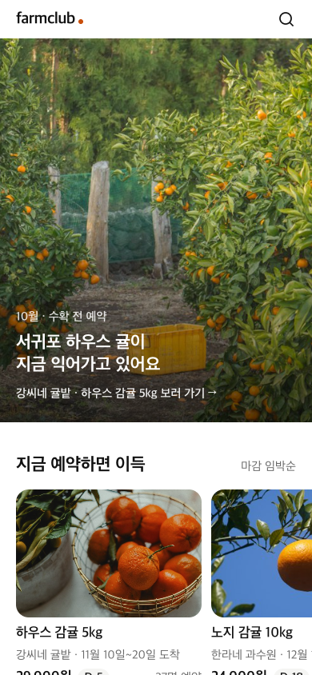 | 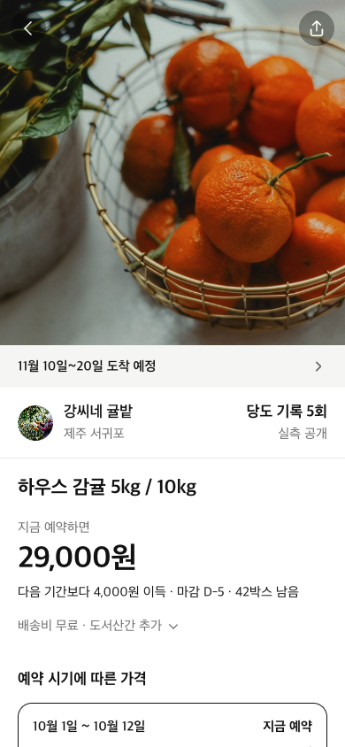 | 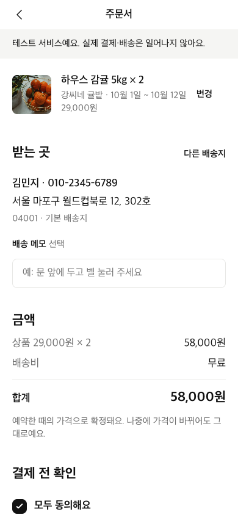 | 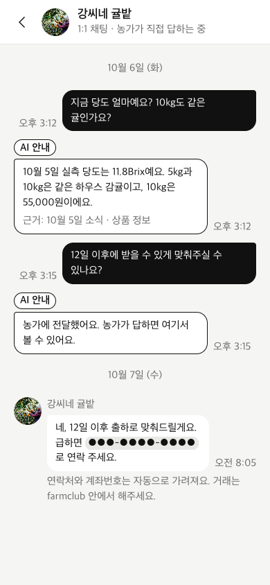 |

| SCR-03 Farm page | SCR-12 Order complete | SCR-13 My Orders | SCR-14 Order detail |
| --- | --- | --- | --- |
| 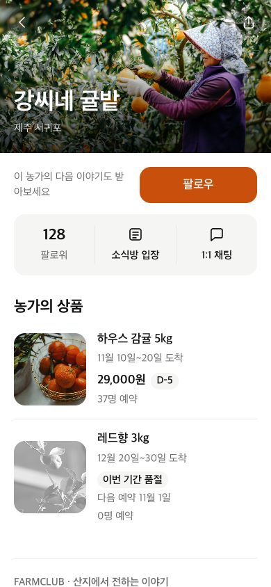 | 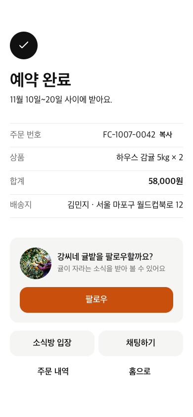 | 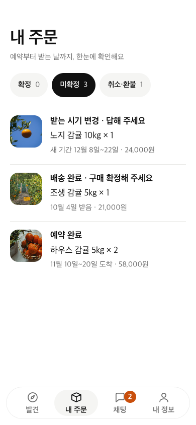 | 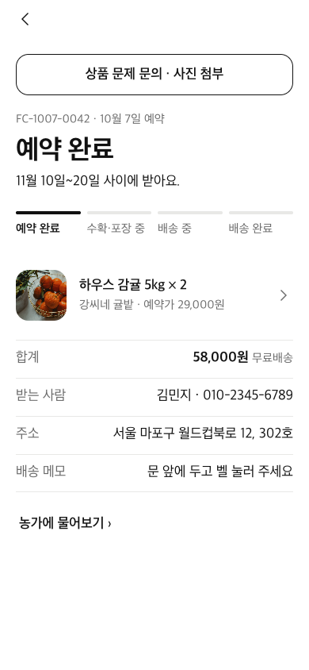 |

| Screen | What it does | Input and actions | Goes to | Failure / not allowed |
| --- | --- | --- | --- | --- |
| **SCR-01 Discover** | First screen: seasonal hero, recommended products, farms to browse | Tap search, hero, product card, farm card or "See all" | Search → SCR-02; product → SCR-04; farm → SCR-03 | No products on sale: shows "No products available right now" with farms only. A failed section shows Retry; the others stay |
| **SCR-02 Farm list** | Approved farms, closing soonest first, with search | Type a search term; scroll for more | Farm card → SCR-03 | No results: "We couldn't find that farm" and a link back to all farms |
| **SCR-03 Farm page** | Farm profile, follow, news room entry, 1:1 chat, products, farm story | Follow / Following, Chat, open the room, tap a product | Product → SCR-04; Chat → SCR-16; room → SCR-18 | Not logged in: login sheet first. Not following: Chat asks to follow first. Missing or revoked farm: "Farm not found" → SCR-02 |
| **SCR-04 Product detail** | Photos, delivery window, price for each reservation period, sweetness and grade, disclosures | Reserve opens the option/quantity sheet; Chat; Share | "Go to checkout" → SCR-10; farm summary → SCR-03 | Paused, sold out, between periods or ended: Reserve is disabled and the reason is shown. Quantity is limited to the per-order maximum |
| **SCR-05 Login** | Pick a consumer test account (Kakao login comes in I2) | Tap an account; close | Back to the screen and action that asked for login | Producer accounts are not listed. Test login off: "You can't log in right now". Closing does nothing |
| **SCR-10 Checkout** | Option, quantity, recipient, address, delivery note, total, four consents | Change option or address, check consents, Pay | Address → address screen; Pay → SCR-11 | Pay is disabled until an address exists and all four consents are checked. Price or stock changed meanwhile: screen refreshes with the latest values and keeps the input |
| **SCR-11 Payment (simulated)** | Pay the full amount; demo success/failure switch | Pay once (button locks while processing) | Success → SCR-12 | Failure: reason with Retry or back to SCR-10, and no stock is used. Sold out at payment: sold-out message → SCR-10. Lost response: retried without charging twice |
| **SCR-12 Order complete** | Confirms the reservation and suggests following the farm | Follow, View news, Chat, My Orders, Home | SCR-18, SCR-16, SCR-13, SCR-01 | If loading the order fails, the screen stays and offers Retry |
| **SCR-13 My Orders** | Orders grouped into Confirmed / Unconfirmed / Canceled-Refunded with counts | Switch tabs, tap an order | Order → SCR-14 | No orders: "You haven't reserved anything yet" and Home. Empty tab: "No {tab} orders" |
| **SCR-14 Order detail** | Status steps, delivery window, tracking, available actions | Cancel (confirm sheet), Confirm receipt, accept the new window or take a refund, copy or track the number, report a problem | Report a problem → SCR-32 | No Cancel after shipping. Someone else's order → SCR-13. Status already changed: refreshes to the latest state |
| **SCR-15 / SCR-18 Chat** | News Rooms (farms you follow) and 1:1 chats in one tab | Switch views, open a room or chat | Room → news room; chat → SCR-16 | No chats: "Ask a farm anything" with a link to farms. Other buyers' replies never appear |
| **SCR-16 1:1 chat** | Private questions to one farm; labeled AI answers or "Sent to the farm" | Type up to 1,000 characters, attach up to 3 photos, Send | Farm header → SCR-03 | Not following and no paid order: sent to SCR-03. Send fails: text and photos are kept for retry. AI fails or times out: question goes to the producer |
| **SCR-17 Me** | Followed farms, address book, "Start as a farm", log out | Tap a farm, manage addresses, log out | Farm → SCR-03; addresses → address book; log out → SCR-01 | Starting a farm explains that the producer app needs its own account |
| **SCR-32 Order problem** | Report damage, quality, taste or other with up to 3 private photos | Pick a type, describe it, attach photos, Send | Success → SCR-16 with the order attached | Not your order or not paid: cannot be sent. Upload or send fails: input is kept and a a retry never files it twice |

### 7.4 Producer app screens

Figure 3. Dashboard (SCR-22), sales settings and the farm's own news room. The producer checks demand, manages supply and prices, and posts updates from the room.

Key producer screens:

| SCR-22 Dashboard | SCR-24 AI product draft | SCR-25 Product edit | SCR-29 Shipping |
| --- | --- | --- | --- |
| 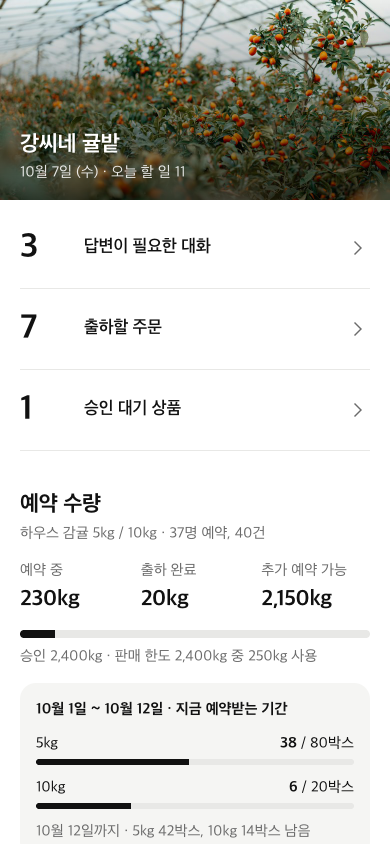 | 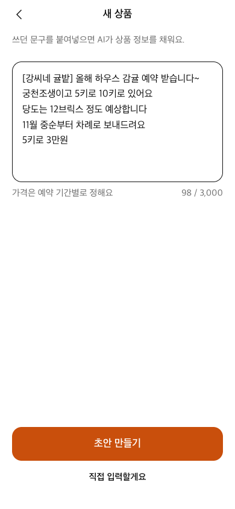 | 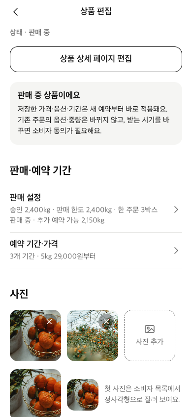 | 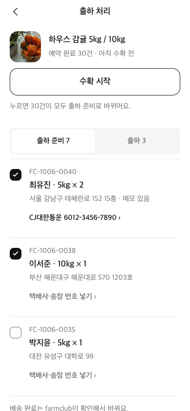 |

| SCR-21 Pending approval | SCR-26 Periods and prices | SCR-28 Chat | SCR-31 AI settings |
| --- | --- | --- | --- |
| 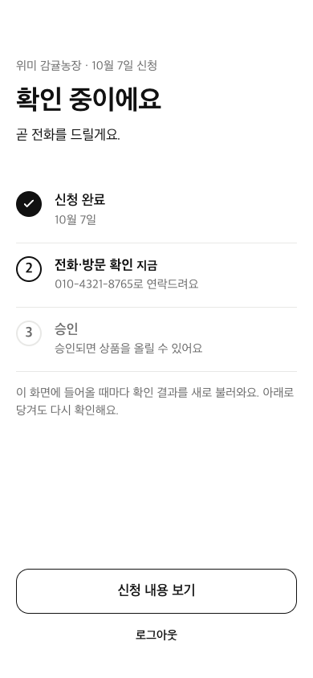 | 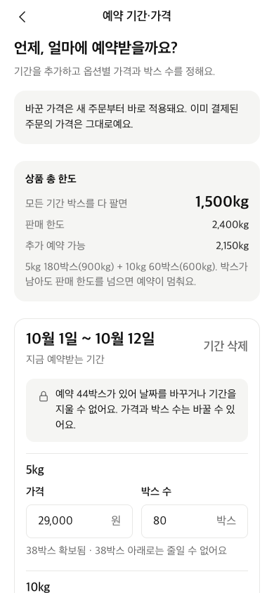 | 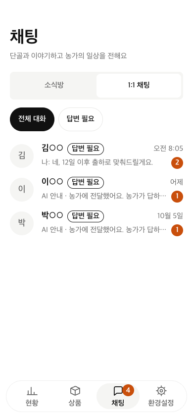 | 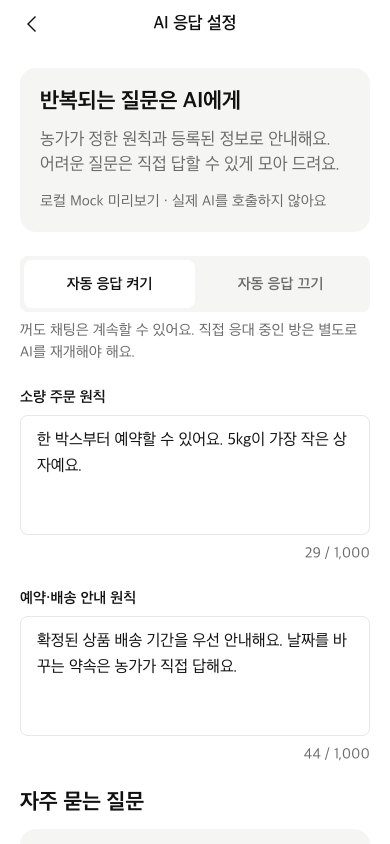 |

| Screen | What it does | Input and actions | Goes to | Failure / not allowed |
| --- | --- | --- | --- | --- |
| **SCR-19 Login** | Pick a producer test account, or apply as a new farm | Tap an account and Start; "Apply as a farm" | No farm → SCR-20; under review or rejected → SCR-21; approved → SCR-22; suspended → suspension notice | Consumer accounts are not listed. Test login off: "You can't log in right now" |
| **SCR-20 Application** | Farm details for joining; creates the producer account | Owner name, farm name, region, main crops, mobile number, policy consent; Apply | SCR-21 | Field errors keep the input. Already applied → SCR-21. Reapplying after rejection fills in the previous values |
| **SCR-21 Pending approval** | Application status, refreshed every time the screen opens | View application, pull to refresh, log out, reapply if rejected | Approved → SCR-22 automatically; reapply → SCR-20 | Before approval, every other producer screen redirects here |
| **SCR-22 Dashboard** | Today's tasks (questions, orders to ship, products under review) and kg per product | Tap a task | Questions → SCR-28 Needs reply; orders → SCR-29; review → SCR-23 | Nothing on sale: "No products on sale" with a link to SCR-24 |
| **SCR-23 Products** | Products grouped by status with reservation counts and kg | Filter, tap a product, "+ New product" | Product → SCR-25; new → SCR-24 | No products: "Add your first product" |
| **SCR-24 AI product draft** | Paste existing KakaoTalk or BAND text (max 3,000 characters) and get a draft | Paste text, Create draft, Edit or enter manually | SCR-25 | Button disabled while the text is empty. AI fails or takes over 20 seconds: text is kept and an empty editor opens. A price in the text is never filled in |
| **SCR-25 Product edit** | Product details, quality, options, delivery window, shipping fee, sales settings | Save, set periods, Submit for approval, pause or resume | Periods → SCR-26 | Submit stays disabled until required fields and period prices are set. Unsaved changes: confirm before leaving. Changing the delivery window with existing orders asks buyers to accept or refund |
| **SCR-26 Periods, prices and supply** | Date-based reservation periods with a price and box count per option | Add or remove periods, pick dates, enter prices and quantities, Save | Back to SCR-25 | Earlier price must be lower and periods cannot overlap. A period with reservations cannot be deleted or re-dated If someone else saved first, the input is kept |
| **SCR-28 Chat** | The farm's news room and every 1:1 chat, with an All / Needs reply filter | Switch views, open a chat, reply, attach | 1:1 → chat with that buyer; AI settings → SCR-31 | No chats or nothing needing a reply is shown separately. A failed load keeps the list |
| **SCR-27 Post news** | Text with up to 5 photos (10MB each) or 1 video (60s, 100MB); public or followers only | Write, attach, choose visibility, Post | Back to the farm's own room | Wrong format or size: reason per file. Attachment fails: the text is kept |
| **SCR-29 Shipping** | Start harvest and mark selected orders shipped with courier and tracking number | Start harvest (confirm), select orders, enter tracking, "Ship n orders" (confirm) | Back to the shipping list | Nothing to ship: "No orders to send right now". Some orders already changed: the rest are processed and the list refreshes. Producers cannot mark orders delivered |
| **SCR-33 Settings** | Farm summary, profile and share link, AI settings, log out | Tap an item | SCR-30, SCR-31, SCR-19 | Retry if loading fails |
| **SCR-30 Farm profile and link** | Edit name, region and introduction; copy or share the farm link | Copy, Share, edit one field, change photo | Field → single-field edit screen | Name and region cannot be empty. The link is hidden until the farm is approved |
| **SCR-31 AI settings** | AI on/off, answering guidelines, FAQs, extra handoff topics, preview | Edit, Save, Preview | Back to SCR-33 | Unsaved changes are marked and confirmed before leaving. Field errors and save conflicts keep the input |

### 7.5 Failure screens

Figure 4. Missing consent, changed reservation terms and a rejected application. The app blocks the next step, asks the user to confirm the new terms, and lets a rejected farm apply again.

More failure states:

| Sold out (SCR-04) | Missing consent (SCR-10) | Payment failed (SCR-11) | AI draft failed (SCR-24) |
| --- | --- | --- | --- |
| 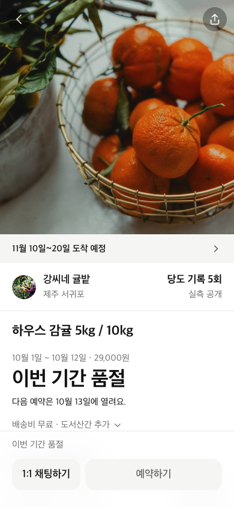 | 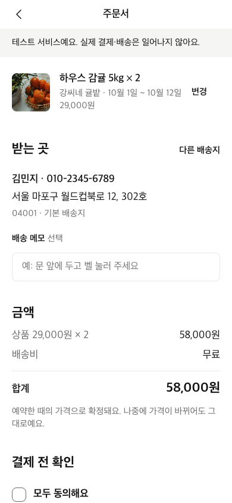 | 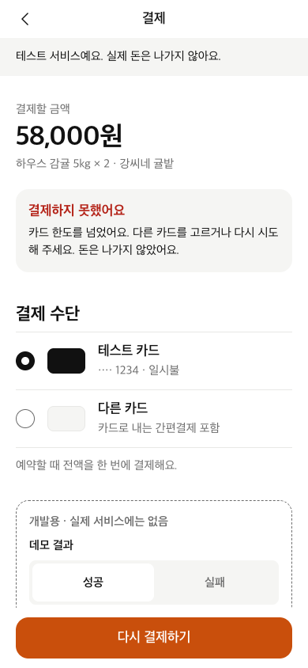 | 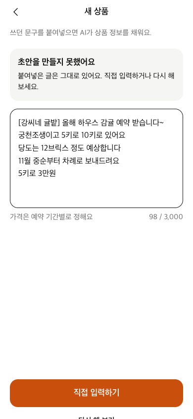 |

Rules that apply on every screen:
- Buttons lock while a request is being processed, and an order or payment is never processed twice even if the user taps again or the connection drops.
- When a save fails (network, validation or conflict), what the user typed and the photos they picked are kept, including after a detour to login.
- If the user is not allowed to see a screen, it shows "You can't view this screen" with a link to the first screen.
- Network errors show "Your connection is unstable" with Retry. Success messages appear as a short toast.

### 7.6 Room permissions

| Viewer | Public news | Follower news | Private replies | Can do |
| --- | --- | --- | --- | --- |
| Anonymous | Read | Hidden | Hidden | Log in first |
| Consumer, not following | Read | Hidden | Hidden | Like public news; follow to reply |
| Consumer, following | Read | Read | Own only | Reply; like news they can see |
| Owning approved producer | Read | Read | All replies in their room | Post news; open a private chat |
| Other producer | No access | No access | No access | None |

Reading a room never follows the farm automatically.

## 8. Implementation Status and References

The prototype runs the main flows on our real server: reservation, simulated payment, fulfillment, capacity approval, private messaging, AI settings, order inquiries and farm stories. Integration results are recorded in [Testing Documentation](https://github.com/snuhcs-course/swpp-2026-project-team-06/wiki/Testing-Documentation) ([PR #53](https://github.com/snuhcs-course/swpp-2026-project-team-06/pull/53), [PR #61](https://github.com/snuhcs-course/swpp-2026-project-team-06/pull/61)).

Not done yet in I1:
- Server-generated link previews for KakaoTalk (AC-19-3).
- Operator tools other than capacity approval, automatic purchase confirmation after eight days, and scheduled refund jobs.
- Production media storage and monitoring.
- Moved to I2: reporting a wrong AI answer (AC-13-5) and natural-language shipping (AC-17-1). AC-01-2 was retired when consumer and producer accounts were separated.

Simulated payments, test-account login and the AI fallback are for the demo; they are not a test of real payment providers or model quality.

Sources: [PRD](https://github.com/snuhcs-course/swpp-2026-project-team-06/blob/main/docs/spec/prd.md), [functional criteria and rules](https://github.com/snuhcs-course/swpp-2026-project-team-06/tree/main/docs/spec/functional), [screen specification](https://github.com/snuhcs-course/swpp-2026-project-team-06/blob/main/docs/spec/screens.md), [capacity 1.4](https://github.com/snuhcs-course/swpp-2026-project-team-06/blob/main/docs/spec/capacity-1.4.md), [storefront 1.5](https://github.com/snuhcs-course/swpp-2026-project-team-06/blob/main/docs/spec/storefront-1.5.md), [design frames](https://github.com/snuhcs-course/swpp-2026-project-team-06/tree/main/docs/design).
