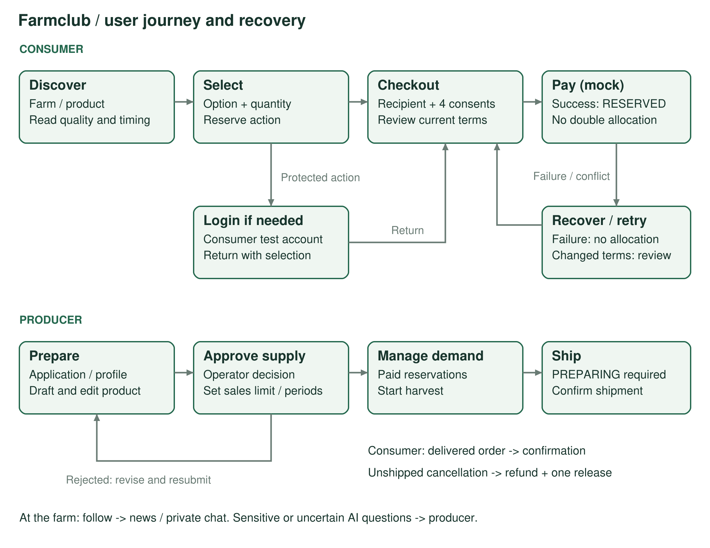
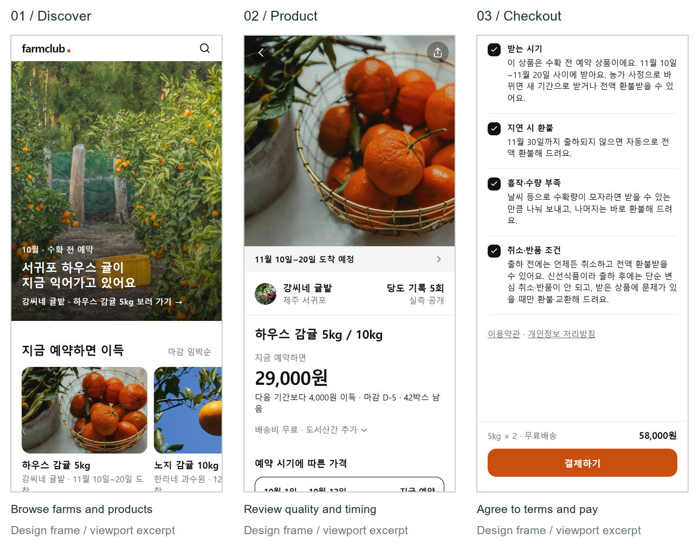
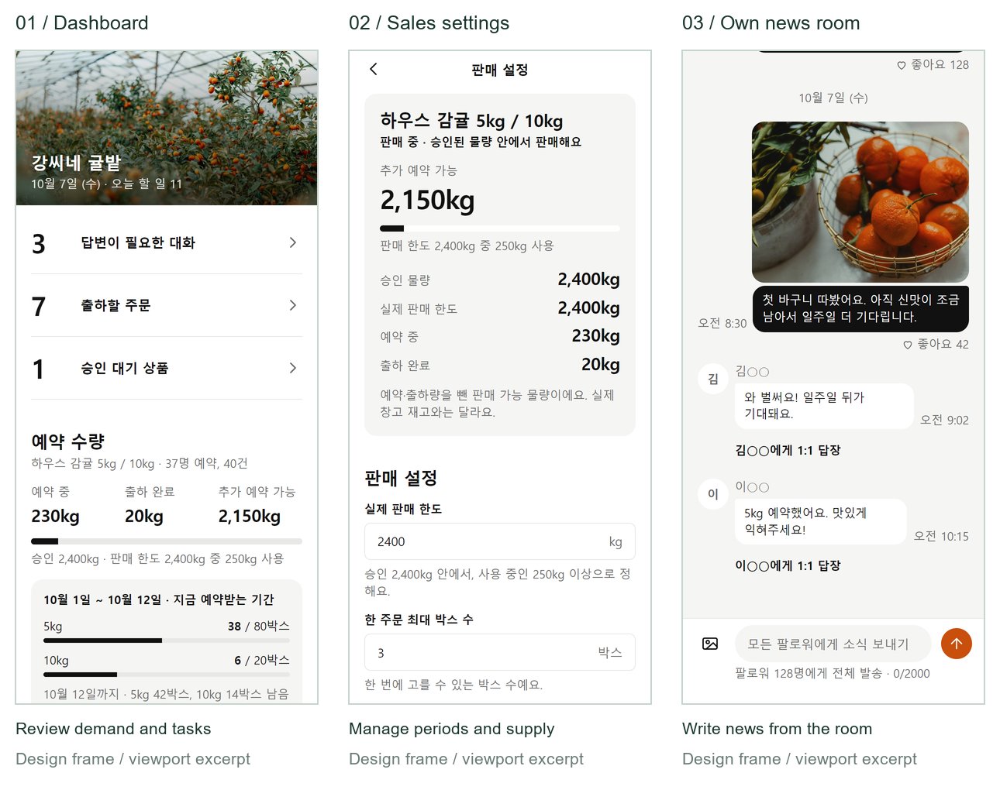
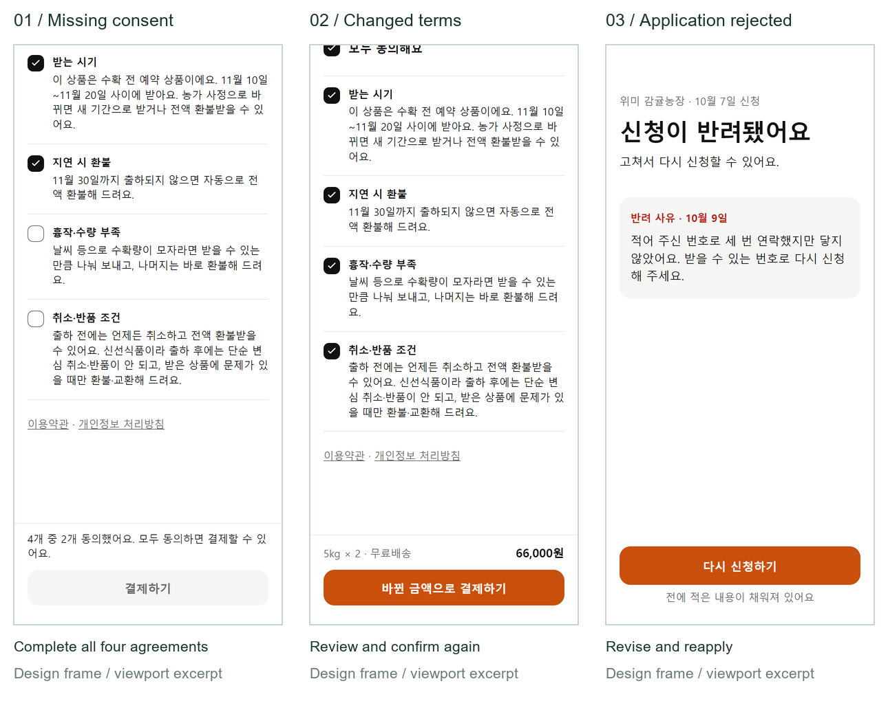

# Requirements and Specifications

Team 6 | Farmclub | Iteration 1 | 9 October 2026

## Document Revision History

| Version | Date | Author | Major changes |
| --- | --- | --- | --- |
| 0.1 | 2026-10-07 | Team 6 | Initial specification from the product documents |
| 0.2 | 2026-10-07 | Team 6 | Separate consumer and producer accounts; revised login and UI requirements |
| 1.0 | 2026-10-09 | Team 6 | Submission edition: customers, competition, stories, criteria and UI flows; consolidate specs 1.2-1.5 |
| 1.1 | 2026-10-09 | Team 6 | Add Nongsafund to the competitive comparison with official sources |

## 1. Project Abstract

Farmclub is a mobile web service that connects consumers with small Jeju citrus farms before harvest. Consumers discover farms, compare product quality and expected delivery windows, and reserve fruit at prices defined for successive reservation periods. They can follow a farm, read growing updates, ask private questions, and track an order through harvest and shipping. Producers manage their farm profile, product descriptions, reservation periods, prices, and available supply. AI assists with drafting product information from existing sales text and answering factual questions, while uncertain or sensitive questions go to the producer. Farmclub approves initial product supply and later capacity increases; producers manage sales within the approved limit. The first iteration targets consumers who value taste and trustworthy quality information, including people ordering fruit for family members, and farmers who already sell through messaging channels. Its prototype uses separate consumer and producer test accounts and simulated card payments, without moving real money. The main experience combines reservation ordering, farm communication, and producer fulfillment across two connected applications. Explicit consent, private conversations, approval controls, and cancellation before shipping support understandable transactions. Subsequent iterations can add real authentication, payment integration, notifications, and operational tools after the team evaluates the prototype and user feedback.

## 2. Customers and Use Context

| Customer | Context and need | Main task |
| --- | --- | --- |
| General audience | Korean seasonal-citrus buyers and small direct-selling farms | Connect discovery, advance ordering and farm communication |
| Primary consumer | Adults in their 40s-50s who prioritize taste and want evidence before reserving | Inspect sweetness, grade, updates and timing; reserve with clear terms |
| Family purchaser | Adults in their 20s-30s buying for parents or another recipient | Choose an option and a recipient different from the buyer |
| Producer | Small Jeju citrus farms already using KakaoTalk or BAND | Reuse sales text, manage demand, publish updates and fulfill orders |
| Operator | Farmclub team members responsible for approval and exceptions | Verify farms, approve supply and handle operational exceptions |

The focus comes from the team's I1 research synthesis, not a claim that everyone in an age group behaves alike. The [research evidence summary](https://github.com/snuhcs-course/swpp-2026-project-team-06/blob/main/docs/spec/evidence.md) identifies taste, uncertainty about quality and harvest updates as priorities. No interviewee contact information is included.

## 3. Competitive Landscape

This comparison describes documented offerings. An unmentioned capability is not treated as proof that a competitor lacks it.

| Alternative | Documented offering | Farmclub's intended distinction |
| --- | --- | --- |
| Nongsafund | Agricultural funding and advance purchases supporting farms before harvest; producer stories, growing-process updates and food subscriptions | Jeju citrus focus with measured/expected sweetness, date-based reservation prices, approved supply limits, AI-assisted drafting and private support |
| Wadiz | Funding, preorder and store services for makers across categories, including food | A focused citrus journey with date-based prices, supply approval and ongoing farm communication |
| Local Line | Farm storefronts, seasonal preorders, inventory, subscriptions and retail/wholesale tools | Consumer-facing Jeju citrus discovery combined with quality information, news rooms and private support |

- **Closest comparison:** Nongsafund already connects advance purchasing with farmer relationships and growing updates. Farmclub's proposed distinction is the specific combination of citrus quality information, reservation rules and producer workflows.
- **Reservation clarity:** Present current price, delivery timing and cancellation terms together.
- **Farm relationship:** Connect public growing updates and private questions to the farm page.
- **Producer assistance:** Draft from existing text and hand judgment-dependent questions to the farmer.
- **Evidence boundary:** These are prototype design choices, not measured market superiority.

Official sources reviewed on 9 October 2026: [Nongsafund's explanation of funding and advance purchases, 28 December 2025](https://www.ffd.co.kr/think-ceo/?bmode=view&idx=169231526) and [storefront/subscriptions](https://www.ffd.co.kr/); [Wadiz company brief, June 2026, pp. 12-16](https://static.wadiz.kr/file/ir/wadiz_company_brief_ko.pdf); [Local Line farm e-commerce](https://www.localline.co/suppliers/e-commerce-for-farmers).

## 4. Scope and Shared Rules

### 4.1 Iteration boundary

- **I1 core:** Discovery/following, separate test-account login, farm/product setup, supply approval, reservation/mock payment, order history/cancellation/shipping, news/private chat and AI assistance.
- **I1 extensions:** Farm AI settings and order-problem inquiries (FEAT-32/33, originally Should), included in the prototype.
- **Later iterations:** Kakao login, real payment/settlement, courier integration, external notifications, dedicated operator UI, natural-language shipping and incorrect-AI-answer reporting.
- **Intent versus delivery:** The acceptance criteria define expected behavior; they do not certify every feature as implemented or tested. Section 8 identifies known implementation boundaries.

### 4.2 Transaction rules

| Area | Required behavior | Rules |
| --- | --- | --- |
| Approval | Farm verification; operator approval for initial product supply and increases | R-22, R-25 |
| Payment | One full card payment; I1 simulates success/failure. Record four consents and their version | R-01-03 |
| Pricing | Earlier periods are cheaper; no overlap. Reconfirm changed unpaid terms; retain paid snapshots | R-17-18 |
| Capacity | Reserved plus shipped weight <= sales limit <= approved weight. Display kg; calculate integer grams | R-06, R-26 |
| Quantity | One option and address per order; enforce per-order and period-option box limits | R-23 |
| Pause | Keep product visible; block new orders and unpaid payment; allow fulfillment of existing paid orders | R-27 |
| Cancellation | Full refund before shipment; restore eligible stock once. Post-shipping refunds do not restore capacity | R-07-08, R-26 |
| Delivery change | Buyer accepts a new window or requests full refund | R-21 |
| Shipment | Producer confirms preparation/shipping, but cannot mark delivery complete | R-19 |

### 4.3 Communication and AI

- News rooms and private 1:1 chat are separate; no consumer-to-consumer discussion (M-01-04).
- A consumer sees only their own replies; the farm owner sees replies to their farm (M-02, M-19).
- Mask external contact details; restrict inquiry photographs to participants (M-16, M-21).
- Automatic answers require farm AI ON and thread AUTO. Producer replies switch to HUMAN; resuming AUTO is explicit (M-05, M-09, M-20).
- Label AI guidance, preserve evidence, distinguish measured/expected sweetness, and hand off uncertainty or sensitive judgment (M-06-08, M-15).
- Exclude shipping personal data and private inquiry photographs from model evidence (M-18, M-21).
- A generated draft does not publish itself. Producers review/save; AI does not set transaction prices or promise compensation (M-10-13).

## 5. Functional Requirements

Each feature has a Connextra user story and core acceptance scenarios. Existing AC identifiers are preserved. The [functional specification index](https://github.com/snuhcs-course/swpp-2026-project-team-06/blob/main/docs/spec/functional/README.md) links the complete source criteria. Presence here does not mean a test has passed.

| Journey | Features | Main screens |
| --- | --- | --- |
| S-1: Prepare farm and product | FEAT-01-05, 19 | SCR-19-21, 23-26, 30 |
| S-2: Discover and reserve | FEAT-06-10 | SCR-01-05, 10-14 |
| S-3: Read updates and ask | FEAT-12-13, 15, 32-33 | SCR-15-18, 27-28, 31-32 |
| S-4: Manage demand and fulfillment | FEAT-10-11, 14, 17 | SCR-13-14, 22, 29 |
| Navigation | FEAT-02, 10, 12 | Four tabs per app; Settings SCR-33 |

### FEAT-01: Account access and application

**Story:** As a visitor, I want to browse before choosing a consumer or producer test account, so that I sign in only when needed and use the correct app.

**AC-01-1 — Return after login**
- **Given:** A logged-out visitor selects a product and quantity.
- **When:** They reserve and complete consumer login.
- **Then:** Checkout opens with the selection preserved.

**AC-01-3 — Approval gate**
- **Given:** A producer is not approved.
- **When:** They open a protected screen or call a producer API.
- **Then:** The app shows the application state and the API refuses the operation.

**AC-01-5 / AC-01-6 — Login boundaries**
- **Given:** Mock login is disabled, or a token belongs to the other app role.
- **When:** Test-login endpoints or a wrong-role protected API are called, respectively.
- **Then:** Disabled test login is refused; wrong-role access returns WRONG_APP. Producer account lists contain producer accounts only.

### FEAT-02: Farm profile and story

**Story:** As an approved producer, I want to edit my farm profile and story, so that buyers understand who grows their fruit.

**AC-02-1 / AC-02-2 — Valid profile**
- **Given:** The producer owns the farm.
- **When:** They save a new name, or try saving an empty name.
- **Then:** A valid name appears in consumer views; an empty name is rejected with field feedback.

**AC-02-4 — Usable storefront**
- **Given:** A farm has a long name or no products.
- **When:** Its page opens at 360px width.
- **Then:** Profile actions, news-room entry and the story remain usable; products precede the story.

### FEAT-03: AI-assisted drafting

**Story:** As a producer, I want to convert existing sales text and selected photographs into an editable draft, so that I reduce repetitive writing.

**AC-03-1 / AC-03-2 — Preserve factual boundaries**
- **Given:** Source text omits sweetness/delivery timing but contains a price.
- **When:** A product draft is generated.
- **Then:** Missing facts stay blank and are identified; the transactional price is not filled automatically.

**AC-03-3 — Extraction failure**
- **Given:** Product extraction fails or times out.
- **When:** A draft is requested.
- **Then:** Original input remains available and manual product editing is possible.

**AC-03-4 — Review and save**
- **Given:** A producer edits a farm or product story.
- **When:** They generate, reorder, preview, cancel regeneration or encounter a failed save.
- **Then:** Generation changes no public content; cancellation/failure preserves edits; only an authorized save publishes them.

### FEAT-04: Product and capacity approval

**Story:** As a producer, I want to configure a product and request supply approval, so that buyers reserve approved, fulfillable products.

**AC-04-1 / AC-04-3 — Publication**
- **Given:** A product is being prepared.
- **When:** The delivery window is missing, or an operator approves a complete initial capacity request.
- **Then:** Missing information blocks submission; approved initial supply publishes the complete product.

**AC-04-4 — Price snapshot**
- **Given:** A product has paid orders.
- **When:** Its producer saves a valid new price.
- **Then:** New orders use it; paid orders retain their original price.

**AC-04-8 / AC-04-9 — Increase request**
- **Given:** A published product has approved capacity.
- **When:** Its owner requests more capacity and an operator approves or rejects it.
- **Then:** Existing sales continue within the old limit; approval raises approved capacity, rejection preserves it. The sales limit remains a separate producer setting.

### FEAT-05: Periods, prices and allocation

**Story:** As a producer, I want to set reservation dates, prices and allocations, so that earlier buyers pay less and demand stays within supply.

**AC-05-1 / AC-05-2 — Invalid schedule**
- **Given:** A later period and price already exist.
- **When:** An earlier price is equal/higher or date ranges overlap.
- **Then:** Saving is rejected with a reason.

**AC-05-4 — Reservation history**
- **Given:** A period has reservation history.
- **When:** Periods are reordered, or that period is deleted/re-dated.
- **Then:** Stable IDs/counts are retained; deletion/date changes are rejected. Valid prices may change for new orders.

### FEAT-06: Discovery and following

**Story:** As a consumer, I want to search and follow farms, so that I can find suitable fruit and keep up with its growth.

**AC-06-1 / AC-06-2 — Discovery**
- **Given:** Farms have different current closing dates and citrus varieties.
- **When:** A consumer browses or searches a variety.
- **Then:** Earlier closing farms appear first; search returns matching farms.

**AC-06-3 — Follow**
- **Given:** A consumer is signed in.
- **When:** They follow a farm.
- **Then:** It appears in their followed farms and its room is accessible from Chat.

### FEAT-07: Product information

**Story:** As a consumer, I want to inspect quality, price and delivery timing, so that I can judge whether to reserve.

**AC-07-1 / AC-07-2 — Stock and sweetness**
- **Given:** Current stock is zero and measured sweetness exists.
- **When:** Product detail opens.
- **Then:** Reservation is disabled with sold-out/next-period information, and measured sweetness is shown rather than an estimate.

**AC-07-5 — Full product detail**
- **Given:** A product has story blocks, or only its original description.
- **When:** A consumer reads it.
- **Then:** Detail is expanded, image proportions are retained, fallback text is available, and disclosures and reservation stay reachable.

### FEAT-08: Checkout

**Story:** As a consumer, I want to select quantity, recipient and address and review terms, so that I can reserve for myself or another person.

**AC-08-1 — Required consents**
- **Given:** At least one required consent is unchecked.
- **When:** The consumer tries to pay.
- **Then:** Payment cannot proceed.

**AC-08-5 — Saved delivery address**
- **Given:** The consumer has saved an address.
- **When:** Checkout opens.
- **Then:** It can populate the form; the order keeps its own address snapshot.

### FEAT-09: Mock card payment

**Story:** As a consumer, I want to pay the full amount once, so that my reservation has no duplicate payment or stock deduction.

**AC-09-1 — Last box**
- **Given:** One box remains.
- **When:** Two consumers pay concurrently.
- **Then:** One succeeds; the other receives a sold-out result.

**AC-09-2 / AC-09-3 — Failure and retry**
- **Given:** An unpaid order exists.
- **When:** Mock payment fails, or an identical request is retried with the same idempotency key.
- **Then:** Failure does not consume stock; retry returns the original result with one payment/deduction.

**AC-09-6 — Mixed weights**
- **Given:** Different weight options share a supply limit.
- **When:** Orders are paid, canceled or shipped.
- **Then:** Integer-gram totals obey the limit; repeated cancellation cannot release stock twice.

### FEAT-10: Order history

**Story:** As a consumer, I want to see order status and required actions, so that I can respond to changes and confirm receipt.

**AC-10-1 — Delivery change**
- **Given:** An order has a proposed delivery-window change.
- **When:** History opens.
- **Then:** It is prioritized until the consumer accepts or requests a refund.

**AC-10-6 / AC-10-7 — Groups and refresh**
- **Given:** Orders span states and more than one results page.
- **When:** My Orders opens or the consumer returns after confirmation/refund.
- **Then:** Confirmed / Unconfirmed / Canceled-Refunded counts include all pages and refresh; Unconfirmed is the default, excludes unpaid orders and puts required actions first. The selected filter persists.

### FEAT-11: Cancellation before shipping

**Story:** As a consumer, I want to cancel before shipping, so that I receive a full refund if my plans change.

**AC-11-1 — Eligible cancellation**
- **Given:** A paid order has not shipped.
- **When:** The buyer confirms cancellation.
- **Then:** Full refund is recorded and eligible stock is restored once.

**AC-11-2 — Already shipped**
- **Given:** An order has shipped.
- **When:** The buyer views or attempts simple cancellation.
- **Then:** The action is unavailable and the request is rejected.

### FEAT-12: News rooms and private chat

**Story:** As a producer, I want to broadcast updates and respond privately, so that followers stay informed without exposing individual questions.

**AC-12-1 / AC-12-6 — Privacy**
- **Given:** Consumer A sends a private chat or room reply.
- **When:** Consumer B requests messages, previews or subsequent pages.
- **Then:** A's content is absent; A and the owning farm can read it.

**AC-12-2 — Contact masking**
- **Given:** A message includes a phone number.
- **When:** It is sent.
- **Then:** Stored and displayed text masks the number.

**AC-12-10 (spec 1.5) — Public-room access**
- **Given:** A room has public and follower-only broadcasts.
- **When:** A user follows, unfollows or logs out.
- **Then:** Messages/previews obey the new role and inaccessible cached content is cleared.

The source also assigns AC-12-10 to producer posting/navigation in spec 1.3. Version qualifiers preserve both meanings without renumbering the source.

### FEAT-13: Answers and handoff

**Story:** As a producer, I want factual questions answered and judgment-dependent questions forwarded, so that I focus on cases requiring my attention.

**AC-13-1 — Delivery fact**
- **Given:** Farm AI is ON, thread mode is AUTO and delivery timing is recorded.
- **When:** A consumer asks when to expect delivery.
- **Then:** AI guidance uses that recorded window.

**AC-13-2 / AC-13-8 — Sensitive judgment**
- **Given:** A question concerns pesticide use, compensation, subjective taste, quality or damage.
- **When:** It is submitted.
- **Then:** It is forwarded rather than answered with an unsupported assurance.

**AC-13-6 — Takeover**
- **Given:** Automatic answering is enabled.
- **When:** A producer replies or captured AI/settings versions change.
- **Then:** A producer reply switches to HUMAN; stale automatic output is not saved. Explicit AUTO resumption affects future questions.

### FEAT-14: Producer dashboard

**Story:** As a producer, I want demand and pending work summarized, so that I can plan harvest and customer support.

**AC-14-1 — New payment**
- **Given:** A producer has viewed the dashboard.
- **When:** Another order is paid and they reload.
- **Then:** Reservation quantity rises and remaining quantity falls.

**AC-14-3 — Distinct counters**
- **Given:** The product has reservations and shipments.
- **When:** Its dashboard is viewed.
- **Then:** Approved, sales-limit, reserved, shipped and available kg are distinguished from customer and order counts.

### FEAT-15: Public news and reactions

**Story:** As a consumer, I want to read growing updates and like them, so that I can learn about a farm before and after following.

**AC-15-1 — Follower-only post**
- **Given:** A post is follower-only.
- **When:** An anonymous/non-following visitor opens the public room.
- **Then:** That post is hidden.

**AC-15-3 — Like toggle**
- **Given:** An accessible post has three likes.
- **When:** A signed-in consumer likes then unlikes it.
- **Then:** Its count changes to four and back to three.

**AC-15-6 (spec 1.5) — Entry and return**
- **Given:** A room is entered from the farm, checkout completion or Chat.
- **When:** The user returns from login or navigates back.
- **Then:** The app restores the correct room/origin.

Spec 1.2 also uses AC-15-6 for consistent broadcast likes across views and no likes on private replies.

### FEAT-17: Harvest and shipment

**Story:** As a producer, I want to confirm harvest and shipment, so that buyers can track fulfillment accurately.

**AC-17-3 — Harvest**
- **Given:** Three orders for a product are reserved.
- **When:** Harvest starts.
- **Then:** All three move to preparation and remain cancelable until shipping.

**AC-17-2 / AC-17-5 — Shipment**
- **Given:** An order is preparing and tracking information has been entered.
- **When:** The producer confirms shipment.
- **Then:** Shipment time/tracking are recorded; the buyer sees SHIPPED and cannot simply cancel.

**AC-17-4 — Delivery boundary**
- **Given:** An order has shipped.
- **When:** The producer tries to mark it delivered.
- **Then:** The request is rejected; its state remains shipped.

### FEAT-19: Farm sharing

**Story:** As a producer, I want a shareable farm link, so that regular customers can enter my storefront directly.

**AC-19-1 / AC-19-2 — Public link**
- **Given:** A link refers to an approved farm or a farm with revoked approval.
- **When:** A logged-out visitor opens it.
- **Then:** An approved farm opens directly; an unavailable farm shows a not-found state and a route to discovery.

**AC-19-3 — Preview requirement**
- **Given:** An approved farm link is pasted into KakaoTalk.
- **When:** The service requests its preview.
- **Then:** The farm name and photograph should appear. Server-generated previews remain a baseline implementation gap.

### FEAT-32: AI settings

**Story:** As a producer, I want to set policies and preview responses, so that guidance reflects my farm without overriding platform rules.

**AC-32-1 — Persist settings**
- **Given:** The owner edits enablement, policies, FAQs or handoff topics.
- **When:** They save and reload.
- **Then:** Values and version persist.

**AC-32-3 — Preview**
- **Given:** Unsaved settings are being edited.
- **When:** An answer is previewed.
- **Then:** Answer/evidence/handoff reason appears without creating conversation/inquiry records or saving settings.

**AC-32-4 — Conflicting write**
- **Given:** A version is stale or a different farm owns the resource.
- **When:** A save is attempted.
- **Then:** It is rejected and local input is retained.

### FEAT-33: Order inquiries

**Story:** As a buyer, I want to report an order problem with private photographs, so that the responsible farm can respond in context.

**AC-33-1 — One contextual inquiry**
- **Given:** A buyer owns a paid order.
- **When:** They submit a type, description and optional photographs, including a retry.
- **Then:** One inquiry is linked to that order and farm conversation.

**AC-33-2 — Access after unfollowing**
- **Given:** The buyer no longer follows the farm.
- **When:** They inquire about their own paid order.
- **Then:** Access remains available; another buyer cannot read or bind its photographs.

**AC-33-3 — Human handling**
- **Given:** An inquiry has been submitted.
- **When:** The farm responds or marks it resolved.
- **Then:** It is handled in HUMAN mode; resolution alone changes no payment/refund state.

## 6. Non-Functional Requirements

These are requirements and targets, not measured guarantees.

| ID | Area | Requirement |
| --- | --- | --- |
| N-01 | Platform | Two mobile web apps; desktop usable; entry by link without installation |
| N-02 | Accessibility | Tap targets >=48px; body 17px, inputs 16px, secondary text 15px; one primary action per screen |
| N-03 | Locale | Korean product UI, KST dates/times, integer KRW |
| N-04 | Responsiveness | AI draft request budget of 20 seconds; recoverable failure/manual editing and human handoff |
| N-05 | Privacy | Collect necessary recipient/contact/address data; exclude it from analytics and AI evidence |
| N-06 | Security | Server-side role and ownership checks, not UI-only hiding |
| N-07 | Reproducibility | Seed accounts/states, fixed demo clock, mock payment success/failure |
| N-08 | AI quality | Target >=80% field-level extraction accuracy; do not fabricate absent fields |

- Response-time and extraction-quality targets need measurement before being reported as achieved.
- Personal-data retention remains an open policy decision (Q-20); no duration is invented here.
- PRD conversion/follow/chat/cancellation metrics are defined, but the analytics scaffold does not establish event delivery.

## 7. User Interface Requirements

### 7.1 Navigation

| App | Tabs, left to right | Key paths |
| --- | --- | --- |
| Consumer | Discover / My Orders / Chat / Me | Orders are top-level; Chat separates News Rooms and 1:1 |
| Producer | Dashboard / Products / Chat / Settings | Profile/link and AI settings are under Settings; write news in the own-farm room |

- Read public farm/product/room content without login. Protected actions return through login to their original context.
- Product filters: Selling / Under review / Draft / Paused / Ended. Pending increases stay in the existing group.
- Orders default to Unconfirmed and retain selection on detail return.
- Desktop content is centered at a maximum width of 480px. Respect safe areas and avoid composer/tab overlap.

### 7.2 Journey and failure branches

Figure 1. Arrows identify user actions, login return, payment failure and shipping gates. Drafting does not automatically approve publication.

### 7.3 Screen references

These are viewport excerpts from repository design frames, not live-deployment evidence. Korean product copy follows N-03; English captions explain the task. Longer screens continue outside each excerpt. The [complete design frames](https://github.com/snuhcs-course/swpp-2026-project-team-06/tree/main/docs/design) remain editable.

Figure 2. Discover (SCR-01), product detail (SCR-04), checkout (SCR-10). Select a product, option and quantity; enter the recipient and agree to four terms.

Figure 3. Dashboard (SCR-22), sales settings and own news room. Review demand, manage supply/prices, and post updates from the room.

Figure 4. Missing consent, changed reservation terms and rejected application. Block invalid progression, ask for reconfirmation and offer reapplication.

### 7.4 Inputs and recovery

| Task | Allowed input/action | Failure and recovery |
| --- | --- | --- |
| Product draft | Required source text, max 3,000 characters | Preserve text; manual completion on failure |
| Story editor | Text/image blocks, reorder, preview, save; no executable HTML | Confirm regeneration/unsaved exit; retain edits |
| Sales settings | Positive integer prices; non-overlapping periods; valid weight/box limits | Field feedback; retain edits; refresh conflicting version |
| Checkout | One option, quantity within limits, recipient/address, four consents | Preserve input after stock/price conflict; reconfirm |
| Mock payment | Explicit success/failure | Failure consumes no stock; same request retries with same key |
| News/chat | Broadcast visibility, private replies and 1:1 messages | Preserve unsent input; offer retry |
| Inquiry | Type, description, up to three private photos | Reject invalid size/type/count and unauthorized attachments |
| Shipment | Preparing order, optional tracking, explicit confirmation | Cancel changes nothing; refresh stale state |

### 7.5 Room permissions

| Viewer | Public news | Follower news | Private replies | Participation |
| --- | --- | --- | --- | --- |
| Anonymous | Read | Hidden | Hidden | Login first |
| Non-follower consumer | Read | Hidden | Hidden | Like public news; follow to reply |
| Follower consumer | Read | Read | Own only | Reply; like accessible news |
| Owning approved producer | Read | Read | All own-farm replies | Broadcast; open private chat |
| Other producer | Denied | Denied | Denied | No other-farm access |

Filter before pagination and previews. Reading alone never follows a farm.

## 8. Delivery Status and References

Baseline: commit 747f588. [PR #53](https://github.com/snuhcs-course/swpp-2026-project-team-06/pull/53) merged DEV-6 integration work. Execution evidence is kept separately in [Testing Documentation](https://github.com/snuhcs-course/swpp-2026-project-team-06/wiki/Testing-Documentation).

- **Prototype paths:** Real API reservation/payment/fulfillment, capacity approval, messaging privacy, settings/inquiries and story persistence.
- **Validation boundary:** Mock payments, seed login and deterministic AI fallbacks do not establish real-provider or model-quality validation.
- **Known baseline gaps:** Server OG sharing; operator APIs beyond capacity approval; automatic eight-day confirmation and operational refund jobs; production media/observability integration. Requirements remain visible despite these gaps.
- **I2 criteria:** AC-13-5 (incorrect-answer reporting), AC-17-1 (natural-language shipping). AC-01-2 is retired.
- **ID caveat:** AC-12-10 and AC-15-6 have multiple versioned meanings in the source; version labels disambiguate them here.

Sources: [PRD](https://github.com/snuhcs-course/swpp-2026-project-team-06/blob/main/docs/spec/prd.md), [functional criteria/rules](https://github.com/snuhcs-course/swpp-2026-project-team-06/tree/main/docs/spec/functional), [screen contracts](https://github.com/snuhcs-course/swpp-2026-project-team-06/blob/main/docs/spec/screens.md), [capacity 1.4](https://github.com/snuhcs-course/swpp-2026-project-team-06/blob/main/docs/spec/capacity-1.4.md), [storefront 1.5](https://github.com/snuhcs-course/swpp-2026-project-team-06/blob/main/docs/spec/storefront-1.5.md).
